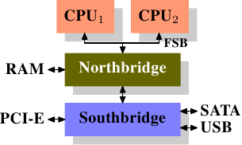
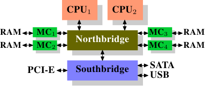
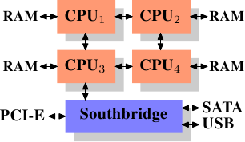

# 2. 现代商用硬件

理解商用硬件很重要，因为专用硬件正在退潮。如今扩展能力更常通过水平扩展而不是垂直扩展来获得，也就是说，使用许多较小、互相连接的商用计算机，往往比使用少数非常大型、速度极快（也很昂贵）的系统更符合成本效益。这是因为快速且廉价的网络硬件已经广泛可用。大型专用系统在某些场景中仍有位置，也仍然有商业机会，但整体市场规模已经被商用硬件市场远远超过。Red Hat 在 2007 年预计，对未来产品而言，大多数数据中心的“标准构建块（building block）”将是一台最多有四个插槽（socket）的计算机，每个插槽安装一颗四核 CPU；如果是 Intel CPU，这些 CPU 将采用超线程（[hyper-threading](https://en.wikipedia.org/wiki/Hyper-threading)，简称 HT）技术。[^2]这意味着数据中心的标准系统将拥有最多 64 个虚拟处理器（virtual processor）[^译注]。当然，更大的机器也会得到支持，但四插槽、四核 CPU 的配置目前被认为是最佳平衡点，大多数优化也都面向这类机器。

由商用部件构建的计算机在结构上也存在巨大差异。即便如此，只要聚焦最重要的差异，我们就能覆盖这类硬件中的 90% 以上。请注意，这些技术细节往往变化很快，因此建议读者把本文的写作日期纳入考虑。

这些年来，个人计算机和小型服务器逐渐标准化为一种由两部分组成的芯片组（chipset）：北桥（Northbridge）和南桥（Southbridge）。图 2.1 展示了这种结构。

*图 2.1：包含北桥与南桥的结构*
所有 CPU（前面的例子中有两颗，但也可以更多）都通过一条公共总线（bus），也就是前端总线（Front Side Bus，FSB），连接到北桥。**北桥除了其他功能之外，还包含内存控制器（memory controller）**，其实现（implementation）决定了计算机使用哪种 RAM 芯片。不同类型的 RAM，例如 DRAM、Rambus 和 SDRAM（synchronous DRAM），需要不同的内存控制器。为了访问其他所有系统设备，北桥必须与南桥通信。**南桥通常称为 I/O 桥**，它通过各种不同的总线处理与设备的通信。
如今最重要的总线是 PCI、PCI Express、SATA 和 USB，但南桥也支持 PATA、IEEE 1394、串口（serial port）和并行端口（parallel port）。较老的系统有连接到北桥的 AGP 插槽，这是因为当时南北桥之间的连接速度不够快，需要出于性能考虑这样设计。不过，如今的 PCI-E 插槽都连接到南桥。

这种系统结构有一些值得注意的结果：

* 从一颗 CPU 到另一颗 CPU 的所有数据通信，都必须经过与北桥通信所用的同一条总线。
* 所有与 RAM 的通信都必须通过北桥。
* RAM 只有单端口。[^3] (ram 可以有多个 port 同时支持读写)
* 一颗 CPU 与连接到南桥的设备之间的通信会经由北桥。

这个设计立刻显现出几个瓶颈。其中一个瓶颈涉及**设备对 RAM 的访问**。在最早期的 PC 中，无论设备连接在哪个桥上，所有与设备的通信都必须经过 CPU，这会对整体系统性能产生负面影响。为了解决这个问题，一些设备开始支持直接内存访问（Direct Memory Access，DMA）。**DMA 允许设备在北桥的帮助下，不经过 CPU 介入（以及随之而来的性能成本），直接在 RAM 中存储和接收数据。**如今，连接到任何总线上的所有高性能设备都可以使用 DMA。虽然这极大降低了 CPU 的工作量，但也会造成对北桥带宽的争用，因为 DMA 请求会与来自 CPU 的 RAM 访问竞争。因此，必须把这个问题纳入考虑。

第二个瓶颈涉及**北桥到 RAM 的总线**。总线的具体细节取决于所部署的内存类型。在较老的系统中，只有一条总线连接所有 RAM 芯片，因此无法进行并行访问。较新的 RAM 类型需要两条独立总线（也就是 DDR2 所称的**通道〔channel〕**，见图 2.8），从而使可用带宽翻倍。北桥会在这些通道之间交错安排内存访问。更新的内存技术（例如 FB-DRAM）还会加入更多通道。

由于可用带宽有限，以尽量减少延迟的方式调度内存访问，对性能非常重要。正如我们将会看到的，处理器比内存快得多，即使使用了 CPU 缓存，也仍然必须等待内存访问。如果多个超线程、核心或处理器同时访问内存，内存访问的等待时间还会更长。DMA 操作也是如此。

不过，内存访问不只是并发（concurrency）的问题。访问模式（access pattern）本身也会极大影响内存子系统的性能，尤其是在有多个内存通道时。在 2.2 节，我们会讨论更多 RAM 访问模式的细节。

在一些比较昂贵的系统上，北桥实际上并不包含内存控制器。作为替代，北桥可以连接到多个外部内存控制器（下面的例子中有四个）。

*图 2.2：包含外部控制器的北桥*

这个架构的优点是存在不止一条内存总线，因此总可用带宽（bandwidth）会增加。这种设计也支持更多内存。并发（concurrent）的内存访问模式可以通过同时访问不同的存储体（memory bank）来减少延迟；当多个处理器像图 2.2 那样直接连接到北桥时尤其如此。对于这种设计，主要限制是北桥的内部带宽；而对这种来自 Intel 的架构而言，北桥内部带宽非常惊人。[^4]

使用多个外部内存控制器并不是提高内存带宽的唯一做法。另一种越来越受欢迎的方式，是把内存控制器集成到 CPU 中，并为每颗 CPU 连接内存。这个架构因基于 AMD Opteron 处理器的 SMP 系统而流行起来。图 2.3 展示了这样的系统。
Intel 将从 Nehalem 处理器开始支持通用系统接口（Common System Interface，CSI）；这基本上也是同一种方法：集成式内存控制器，并让每个处理器都有可能拥有本地（local）内存。

*图 2.3：集成式内存控制器*

采用这样的架构，有多少处理器，就有多少可用的存储体。在一台四颗 CPU 的机器上，不需要拥有巨大带宽的复杂北桥，内存带宽就能扩大为四倍。把内存控制器集成到 CPU 中还有一些额外优点；但我们不会在这里继续深入这些技术。

这个架构也有缺点。首先，因为机器仍然必须让系统中的所有内存都能被所有处理器访问，内存就不再是均匀的（uniform）（因此这种架构被称为 NUMA，即**非均匀内存架构〔Non-Uniform Memory Architecture〕**）。本地内存（连接到处理器的内存）可以按正常速度访问。访问连接到其他处理器的内存时，情况就不同了。这时必须使用处理器之间的互连（interconnect）。如果 CPU1 要访问连接到 CPU2 的内存，就需要跨过一条互连；如果同一颗 CPU 要访问连接到 CPU4 的内存，就必须跨过两条互连。

每次这样的通信都有相应成本。在描述访问远程（remote）内存所需的额外时间时，我们会使用“NUMA 因子（factor）”这个说法。图 2.3 中的示例架构对每颗 CPU 都有两个层级：紧邻的 CPU，以及相隔两条互连的一颗 CPU。在更复杂的机器中，层级数量可能显著增长。还有一些机器架构（例如 IBM 的 x445 与 SGI 的 Altix 系列）具有不止一种连接类型。CPU 被组织成节点；在同一节点内，访问内存的时间可能是一致的，也可能只有很小的 NUMA 因子。不过，节点之间的连接可能非常昂贵，NUMA 因子也可能相当高。

如今已经存在商用 NUMA 机器，而且它们未来很可能扮演更重要的角色。预计从 2008 年末开始，每台 SMP 机器都会使用 NUMA。由于 NUMA 会带来相关成本，识别程序是否运行在 NUMA 机器上非常重要。我们将在第五节讨论更多机器架构，以及 Linux 内核（kernel）为这类程序提供的一些技术。

除了本节其余部分描述的技术细节之外，还有若干影响 RAM 性能的额外因素。它们无法由软件控制，因此本节不会覆盖这些因素。感兴趣的读者可以在 2.1 节了解其中一部分内容。它们主要用于更完整地理解 RAM 技术，也可能帮助读者在购买计算机时做出更好的决策。

接下来的两节会在逻辑门（gate）层次讨论硬件细节，并涉及内存控制器与 DRAM 芯片之间的访问协议（protocol）。程序员很可能会发现这些信息很有启发，因为这些细节解释了 RAM 访问为何会以这种方式工作。不过，这些都属于选读知识；急着阅读与日常工作更直接相关主题的读者，可以直接跳到 2.2.5 节。

[^2]: 超线程（HT）使得一颗处理器核心只需少量额外硬件，就能用于两个或更多并发执行流。
[^3]: 本文不会讨论多端口 RAM，因为这种 RAM 并不见于商用硬件中，至少不会出现在程序员能够访问的位置。它可以在依赖极高速度的专用硬件中找到，例如网络路由器。
[^4]: 为完整起见，这里需要提到，这类内存控制器布局也可以用于其他用途，例如“内存 RAID”；它适合与热插拔（hotplug）内存结合使用。
[^译注]: 这句的原文是 "the standard system in the data center will have up to 64 virtual processors"，注意到本文发表的时间点在 2007 年，本句是 Red Hat 公司之前的推论，64 个虚拟处理器核意味着 4 个插槽、HT (即 2 个硬件线程)，和每个 CPU 要有 8 核，不过这样的硬件配置要到 2014 年的 [POWER8](https://en.wikipedia.org/wiki/POWER8) 才出现，后者的每个 CPU 可有 6 或 12 核。
