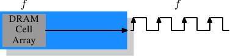
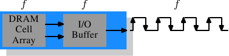
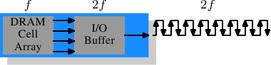
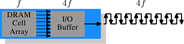

# 2.2.4. 内存类型

值得花一些时间看看当前以及即将投入使用的内存类型。我们将从 SDR（单倍数据速率，Single Data Rate）SDRAM 开始，因为它们是 DDR（双倍数据速率，Double Data Rate）SDRAM 的基础。SDR 相当简单：存储单元速度与数据传输速率相同。

*图 2.10：SDR SDRAM 的运作*

在图 2.10 中，DRAM 存储单元数组可以用与内存总线传输速率相同的速率输出内存内容。如果 DRAM 存储单元数组可以在 100MHz 下工作，那么单个存储单元所在总线的数据传输率就是 100Mb/s。所有组件的频率 $f$ 都相同。提高 DRAM 芯片吞吐量（throughput）的代价很高，因为能耗会随频率上升而增加。面对数量庞大的数组单元，这种成本高到难以承受。[^11]实际上问题还更严重，因为提高频率通常还需要提高电压，以维持系统稳定性。DDR SDRAM（后来追称为 DDR1）设法在不提高任何相关频率的情况下提升吞吐量。

*图 2.11：DDR1 SDRAM 的运作*

从图 2.11 可以看出，也可以从名称推测出，SDR 与 DDR1 的差异在于每个周期传输的数据量翻倍。也就是说，**DDR1 芯片会在上升沿和下降沿都传输数据**。这有时称为“双倍泵送（double-pumped）”总线。为了在不提高存储单元数组频率的情况下做到这一点，必须引入一个缓冲区（buffer）。这个缓冲区在每条数据线上保存两个 bit。这又要求图 2.7 中存储单元数组的数据总线由两条线路组成。实现方式很简单：只需要对两个 DRAM 存储单元使用相同的列地址，并并行访问它们。为实现这一点，对存储单元数组所需的修改也很小。

SDR DRAM 只是直接用频率来命名（例如 PC100 表示 100MHz SDR）。为了让 DDR1 DRAM 听起来更好，市场人员必须想出新方案，因为频率并没有改变。他们提出的名称包含 DDR 模块（拥有 64 bit 总线）能够维持的、以 byte 为单位的传输率：

$$
100\text{MHz} \times 64\text{bit} \times 2 = 1,600\text{MB/s}
$$

于是，一个频率为 100MHz 的 DDR 模块被称为 PC1600。因为 1600 > 100，所有营销需求都得到了满足；它听起来好得多，尽管实际提升只是两倍。[^12]

*图 2.12：DDR2 SDRAM 的运作*

为了进一步挖掘内存技术的潜力，DDR2 又加入了一些创新。从图 2.12 可以看到，最明显的变化是总线频率翻倍。频率翻倍意味着带宽翻倍。由于让存储单元数组频率翻倍并不经济，现在需要 I/O 缓冲区在每个时钟周期获取四个 bit，然后再送到总线上。这意味着 DDR2 模块的变化只在于让 DIMM 的 I/O 缓冲区组件能够以更高速度运行。这当然可行，而且不会明显增加能耗，因为它只是一个很小的组件，而不是整个模块。市场人员为 DDR2 想出的名称与 DDR1 名称类似，只是在计算数值时把乘以二改为乘以四（现在我们有一条四倍泵送〔quad-pumped〕总线）。表 2.1 显示了如今使用的模块名称。

| 数组频率 | 总线频率 | 数据速率 | 名称（速率） | 名称（FSB） |
| --- | --- | --- | --- | --- |
| 133MHz | 266MHz | 4,256MB/s | PC2-4200 | DDR2-533 |
| 166MHz | 333MHz | 5,312MB/s | PC2-5300 | DDR2-667 |
| 200MHz | 400MHz | 6,400MB/s | PC2-6400 | DDR2-800 |
| 250MHz | 500MHz | 8,000MB/s | PC2-8000 | DDR2-1000 |
| 266MHz | 533MHz | 8,512MB/s | PC2-8500 | DDR2-1066 |

*表 2.1：DDR2 模块名称*

命名上还有一个转折。CPU、主板和 DRAM 模块所使用的 FSB 速度，是用*有效*频率来指定的。也就是说，它把时钟周期两个边沿上的传输都计算进去，从而抬高数字。因此，一个拥有 266MHz 总线的 133MHz 模块，其 FSB“频率”为 533MHz。

沿着转向 DDR2 的方向，DDR3（真正的 DDR3，而不是显卡中使用的伪 GDDR3）规范要求更多变化。电压将从 DDR2 的 1.8V 降至 DDR3 的 1.5V。由于功耗公式使用电压的平方进行计算，单这一项就带来 30% 的改善。再加上裸片（die）尺寸缩小以及其他电气改进，DDR3 可以在相同频率下把功耗降到一半；或者在相同功率包络（envelope）内达到更高频率；又或者在相同散热量下实现两倍容量。

DDR3 模块的存储单元数组会以外部总线四分之一的速度运行，因此需要把 DDR2 的 4 bit I/O 缓冲区扩大到 8 bit。示意图见图 2.13。

*图 2.13：DDR3 SDRAM 的运作*

起初，DDR3 模块的 $\overline{\text{CAS}}$ 延迟可能会略高一些，仅仅因为 DDR2 技术更加成熟。这会导致 DDR3 只有在频率高于 DDR2 可达到频率时才有用；即便如此，也主要是在带宽比延迟更重要的时候才有意义。已经有关于 1.3V 模块的讨论，称其可以达到与 DDR2 相同的 $\overline{\text{CAS}}$ 延迟。无论如何，由更快总线带来的更高速度潜力，将超过增加的延迟。

DDR3 的一个潜在问题是，当传输率达到 1,600Mb/s 或更高时，每个通道的模块数量可能会减少到只有一个。在早期版本中，所有频率都有这个要求，所以可以期待某个时候这一要求会对所有频率取消。否则，系统容量会受到严重限制。

表 2.2 列出了我们很可能会看到的 DDR3 模块名称。JEDEC 目前已经同意前四种类型。鉴于 Intel 的 45nm 处理器拥有速度为 1,600Mb/s 的 FSB，1,866Mb/s 类型是超频市场所需要的。随着 DDR3 生命周期推进，我们很可能会看到更多此类产品。

| 数组频率 | 总线频率 | 数据速率 | 名称（速率） | 名称（FSB） |
| --- | --- | --- | --- | --- |
| 100MHz | 400MHz | 6,400MB/s | PC3-6400 | DDR3-800 |
| 133MHz | 533MHz | 8,512MB/s | PC3-8500 | DDR3-1066 |
| 166MHz | 667MHz | 10,667MB/s | PC3-10667 | DDR3-1333 |
| 200MHz | 800MHz | 12,800MB/s | PC3-12800 | DDR3-1600 |
| 233MHz | 933MHz | 14,933MB/s | PC3-14900 | DDR3-1866 |

*表 2.2：DDR3 模块名称*

所有 DDR 内存都有一个问题：总线频率提高后，构建并行数据总线会变得困难。DDR2 模块有 240 个引脚。所有连接到数据和地址引脚的走线都必须规划得长度大致相同。更大的问题是，如果同一条总线上菊花链（daisy-chain）连接了超过一个 DDR 模块，那么每增加一个模块，信号都会变得更加失真。DDR2 规范每条总线（也称通道）只允许两个模块，DDR3 规范在高频下只允许一个模块。每个通道有 240 个引脚，因此单个北桥很难合理驱动超过两个通道。替代方案是使用外部内存控制器（如图 2.2），但这代价高昂。

这意味着商用主板最多只能安装四个 DDR2 或 DDR3 模块。这个限制严重限制了系统可以拥有的内存总量。即使老旧的 32 bit IA-32 处理器也能处理 64GB RAM，而且即便是家用场景，内存需求也在持续增长，所以必须采取一些措施。

一种解决办法是如第二节所述，把内存控制器加入每个处理器。AMD 的 Opteron 系列就是这样做的，Intel 也将通过其 CSI 技术做到这一点。只要处理器能够使用的合理内存容量可以连接到单个处理器上，这种方式就会有帮助。在某些情况下并非如此，而这种设置会引入 NUMA 架构及其负面影响。对于某些场景，还需要其他解决方案。

Intel 针对大型服务器机器的解决方案，至少目前，被称为全缓冲 DRAM（Fully Buffered DRAM，FB-DRAM）。FB-DRAM 模块使用与如今 DDR2 模块相同的内存芯片，这使其生产成本相对较低。差异在于它与内存控制器的连接方式。FB-DRAM 使用的不是并行数据总线，而是串行总线（Rambus DRAM 当年也采用过这种方式；SATA 之于 PATA、PCI Express 之于 PCI/AGP 也是类似演进）。串行总线可以在高得多的频率下驱动，从而抵消串行化的负面影响，甚至提高带宽。使用串行总线的主要影响是：

1. 每个通道能使用更多模块。
2. 每个北桥／内存控制器可以使用更多通道。
3. 串行总线被设计为全双工（fully-duplex）（两条线）。
4. 实现差分（differential）总线（每个方向两条线）的成本足够低，因此可以提高速度。

相比 DDR2 的 240 个引脚，一个 FB-DRAM 模块只有 69 个引脚。由于可以更好地处理总线的电气影响，菊花链连接 FB-DRAM 模块要简单得多。FB-DRAM 规范允许每个通道最多连接 8 个 DRAM 模块。

与双通道北桥的连接需求相比，现在可以用更少的引脚驱动 6 个 FB-DRAM 通道：2 × 240 个引脚对比 6 × 69 个引脚。每个通道的布线更简单，这也有助于降低主板成本。

对传统 DRAM 模块来说，全双工并行总线成本高到难以承受，因为复制所有线路的代价太高。串行线路则不同，即使是 FB-DRAM 所要求的差分线路也是如此。因此，串行总线被设计成全双工，这意味着在某些情况下，仅凭这一点理论上就能使带宽翻倍。但这不是唯一利用并行性提升带宽的地方。由于一个 FB-DRAM 控制器可以同时运行多达六个通道，即使在 RAM 容量较小的系统中，使用 FB-DRAM 也可以提高带宽。一个带四个模块的 DDR2 系统有两个通道，而相同容量可以通过普通 FB-DRAM 控制器用四个通道处理。串行总线的实际带宽取决于 FB-DRAM 模块上使用的 DDR2（或 DDR3）芯片类型。

我们能像这样总结优点：

 X | DDR2 | FB-DRAM
--- | --- | ---
针脚数 | 240 | 69
通道数 | 2 | 6
DIMM 数／通道数 | 2 | 8
最大内存[^13] | 16GB[^14] | 192GB
吞吐量[^15] | ~10GB/s | ~40GB/s

如果在一个通道上使用多个 DIMM，FB-DRAM 也有一些缺点。链中的每个 DIMM 都会引入信号延迟，尽管延迟很小，但仍会增加等待时间。第二个问题是，驱动串行总线的芯片需要大量能量，因为频率非常高，而且还需要驱动总线。不过，在相同内存容量和相同频率下，FB-DRAM 总是可以比 DDR2 和 DDR3 更快，因为最多四个 DIMM 中每个都可以拥有自己的通道；对于大型内存系统，DDR 使用商用组件时根本没有对应解决方案。

[^11]: 功率 = 动态电容 × 电压2 × 频率

[^12]: 我会接受二倍这个倍率，但我不必喜欢这种膨胀的数字。

[^13]: 假设为 4GB 模块。

[^14]: 一份 Intel 的简报 ── 基于某些我不理解的原因 ── 说是 8GB...

[^15]: 假设为 DDR2-800 模块。
