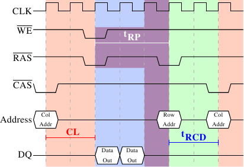

# 2.2.2. 预充电与激活

图 2.8 未涵盖整个周期。它只显示出访问 DRAM 的完整循环的一部分。在可以发送新的 $\overline{\text{RAS}}$ 信号之前，必须无效化（deactivate）目前锁上的列，并对新的列预充电（precharge）。这里我们仅聚焦在通过明确命令来执行的情况。有些协议上的改进 ── 在某些情况下 ── 可以避免这个额外步骤。不过由预充电引入的延迟仍然会影响操作。

<figure>
  
  <figcaption>图 2.9：SDRAM 预充电与激活</figcaption>
</figure>

图 2.9 示意从 $\overline{\text{CAS}}$ 信号开始、到另一列的 $\overline{\text{CAS}}$ 信号为止的活动。与先前一样，经过 CL 周期后，便可以取得以第一个 $\overline{\text{CAS}}$ 信号请求的数据。在这个例子中，请求两个 word，其 ── 在一个简易的 SDRAM 上 ── 花了两个周期来传输。也可以想象成是在一张 DDR 芯片上传输四个 word。

即使在命令速率为 1 的 DRAM 模块上，也无法立即发出预充电命令。它必须等待与传输数据一样长的时间。在这个例子中，它花了两个循环。虽然与 CL 相同，但这只是巧合。预充电信号没有专用的线路；有些实现是通过同时降低允写（Write Enable，$\overline{\text{WE}}$）与 $\overline{\text{RAS}}$ 的电位来发出这个命令。这个组合本身没什么特别意义（编码细节见 [18]）。

一旦发出预充电命令，它会花费 **tRP**（列预充电时间）个周期，直到行能被选取为止。在图 2.9 中，大部分的时间（以紫色标示）与 memory 传输时间（浅蓝）重叠。这满好的！但 tRP 比传输时间还长，所以下一个 $\overline{\text{RAS}}$ 信号会被延误一个周期。

假使我们延伸图表的时间轴，我们会发现下一次数据传输发生在前一次停止的 5 个周期之后。这表示在七个周期中，只有两个周期有用到数据总线。将这乘上 FSB 的速度，对 800MHz 总线而言，理论上的 6.4GB/s 就变成 1.8GB/s。这太糟，而且必须避免。在第六节描述的技术能帮忙提升这个数字。程序开发者通常也得尽一份力。

对于 SDRAM 模块，还有一些没有讨论过的时间值。在图 2.9 中，预充电命令受限于数据传输时间。另一个限制是，在 $\overline{\text{RAS}}$ 信号之后，SDRAM 模块需要一些时间才可以为另一行预充电（记作 **tRAS**）。这个数字通常非常大，为 tRP 值的两到三倍。假如 ── 在 $\overline{\text{RAS}}$ 信号之后 ── 只有一个 $\overline{\text{CAS}}$ 信号，并且数据传输在少数几个周期内就完成，这就是问题。假设在图 2.9 中，起始的 $\overline{\text{CAS}}$ 信号是直接接在 $\overline{\text{RAS}}$ 信号之后，并且 tRAS 为 8 个周期。预充电命令就必须要延迟一个额外的周期，因为 tRCD、CL、与 tRP（因为它比数据传输时间还长）的总和只有 7 个周期。

DDR 模块经常以一种特殊的标记法描述：w-x-y-z-T。举例来说：2-3-2-8-T1。这代表：

| 标记 | 示例值 | 含义 |
| --- | --- | --- |
| w | 2 | $\overline{\text{CAS}}$ 等待时间（CL） |
| x | 3 | $\overline{\text{RAS}}$ 至 $\overline{\text{CAS}}$ 等待时间（tRCD） |
| y | 2 | $\overline{\text{RAS}}$ 预充电（tRP） |
| z | 8 | 激活至预充电延迟（tRAS） |
| T | T1 | 命令速率 |

还有许多其他会影响命令的发送或处理方式的时间常数。不过在实践上，这五个常数就足以判定模块的性能。

知道这些关于电脑的信息，有时有助于解释某些测量结果。购买电脑的时候，知道这些细节显然是有用的，因为它们 ── 以及 FSB 与 SDRAM 模块的速度 ── 是决定一台电脑速度的最重要因素。

非常大胆的读者也可以试着调校（tweak）系统。有时候 BIOS 允许修改某些或者全部的值。SDRAM 模块拥有可以设置这些值的可程序化寄存器（register）。通常 BIOS 会挑选最佳的默认值。如果 RAM 模块的品质很好，可能可以在不影响电脑稳定性的前提下降低某些延迟。网络上众多的超频网站提供大量的相关文件。尽管如此，请自行承担风险，可别说你没被警告过。
