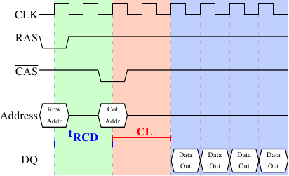

# 2.2.1. 读取协议

*图 2.8：SDRAM 读取时序*

图 2.8 显示了 DRAM 模块上一些连接器的活动，这些活动发生在三个以不同颜色标出的阶段中。像往常一样，时间从左向右流动。许多细节被省略了；这里我们只讨论总线时钟、$\overline{\text{RAS}}$ 与 $\overline{\text{CAS}}$ 信号，以及地址总线和数据总线。读取周期开始时，内存控制器会把行地址放到地址总线上，并拉低 $\overline{\text{RAS}}$ 信号。所有信号都会在时钟（CLK）的上升沿（rising edge）读取，因此只要信号在被读取时稳定，即使并非完全方波也没有关系。设置行地址会使 RAM 芯片开始锁存（latch）被寻址的行。

经过 **tRCD**（$\overline{\text{RAS}}$ 到 $\overline{\text{CAS}}$ 的延迟）个时钟周期之后，就可以发送 $\overline{\text{CAS}}$ 信号。此时列地址通过放到地址总线上并拉低 $\overline{\text{CAS}}$ 线来传输。这里可以看到，地址的两个部分（大致是两半；其他划分方式没有意义）如何通过同一条地址总线传输。

现在寻址已经完成，可以传输数据了。RAM 芯片需要一些时间来准备数据。这个延迟通常称为 $\overline{\text{CAS}}$ 延迟（$\overline{\text{CAS}}$ Latency，**CL**）。在图 2.8 中，$\overline{\text{CAS}}$ 延迟为 2。这个值可以更高或更低，取决于内存控制器、主板和 DRAM 模块的质量。延迟也可以是半周期值。当 CL=2.5 时，第一份数据会在蓝色区域的第一个*下降沿*可用。

经过这些准备才获取数据，如果只传输一个数据字（word）就太浪费了。因此，DRAM 模块允许内存控制器指定要传输多少数据。常见选择是 2、4 或 8 个数据字。这使得缓存中的整行（line）可以在不发出新的 $\overline{\text{RAS}}$／$\overline{\text{CAS}}$ 序列的情况下被填满。内存控制器也可以在不重置行选择的情况下发送新的 $\overline{\text{CAS}}$ 信号。这样，连续的内存地址就可以明显更快地读取或写入，因为不必发送 $\overline{\text{RAS}}$ 信号，也不必停用（deactivate）该行（见下文）。内存控制器必须决定是否让这一行保持“打开（open）”。在真实应用中，推测性地一直让它保持打开会有缺点（见 [3]）。发送新的 $\overline{\text{CAS}}$ 信号只受 RAM 模块命令速率（Command Rate）限制（通常写作 T*x*，其中 *x* 是 1 或 2 这样的值；高性能 DRAM 模块若每个周期都能接受新命令，则该值为 1）。

在这个例子中，SDRAM 每个周期输出一个数据字。第一代 SDRAM 就是这样工作的。DDR 可以在每个周期传输两个数据字。这会缩短传输时间，但不会改变延迟。原则上 DDR2 的工作方式相同，尽管实际表现看起来不同。这里没有必要深入细节；只需要注意，DDR2 可以做得更快、更便宜、更可靠，也更节能（更多信息见 [6]）。
