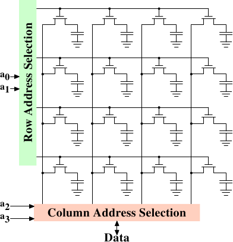

# 2.1.3. DRAM 访问

一支程序使用虚拟地址（virtual address）来选择 memory 位置。处理器将其转换（translate）成物理地址（physical address），最终由 memory 控制器选择对应于这个地址的 RAM 芯片。为了选择 RAM 芯片中的个别记忆单元，物理地址的一部分会以数条地址线（address line）的形式被传递进去。

由 memory 控制器个别寻址（address）memory 位置是极为不切实际的：4GB 的 RAM 会需要 232 条地址线。作为替代，地址会使用较小的一组地址线，编码成二进制数值传递。以这种方式传递到 DRAM 芯片的地址必须先被多路分解（demultiplex）。有 $N$ 条地址线的解复用器（demultiplexer）将会有 $2^N$ 条输出线（output line）。这些输出线能被用以选择记忆单元。对于小容量的芯片而言，使用这种直接的方法是没什么大问题的。

但假如记忆单元的数量增加，这个方法就不再合适。一个 1Gbit[^6] 容量的芯片将会需要 30 条地址线以及 230 选择线（select line）。在不牺牲速度的前提下，解复用器的大小会随着输入线（input line）的数量以指数成长。用于 30 条地址线的解复用器需要大量的芯片空间，外加解复用器的（尺寸与时间）复杂度。更重要的是，同时在地址线上传输 30 个脉冲（impulse）比「只」传输 15 个脉冲还要难得多。只有少数的地址线可以用长度完全相同或适当安排时间的方式排版。[^7]

<figure>
  
  <figcaption>图 2.7：动态 RAM 示意图</figcaption>
</figure>

图 2.7 显示了以极高层角度示意的 DRAM 芯片。DRAM 记忆单元被组织在列（row）与行（column）中。虽然它们可以全都排成一列，但 DRAM 芯片会因而需要一个庞大的解复用器。通过数组（array）的方式，便可以用各为**一半大小**的一个解复用器与一个多路复用器达到这种目的。[^8]这从各方面来说都是个大大的节约。在这个例子中，地址线 $\mathbf{a_{0}}$ 与 $\mathbf{a_{1}}$ 通过行地址选择（row address selection）（$\overline{\text{RAS}}$）[^9]解复用器选择一整列记忆单元的地址线。在读取时，所有记忆单元的内容都可以被*列地址选择（column address selection）*多路复用器（multiplexer）（$\overline{\text{CAS}}$）取得。基于地址线 $\mathbf{a_{2}}$ 与 $\mathbf{a_{3}}$，其中一列的内容便可以提供给 DRAM 芯片的数据针脚（pin）。这会在许多 DRAM 芯片上并行地发生多次，以产生对应于数据总线宽度的所有 bit。

对于写入操作，新的记忆单元的值会被置于数据总线中，然后 ── 当记忆单元通过 $\overline{\text{RAS}}$ 与 $\overline{\text{CAS}}$ 选取时 ── 存储到数据单元中。相当直观的设计。这实际上有着显然地更多的困难。需要规范发出信号之后，在数据可以由数据总线读取之前有多少延迟。如同上节所述，电容无法立即充放电。来自于记忆单元的信号太微弱了，以致于它非得被放大（amplify）不可。对于写入操作，必须指定设置完 $\overline{\text{RAS}}$ 与 $\overline{\text{CAS}}$ 之后，数据必须在总线维持多久，才可以成功地在记忆单元中存储新值（再提醒一次，电容不会立即被充放电）。这些时间常数（constant）对于 DRAM 芯片的性能而言是至关重要的。我们将会在下一节讨论这些。

一个次要的可扩展性问题是，令 30 条地址线都连接到每个 RAM 芯片也不大可行。一个芯片的针脚是个宝贵的资源。必须尽可能多地并行传输数据（像是一次 64 bit）已经够「糟」。memory 控制器必须可以寻址每个 RAM 模块（module）（RAM 芯片的集合）。假如因为性能因素，需要并行访问多个 RAM 模块，并且每个 RAM 模块需要它所拥有的一组 30 条或者更多条地址线，那么仅为了处理地址，以 8 个 RAM 模块而言，memory 控制器就必须要有多达 240+ 根针脚。

为了克服这些次要的可扩展性问题，DRAM 芯片长期以来必须自行多路复用地址。这代表地址会被转变成两个部分。由地址 bit（图 2.7 的例子中的 $\mathbf{a_{0}}$ 与 $\mathbf{a_{1}}$）组成的第一个部分选取行。这个选择直到撤销之前都会维持有效。接着第二个部分，地址 bit $\mathbf{a_{2}}$ 与 $\mathbf{a_{3}}$，选取列。决定性的差异在于，只需要两条外部的地址线。[^译注]需要额外一些少量的线路来代表能否取得 $\overline{\text{RAS}}$ 与 $\overline{\text{CAS}}$ 的线路，但这对于减半地址线来说，这只是个很小的代价。不过，这种地址多路复用带来了一些自身的问题。我们将会在 2.2 节讨论这些问题。

[^6]: 我厌恶这些 [SI 前缀（prefix）](https://www.nist.gov/pml/weights-and-measures/metric-si-prefixes)。对我来说一个 giga-bit 永远是 230 而非 109 bit。

[^7]: 现代 DRAM 类型（如 DDR3）可以自动调整时序，但可以容忍的范围有限。

[^8]: 多路复用器与解复用器是对等的，并且这里的多路复用器在写入时需要如解复用器一般运作。所以从现在开始我们要忽略其差异。

[^9]: 名字上的线表示信号是反相的（negated）。

[^译注]: 这里的意思单看字面可能比较难理解。以图 2.7 为例，memory 由 4 × 4 的记忆单元组成。对外仅提供两条地址线。在选择记忆单元时，首先由两条外部地址线指定列，并将结果暂存起来。接着，再利用同样的两条外部地址线指定行。便可以只用两条外部地址线来指定 16 个记忆单元中的一个。详见 2.2 节。
