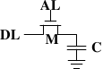
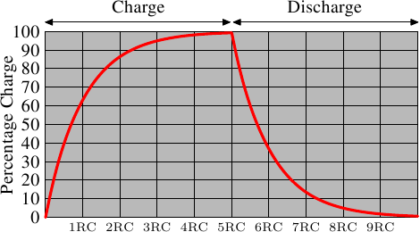

# 2.1.2. 动态 RAM

动态 RAM 在结构上比静态 RAM 简单许多。图 2.5 展示了常见 DRAM 存储单元的设计结构。它只由一个晶体管和一个电容（capacitor）组成。复杂度上的巨大差异，自然意味着它的工作方式与静态 RAM 非常不同。

*图 2.5：1-T 动态 RAM*

一个动态 RAM 存储单元会把状态保存在电容 $\mathbf{C}$ 中。晶体管 $\mathbf{M}$ 用于控制对这个状态的访问。为了读取存储单元的状态，需要拉高访问线 $\mathbf{AL}$（access line）；这会根据电容中的电荷，使电流流过数据线（data line）$\mathbf{DL}$，或者不产生电流。要写入存储单元，则要先适当地设置数据线 $\mathbf{DL}$，然后拉高 $\mathbf{AL}$ 足够长的时间，以便给电容充电或放电。

动态 RAM 的设计有许多复杂之处。**使用电容意味着读取存储单元会使电容放电。这个过程无法无限重复，必须在某个时刻给电容重新充电**。更糟的是，为了容纳大量存储单元（如今芯片包含 109 个或更多存储单元已经很常见），电容的电容值必须很低（在飞法〔femto-farad，10-15 法拉〕范围内，甚至更低）。完全充电后的电容只保存几万个电子。尽管电容的电阻很高（几太欧姆），电荷耗散仍然只需要很短时间。这个问题称为“漏电（leakage）”。

这种漏电就是 DRAM 存储单元必须持续刷新的原因。对如今大多数 DRAM 芯片来说，这种刷新必须每 64ms 发生一次。在刷新周期内无法访问内存，因为刷新本质上就是一次丢弃结果的内存读取操作。对某些工作负载而言，这个额外开销可能会阻塞多达 50% 的内存访问（见 [3]）。

第二个由微小电荷造成的问题是，从存储单元读取的信息无法直接使用。数据线必须连接到感测放大器（sense amplifier），它能够在仍应计为 1 的整个电荷范围内，区分存储的是 0 还是 1。

第三个问题是，读取存储单元会耗尽电容的电荷。这意味着每次读取操作之后，都必须跟着执行一次给电容重新充电的操作。这可以通过把感测放大器的输出反馈回电容来自动完成。不过，这也意味着读取内存内容需要额外能量，而且更重要的是需要额外时间。

第四个问题是，给电容充电和放电并不是瞬时完成的。由于感测放大器接收到的信号不是矩形波，因此必须保守估计何时才能使用存储单元的输出。电容充电和放电的公式为：

$$
\begin{aligned}
Q_{\text{Charge}}(t) &= Q_{0}(1 - e^{-\frac{t}{RC}})
\\
Q_{\text{Discharge}}(t) &= Q_{0} e^{-\frac{t}{RC}}
\end{aligned}
$$

这意味着电容充电或放电需要一些时间（由电容值 C 和电阻 R 决定）。这也意味着感测放大器可检测到的电流不会立即出现。图 2.6 显示了充电与放电曲线。X 轴以 RC（电阻乘以电容值）为单位，这是一种时间单位。

*图 2.6：电容充电与放电时间*

**与静态 RAM 在字访问线被拉高时几乎立即给出输出不同，动态 RAM 总要花一点时间等待电容充分放电。这个延迟严重限制了 DRAM 能达到的速度。**

这种简单方法也有优点。最主要的优点是尺寸。一个 DRAM 存储单元所需的芯片面积比一个 SRAM 存储单元小许多倍。SRAM 存储单元还需要为维持状态的晶体管单独供电。DRAM 存储单元的结构也更简单、更规则，这意味着在裸片上紧密排列大量存储单元会更容易。

总的来说，（相当显著的）成本差异胜出了。除了网络路由器等专用硬件之外，我们必须接受基于 DRAM 的主内存。这对程序员有巨大影响，本文余下部分会讨论这些影响。不过首先，我们还需要再看一些实际使用 DRAM 存储单元时的细节。
