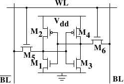

# 2.1.1. 静态 RAM

*图 2.4：6-T 静态 RAM*

图 2.4 展示了一个由 6 个晶体管（transistor）构成的 SRAM 存储单元（cell）的结构。这个存储单元的核心由四个晶体管 $\mathbf{M_{1}}$ 到 $\mathbf{M_{4}}$ 构成，它们形成两个交叉耦合（cross-coupled）的反相器（inverter）。它们有两个稳定状态，分别表示 0 与 1。只要 $\mathbf{V_{dd}}$ 上有电源供电，状态就是稳定的。

如果需要访问存储单元的状态，就拉高字访问线（word access line）$\mathbf{WL}$。这会使存储单元的状态几乎立刻在 $\mathbf{BL}$ 与 $\overline{\mathbf{BL}}$ 上可供读取。如果必须覆盖存储单元的状态，则要先将 $\mathbf{BL}$ 与 $\overline{\mathbf{BL}}$ 线路设为期望值，然后再拉高 $\mathbf{WL}$。由于外部驱动器（driver）强于四个晶体管（$\mathbf{M_{1}}$ 到 $\mathbf{M_{4}}$），旧状态便可以被覆盖。

关于存储单元工作方式的更详细描述，请见 [20]。对接下来的讨论来说，需要注意的重点是：

* 一个存储单元需要六个晶体管。也有四个晶体管的变体，但它们有一些缺点。
* 维持存储单元的状态需要持续供电。
* 一旦字访问线 $\mathbf{WL}$ 被拉高，存储单元的状态几乎可以立即读取。这个信号和其他由晶体管控制的信号一样接近矩形（rectangular），会在两个二进制状态之间快速变化。
* 存储单元的状态是稳定的，不需要刷新周期（refresh cycle）。

也存在其他形式的 SRAM，它们更慢但功耗更低。不过，由于我们关注的是高速 RAM，所以这里不讨论这些形式。这些较慢的变体之所以值得关注，主要是因为它们接口更简单，比动态 RAM 更容易用于系统中。
