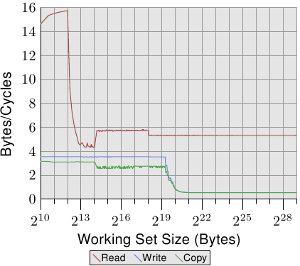
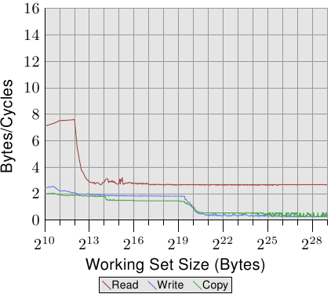
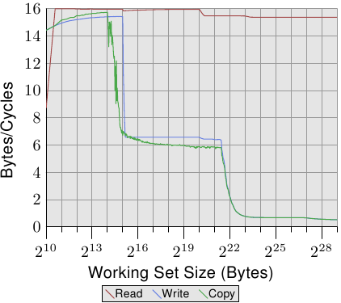
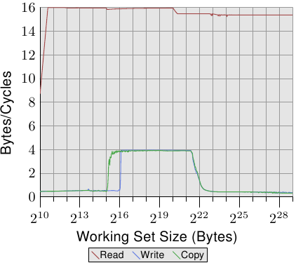
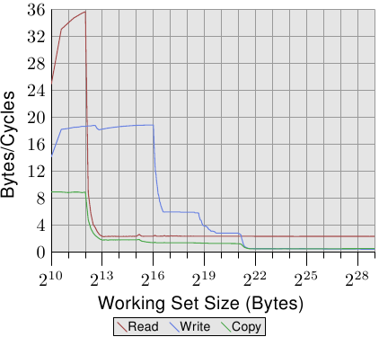
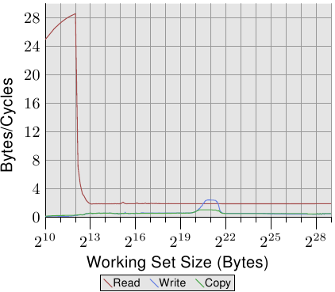

# 3.5.1. cache 与内存带宽

为了更好地理解处理器的能力，我们要测量在最理想情况下的可用带宽。这个测量格外有趣，因为不同处理器版本的差异很大。这就是本节充满着数个不同机器数据的原因。测量性能的程序使用 x86 与 x86-64 处理器的 SSE 指令以同时加载或存储 16 byte。就如同我们的其他测试一样，工作集从 1kB 增加到 512MB，并测量每个周期可以加载或存储多少 byte。

*图 3.24：Pentium 4 的带宽*

图 3.24 显示在一台 64 bit Intel Netburst 处理器上的性能。对于可以塞进 L1d 的工作集大小，处理器每个周期可以读取完整的 16 byte –– 即，每个周期执行一次加载指令（`movaps` 指令一次搬移 16 byte）。测试不会对读取的数据做任何事，我们测试的仅有读取指令本身。一旦 L1d 不再足够，性能就立刻大幅地降低到每周期少于 6 byte。在 218 的一步是因为 DTLB cache 的枯竭，表示每个新页的额外工作。由于读取是顺序的，预取可以完美地预测访问，并且对于所有工作集大小，FSB 能以大约每周期 5.3 byte 传输内存内容。不过，预取的数据不会传播到 L1d。这些当然是真实程序中永远无法达到的数字。将它们想成实际上的极限吧。

比起读取的性能，令人更为吃惊的是写入与复制的性能。写入的性能 –– 即便对于很小的工作集大小 –– 始终不会上升到每周期 4 byte 以上。这暗示着，在这些 Netburst 处理器上，Intel 为 L1d 选择使用直写模式，其中的性能显然受限于 L2 的速度。这也代表复制测试 –– 其从一个内存区域复制到第二个、不重叠的内存区域 –– 的性能并没有显着地变差。所需的读取操作要快得多，并且可以与写入操作部分重叠。写入与复制测量中，最值得注意的细节是，当 L2 cache 不再足够时的低性能。性能跌落到每周期 0.5 byte ！这表示写入操作比读取操作慢十倍。这意味着，对于这个程序的性能而言，优化那些操作是更加重要的。

*图 3.25：有着 2 条 HT 的 P4 带宽*

在图 3.25 中，我们看到在相同处理器上、但以两条线程执行的结果，每条线程各自归属于处理器的两条 HT 的其中一条上。这张图表与前一张使用相同的刻度，以阐明两者的差异。曲线有些微抖动，仅是因为测量两条并行线程的问题。结果如同预期。由于 HT 共享寄存器以外的所有资源，每条线程都只有一半的 cache 与可用带宽。这表示，即使每条线程都必须等待很久、并可以将执行时间拨给另一条线程，这也没有造成任何不同，因为另一条线程也必须等待内存。这忠实地显示使用 HT 的最差情况。

*图 3.26：Core 2 的带宽*

*图 3.27：有着 2 条 HT 的 Core 2 带宽*

对比图 3.24 与图 3.25，对于 Intel Core 2 处理器，图 3.26 与 3.27 的结果看起来差异甚大。这是一个有着共享 L2 的双核处理器，其 L2 是 P4 机器上的 L2 的四倍大。不过，这只解释写入与复制性能延后下降的原因。

有另一个、更大的不同。整个工作集范围内的读取性能停留在大约是最佳的每周期 16 byte。读取性能在 220 byte 之后的下降同样是因为工作集对 DTLB 来说太大。达到这么高的数字代表处理器不仅可以预取数据、还及时传输数据。这也代表数据被预取至 L1d 中。

写入与复制的性能也大为不同。处理器没有直写策略；写入的数据被存储在 L1d 中，而且仅会在必要时逐出。这使得写入速度接近于最佳的每周期 16 byte。一旦 L1d 不再足够，性能便显着地降低。如同使用 Netburst 处理器的情况，写入的性能显着地降低。由于读取性能很高，这里的差距甚至更大。事实上，当 L2 也不再足够时，速度差异甚至提升到 20 倍！这不代表 Core 2 处理器表现得很糟。相反的，它们的性能一直都比 Netburst 处理器核还好。

在图 3.27 中，测试执行两条线程，各自在 Core 2 处理器两颗处理器核的其中一颗上。两条线程都访问相同的内存，不过不需要完美地同步。读取性能的结果跟单线程的情况没什么不同。看得到稍微多一点的抖动，这在任何多线程的测试案例里都在预期之中。

有趣的一点是，对于能塞进 L1d 的工作集大小的写入与复制性能。如同图中能看到的，性能就像是数据必须从主内存读取一样。两条线程都争夺着相同的内存位置，因而必须送出 cache 行的 RFO 消息。麻烦之处在于，即使两颗处理器核共享 cache，这些请求也不是以 L2 cache 的速度处理。一旦 L1d cache 不再足够，被修改的项目会从每颗处理器核的 L1d 刷新到共享的 L2。这时，由于 L1d 未命中被 L2 cache 所弥补、而且只有在数据还没被刷新时才需要 RFO 消息，性能便显着地增加。这就是我们看到，对于这些工作集大小，速度降低 50% 的原因。这个渐近行为如同预期一般：由于两颗处理器核共享相同的 FSB，每颗处理器核会得到一半的 FSB 带宽，这表示对于大工作集而言，每条线程的性能大约是单线程时的一半。

*图 3.28：AMD 10h 家族 Opteron 的带宽*

即使同个供应商的处理器版本之间都有显着的差异，所以当然也值得看看其他供应商的处理器性能。图 3.28 显示一个 AMD 10h 家族 Opteron 处理器的性能。这个处理器拥有 64kB L1d、512kB L2、以及 2MB 的 L3。L3 cache 被处理器的所有核所共享。性能测试的结果能在图 3.28 看到。

注意到的第一个关于数字的细节是，假如 L1d cache 足够的话，处理器每个周期可以处理两条指令。读取性能超过每周期 32 byte，甚至连写入性能都很高 –– 每周期 18.7 byte。不过，读取的曲线立刻就掉下去，而且非常低 –– 每周期 2.3 byte。对于这个测试，处理器没有预取任何数据，至少不怎么有效率。

另一方面，写入曲线的表现则取决于不同 cache 的大小。在 L1d 全满时达到性能高峰，于 L2 降到 6 byte，于 L3 降到 2.8 byte，最后在连 L3 也无法容纳所有数据时，降到每周期 .5 byte。在 L1d cache 时的性能超越（较旧的）Core 2 处理器，L2 访问一样快（因为 Core 2 有个比较大的 cache），而 L3 与主内存访问则比较慢。

复制的性能无法比读取或写入的性能还要来得好。这就是我们看到，这条曲线起初被压在读取性能下面、而后又被压在写入性能下面的原因。

*图 3.29：有着 2 条 HT 的 AMD 10h 家族的带宽*

Opteron 处理器的多线程性能显示于图 3.29。读取性能基本上不受影响。每条线程的 L1d 与 L2 如先前一般运作，而在这个例子下的 L3 cache 也没预取得很好。两条线程没有因其目的而过分地压榨 L3。在这个测试中的大问题是写入的性能。所有线程共享的数据都得通过 L3 cache。这种共享看起来非常没有效率，因为即使 L3 cache 的大小足以容纳整个工作集，成本也远大于一次 L3 访问。将这张图与图 3.27 相比，我们看到在适当的工作集大小范围中，Core 2 处理器的两条线程是以共享的 L2 cache 的速度来运作的。对于 Opteron 处理器，这种性能水平*只有*在一个非常小范围的工作集大小内才能达到，而即使在这里，它也只能接近 L3 的速度，比 Core 2 的 L2 还慢。

