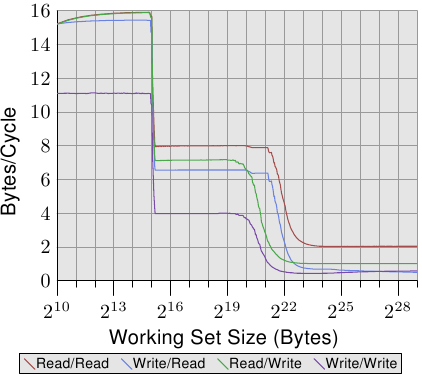

# 3.5.3. cache 的配置

cache 在与 HT 及处理器核的关系中的位置并不在程序开发者的控制之下。但程序开发者可以决定线程要在何处执行，于是 cache 如何与使用的 CPU 共处就变得很重要。

这里我们不会深入在何时选择哪颗处理器核来执行线程的细节。我们只会描述在设置线程的亲和性（affinity）时，程序开发者必须要考虑的架构细节。

HT，根据定义，共享寄存器集以外的所有东西。这包含 L1 cache。这里没什么好说的。有趣之处从一个处理器的个别处理器核开始。每颗处理器核至少拥有它自己的 L1 cache。除此之外，如今共有的细节并不多：

* 早期的多核处理器完全不共享 cache。
* 之后的 Intel 模型的双核处理器拥有共享的 L2 cache。对于四核处理器，我们必须为由两颗处理器核组成的每一对处理个别的 L2 cache。没有更高层次的 cache。
* AMD 的 10h 处理器家族拥有独立的 L2 cache 与一个统一式 L3 cache。

在处理器供应商的宣传品中已经写许多关于它们各自的模型的优点。若是由处理器核处理的工作集并不重叠，拥有不共享的 cache 就有一些优势。这对于单线程程序而言非常有用。由于这仍经常是当下的真实情况，因此这种做法并不怎么差。但总是会有一些重叠的。cache 都包含通用运行期函数库（runtime library）中最活跃使用的部分，代表有一些 cache 空间会被浪费。

与 Intel 的双核处理器一样完全共享 L1 以外的所有 cache 有个大优点。若是在两颗处理器核上的线程工作集有大量的重叠，可用的 cachememory 总量也会增加，工作集也可以更大而不致降低性能。若是工作集没有重叠，Intel 的进阶智慧型 cache（Advanced Smart Cache）管理应该要防止任何一颗处理器核独占整个 cache。

不过，如果两颗处理器核为了它们各自的工作集使用大约一半的 cache，也会有一些冲突。cache 必须不断地掂量两颗处理器核的 cache 使用量，而作为这个重新平衡的一部分而执行的逐出操作可能会选得很差。为了看到这个问题，让我们看看另一个测试程序的结果。

测试程序拥有一个不断 –– 使用 SSE 指令 –– 读取或写入一个 2MB memory 区块的进程。选择 2MB 是因为这是这个 Core 2 处理器的 L2 cache 大小的一半。进程被钉在一颗处理器核上，而第二个进程则被钉在另一颗处理器核上。第二个进程读写一块可变大小的 memory 区域。图表显示每周期被读取或写入的 byte 数。显示四条不同的曲线，每条代表一种进程读取与写入的组合。其中 read/write 曲线代表一个总是写入 2MB 工作集的背景进程，和一个读取可变工作集、用于测量的进程。

<figure>
  
  <figcaption>图 3.31：两个进程的带宽</figcaption>
</figure>

这张图有趣的部分在于 220 与 223 byte 之间。若是两颗处理器核的 L2 cache 完全分离，我们可以预期四个测试的性能全都会在 221 与 222 之间 –– 这表示，L2 cache 耗尽的时候 –– 往下掉。如同我们能在图 3.31 中看到的，情况并非如此。以在背景进程写入的情况而言，这是最明显的。性能在工作集大小达到 1MB 之前就开始下降。两个进程没有共享 memory，因此进程也不会导致 RFO 消息被产生。这纯粹是逐出的问题。智慧型 cache 管理有它的问题，导致感觉到的 cache 大小比起每颗处理器核可用的 2MB，更接近于 1MB。只能期望，若是在处理器核之间共享的 cache 依旧是未来处理器的特征的话，智慧型 cache 管理所使用的演算法会被修正。

有一个拥有两个 L2 cache 的四核处理器仅是可以引入更高层次 cache 之前的权宜之计。比起独立的插槽与双核处理器，这个设计并没有什么显着的性能优势。两颗处理器核通过在外部被视为 FSB 的相同的总线沟通。没有什么特别快的数据交换。

针对多核处理器的 cache 设计的未来将会有更多的层次。AMD 的 10h 处理器家族起个头。我们是否会继续看到被一个处理器核的一个子集所共享的更低层次的 cache 仍有待观察（在 2008 年处理器的世代中，L2 cache 没有被共享）。额外的 cache 层次是必要的，因为高速与频繁使用的 cache 无法被多颗处理器核所共享。性能会受到影响。也会需要非常大的高关联度 cache。cache 大小以及关联度两者都必须随着共享 cache 的处理器核数量而增长。使用一个大的 L3 cache 以及合理大小的 L2 cache 是个适当的权衡。L3 cache 较慢，但它理想上并不如 L2 cache 一样常被使用。

对程序开发者而言，所有这些不同的设计都代表进行调度决策时的复杂性。为了达到最好的性能，必须知道工作负载以及机器架构的细节。幸运的是，我们拥有确定机器架构的依据。这些接口会在之后的章节中介绍。

