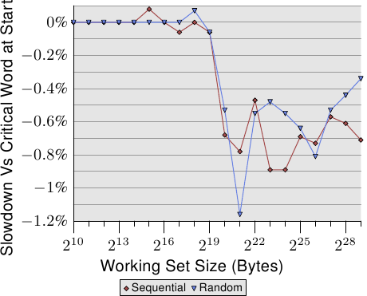

# 3.5.2. 关键数据字加载

内存以比 cache 行大小还小的块从主内存传输到 cache 中。如今是一次传输 64 *bit*，而 cache 行的大小为 64 或 128 *byte*。这表示每个 cache 行需要 8 或 16 次传输。

DRAM 芯片可以用突发（burst）模式传输这些 64 bit 的块。这可以在没有来自内存控制器的额外命令及相应延迟的情况下填满 cache 行。如果处理器预取 cache 行，这可能是最合适的传输方式。

如果一个程序访问数据或 cache 时发生未命中（这表示，这是个强制性 cache 未命中〔compulsory cache miss〕——因为数据是第一次使用、或者是容量性 cache 未命中〔capacity cache miss〕——因为受限的 cache 大小需要逐出 cache 行），情况便不同。程序继续执行所需的 cache 行中的 word 也许不是 cache 行中的第一个 word。即使在突发模式下、并以双倍数据速率来传输，个别的 64 bit 块也会在明显不同的时间点到达。每个块会在前一个块到达之后 4 个 CPU 周期以上到达。如果程序继续执行所需的 word 是 cache 行的第八个，程序就必须在第一个 word 到达之后，等待额外的 30 个周期以上。

事情并不必然非得如此。内存控制器可以用不同的顺序随意请求 cache 行的 word。处理器可以传达程序正在等待哪个 word——即*关键数据字*，而内存控制器可以先请求这个 word。一旦这个 word 到达，程序便可以在 cache 行其余部分到达、并且 cache 还不在一致状态的期间继续执行。这个技术被称为关键数据字优先与提早重新启动（Critical Word First & Early Restart）。

如今的处理器实现这项技术，但有些不可能实现的情况。如果处理器预取数据，并且关键数据字是未知的。万一处理器在预取操作的途中请求这个 cache 行，就必须在不可以影响顺序的情况下，一直等到关键数据字到达为止。

*图 3.30：在 cache 行末端的关键数据字*

即使在适当的地方有了这些优化，关键数据字在 cache 行的位置也很重要。图 3.30 显示顺序与随机访问的 Follow 测试结果。显示的是以用来遍历的指针位于第一个 word 来执行测试，对比指针位于最后一个 word 的情况下的速度减慢的结果。元素大小为 64 byte，与 cache 行的大小一致。数字受到许多杂讯干扰，但可以看到，一旦 L2 不再足以持有工作集大小，关键数据字在末端时的性能立刻就慢约 0.7%。顺序访问似乎受到多一点影响。这与前面提及的、预取下个 cache 行时的问题一致。
