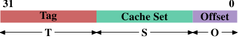
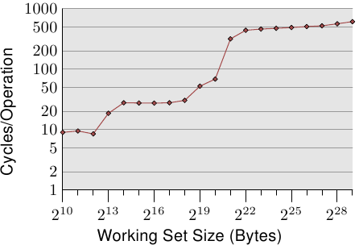

# 3.2. 高层 cache 操作

我们必须结合第二节所学到的机器架构与 RAM 技术、以及前一节所描述的 cache 结构，以了解使用 cache 的开销与节约之处。

默认情况下，由 CPU 核读取或写入的所有数据都存在 cache 中。有些 memory 区域无法被 cache，但只有操作系统实现者得去挂虑这点；这对应用程序开发者而言是不可见的。也有一些指令能令程序开发者刻意地绕过某些 cache。这些将会在第六节中讨论。

假如 CPU 需要一个数据 word ，会先从 cache 开始搜索。显而易见地，cache 无法容纳整个主 memory 的内容（不然我们就不需要要 cache），但由于所有 memory 地址都能被 cache，所以每个 cache 项目（entry）都会使用数据 word 在主 memory 中的地址来*标记（tag）*。如此一来，读取或写入到某个地址的请求便会在 cache 中搜索符合的标签。在这个情境中，地址可以是虚拟或物理的，视 cache 的实现而有所不同。

除了真正的 memory 之外，标签也会需要额外的空间，因此使用一个 word 作为 cache 的粒度（granularity）是很浪费的。对于一台 x86 机器上的一个 32 bit word 而言，标签本身可能会需要 32 bit 以上。再者，由于空间局部性是作为 cache 基础的其中一个原理，不将此纳入考量并不太好。由于邻近的 memory 很可能会一起被用到，所以它也应该一起被加载到 cache 中。也要记得我们在 2.2.1 节所学到的：假如 RAM 模块可以在不需要新的 $\overline{\text{CAS}}$、甚至是 $\overline{\text{RAS}}$ 信号的情况下传输多个数据 word ，这是更有效率的。所以存储在 cache 中的项目并非单一 word ，而是多个连续 word 的「行（line）」。在早期的 cache 中，这些行的长度为 32 byte ；如今一般是 64 byte。假如 memory 总线的宽度是 64 bit，这表示每个 cache 行要传输 8 次。DDR 有效地支持这种传输方式。

当 memory 内容为处理器所需时，整个 cache 行都会被加载到 L1d 中。每个 cache 行的 memory 地址会根据 cache 行的大小，以掩码（mask）地址值的方式来计算。对于一个 64 byte 的 cache 行来说，这表示低 6 bit 为零。舍弃的 bit 则用作 cache 行内的偏移量（offset）[^译注]。剩余的 bit 在某些情况下用以定位 cache 中的行、以及作为标签。在实践上，一个地址值会被切成三个部分。对于一个 32 bit 的地址来说，这看来如下：

一个大小为 $2^{\mathbf{O}}$ 的 cache 行，低 $\mathbf{O}$ bit 用作 cache 行内的偏移量。接下来的 $\mathbf{S}$ bit 选择「cache 集（cache set）」。我们马上就会深入更多为何 cache 行会使用集合 –– 而非一个一组（single slot）–– 的细节。现在只要知道有 $2^{\mathbf{S}}$ 个 cache 行的集合就够。剩下的 $32 - \mathbf{S} - \mathbf{O} = \mathbf{T}$ byte 成标签。这 $\mathbf{T}$ 个 bit 是与每个 cache 行相关联、以区分在同一 cache 集中所有*别名（alias）*[^18]的值。不必存储用以寻址 cache 集的 $\mathbf{S}$ bit，因为它们对同个集合中的所有 cache 行而言都是相同的。

当一个指令修改 memory 时，处理器依旧得先加载一个 cache 行，因为没有指令可以一次修改一整个 cache 行（这个规则有个例外：合并写入〔write-combining〕，会在 6.1 节说明）。因此在写入操作之前，得先加载 cache 行的内容。cache 无法持有不完全的 cache 行。已被写入、并且仍未写回主 memory 的 cache 行被称为「脏的（dirty）」。一旦将其写入，脏标志（dirty flag）便会被清除。

为了可以在 cache 中加载新的数据，几乎总是得先在 cache 中腾出空间。从 L1d 的逐出操作（eviction）会将 cache 行往下推入 L2（使用相同的 cache 行大小）。这自然代表 L2 也得腾出空间。这可能转而将内容推入 L3，最终到主 memory 中。每次逐出操作都会越来越昂贵。这里所描述的是现代 AMD 与 VIA 处理器所优先采用的*独占式 cache（exclusive cache）*模型。Intel 实现*包含式 cache（inclusive caches）*[^19]，其中每个在 L1d 中的 cache 行也会存在 L2 中。因此，从 L1d 进行逐出操作是更为快速的。有了足够的 L2 cache 的话，将内容存在两处而造成 memory 浪费的缺点是很小的，而这在逐出操作时会带来回报。独占式 cache 的一个可能的优点是，加载一个新的 cache 行只需碰到 L1d 而不需要 L2，这会快上一些。

只要为了处理器架构而规定的 memory 模型没有改变，CPU 是被允许以它们想要的方式来管理 cache 的。举例来说，善用少量或没有 memory 总线活动的时段，并主动地将脏的 cache 行写回到主 memory 中，对处理器来说是非常好的。x86 与 x86-64 –– 不同厂商、甚至是同一厂商的不同型号之间 –– 的处理器之间有着各式各样的 cache 架构，证明 memory 模型抽象化的能力。

在对称式多处理器（Symmetric Multi-Processor，SMP）系统中，CPU 的 cache 无法独立于彼此运作。所有处理器在任何时间都假定要看到相同的 memory 内容。这种 memory 一致观点的维持被称为「cache 一致性（cache coherency）」。假如一个处理器只看它自己拥有的 cache 与主 memory，它就不会看到其他处理器中的脏 cache 行的内容。提供从一个处理器到另一个处理器 cache 的直接访问会非常昂贵，而且是个极大的瓶颈。取而代之地，处理器会在另一个处理器要读取或写入到某个 cache 行时察觉到。

假如侦测到一次写入访问，并且处理器在其 cache 中有这个 cache 行的干净副本，这个 cache 行就会被标为无效（invalid）。未来的查询会需要重新加载这个 cache 行。注意到在另一颗 CPU 上的读取访问并不需要要进行无效化，多个干净副本可以被保存得很好。

更加复杂的 cache 实现容许其他的可能性发生。假设在一个处理器 cache 中的一个 cache 行是脏的，并且第二个处理器想要读取或写入这个 cache 行。在这个情况下，主 memory 的内容太旧，而请求的处理器必须 –– 作为替代 –– 从第一个处理器取得 cache 行的内容。第一个处理器经由窥探注意到这个状况，并自动地将数据寄送给请求的处理器。这个动作绕过主 memory，虽然在某些实现中，是假定 memory 控制器会注意到这个直接传输、并将更新的 cache 行内容存储到主 memory 中。假如是为了写入而进行访问，第一个处理器便会将它的本地 cache 行的副本无效化。

许多 cache 一致化的协议随着时间被逐渐发展出来。最重要的为 MESI，我们将会 3.3.4 节中介绍它。这所有的结果可以被总结为一些简单的规则：

* 一个脏的 cache 行不会出现在任何其他处理器的 cache 中。
* 相同 cache 行的干净副本可以存在任意数量的 cache 中。

假如可以维持这些规则，即便在多处理器的系统中，处理器也可以高效地使用它们的 cache。所有处理器所需要做的，就是去监控其他处理器的写入访问，并将这个地址与它们本地 cache 中的地址做比较。在下一节，我们将会深入更多实现、尤其是成本的一些细节。

最后，我们该至少给个 cache 命中（hit）与错失（miss）相关成本的印象。这些是 Intel 针对 Pentium M 列出的数字：

到 | 周期
--- | ---
寄存器 | <= 1
L1d | ~3
L2 | ~14
主 memory | ~240

这些是以 CPU 周期测量的实际访问时间。有趣的是，对内建于芯片上的 L2 cache 而言，大部分（甚至可能超过一半）的访问时间都是由线路延迟造成的。这是一个只会随着 cache 大小变大而变糟的物理限制。只有制程的缩小（举例来说，从 Intel 系列中 Merom 的 60nm 到 Penryn 的 45nm）能提升这些数字。

表格中的数字看起来很大，但 –– 幸运地 –– 不必在每次发生 cache 加载与错失时都负担全部的成本。一部分的成本可以被隐藏。如今的处理器全都会使用不同长度的内部管线，指令会在其中被解码、并且为执行而准备。部分的准备是从 memory（或 cache）加载值，假如它们要被传输到寄存器的话。假如 memory 加载操作可以足够早就在管线中开始，它也许会与其他操作并行进行，而整个加载成本就可能被隐藏。这对 L1d 经常是可能的；对某些有着长管线的处理器来说，L2 亦是如此。

提早开始 memory 读取有着诸多阻碍。也许简单得像是没有足够的资源来访问 memory，或者可能是加载的最终地址之后才会作为另一个指令的结果取得。在这些情况中，加载成本无法被（完全地）隐藏。

对于写入操作，CPU 不必一直等到值被安然地存储进 memory 中为止。只要接下来指令的执行就像是与值已被存入 memory 有着似乎相同的效果，就没有什么能阻止 CPU 走捷径。它可以早点开始执行下个指令。有着影子寄存器（shadow register）–– 其可以持有一般寄存器无法取得的值 –– 的帮助，甚至可能改变未完成的写入操作所要存储的值。

<figure>
  
  <figcaption>图 3.4：随机写入的访问时间</figcaption>
</figure>

有关 cache 行为影响的图表，见图 3.4。我们稍候会谈到产生数据的程序；这是个不停地以随机的方式访问可控制 memory 总量的程序的简易模拟。每笔数据有着固定的大小。元素的数量视选择的工作集大小而定。Y 轴表示处理一个元素所花费的 CPU 周期的平均；注意到 Y 轴为对数刻度。这同样适用于所有这类图表的 X 轴。工作集的大小总是以二的幂次表示。

这张图显示三个不同的平稳阶段。这并不让人意外：这个处理器有 L1d 与 L2 cache，但没有 L3。经由一些经验，我们可以推论这个 L1d 大小为 213 byte，而 L2 大小为 220 byte。假如整个工作集能塞进 L1d 中，对每个元素的每次操作的周期数会低于 10。一旦超过 L1d 的大小，处理器就必须从 L2 加载数据，而平均时间则迅速成长到 28 左右。一旦 L2 也不够大，时间便飙升到 480 个周期以上。这就是许多、或者大部分操作必须从主 memory 加载数据的时候。更糟的是：由于数据被修改，脏的 cache 行也必须被写回。

这张图应该有给予探究程序撰写上的改进、以协助提升 cache 使用方式的充分动机。我们在这里所谈论的并不是几个少得可怜的百分点；我们说的是有时可能的几个数量级的提升。在第六节，我们将会讨论能让我们写出更有效率的程序的技术。下一节会深入更多 CPU cache 设计的细节。有这些知识很好，但对于本文其余部分并非必要。所以这一节可以跳过。

[^译注]: 用来作为 cache 行内某个 word 的索引。

[^18]: 所有地址有着相同 $\mathbf{S}$ 部分的 cache 行都被视为相同的别名。

[^19]: 这个概括并不完全正确。一些 cache 是独占式的，而部分包含式 cache 具有独占式 cache 的特性。
