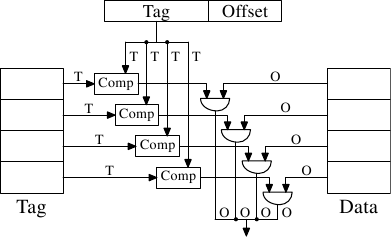
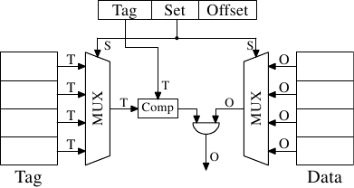
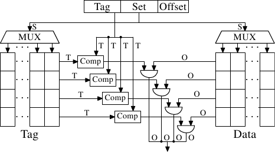
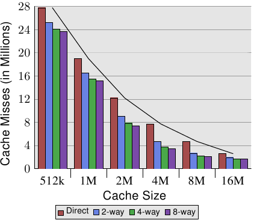
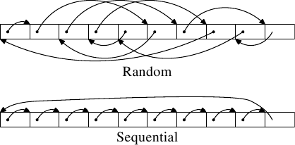

# 3.3.1. 关联度

实现一个每个 cache 行都能保存任意内存位置副本的 cache 是有可能的（见图 3.5）。这被称为一个*全关联式 cache（fully associative cache）*。要访问一个 cache 行，处理器核必须要将每个 cache 行的标签与请求地址的标签进行比较。标签会由地址中不是 cache 行偏移量的整个部分组成（这表示在 3.2 节图示中的 $\mathbf{S}$ 为零）。

有些 cache 是像这样实现的，但是看看如今使用的 L2 数量，证明这是不切实际的。给定一个有着 64B cache 行的 4MB cache，这个 cache 将会有 65,536 个项目。为了达到足够的性能，cache 逻辑必须要可以在短短几个周期内，从这所有的项目中挑出符合给定标签的那一个。实现这点要付出庞大的精力。

*图 3.5：全关联式 cache 示意图*

对每个 cache 行来说，都需要一个比较器（comparator）来比对很大的标签（注意，$\mathbf{S}$ 为零）。紧邻着每条连线的字母代表以 bit 为单位的宽度。假如没有给定，那么它就是一条单一 bit 的线路。每个比较器都必须比对两个 $\mathbf{T}$ bit 宽的值。接着，基于这个结果，选择合适的 cache 行内容，并令它能被取得。有多少 cache 行，都得合并多少组 $\mathbf{O}$ 数据线。实现一个比较器所需的晶体管数量很大，特别是它必须运作地非常快的时候。迭代比较器（iterative comparator）是不可用的。节省比较器数量的唯一方式，就是反覆地比较标签以减少比较器的数量。这与迭代比较器并不合适的理由相同：它太花时间了。

全关联式 cache 对小 cache（例如在某些 Intel 处理器的 TLB cache 就是全关联式的）来说是有实用价值的，但那些 cache 都很小，非常小。我们所指的是至多只有几十个项目的情况。

对 L1i、L1d、以及更高层次的 cache 来说，需要采用不同的方法。我们所能做的是限缩搜索。在最极端的限制中，每个标签都恰好映射到一个 cache 项目。计算方式很简单：给定 4MB／64B、有着 65,536 个项目的 cache，我们可以直接使用地址的 6 到 21 bit（16 个 bit）来直接寻址每个项目。低 6 bit 是 cache 行内部的索引。

*图 3.6：直接映射式 cache 示意图*

如图 3.6 所见到的，这种*直接映射式 cache（direct-mapped cache）*很快，而且实现起来相对简单。它需要一个比较器、一个多路复用器（在这张示意图中有两个，标签与数据是分离的，但在这个设计上，这点并不是个硬性要求）、以及一些用以选择有效 cache 行内容的逻辑。比较器是因速度要求而复杂，但现在只有一个；因此，便可以花费更多的精力来让它变快。在这个方法中，实际的复杂之处都落在多路复用器上。在一个简易的多路复用器上，晶体管的数量以 $O(\log N)$ 成长，其中 $N$ 为 cache 行的数量。这可以容忍，但可能会慢了点，在这种情况下，通过在多路复用器中增加更多的晶体管以并行化某些工作，便可以提升速度。晶体管的总数可以缓慢地随着 cache 大小的成长而成长，使得这种解法非常有吸引力。但它有个缺点：只有在程序用到的地址，对于用以直接映射的 bit 来说是均匀分布的情况下，它才能运作得很好。若非如此，而且经常这样的话，某些 cache 项目会因为频繁地使用而被重复地逐出，而其余的项目则几乎完全没用到、或者一直是空的。

*图 3.7：集合关联式 cache 示意图*

这个问题能通过让 cache*集合关联（set associative）*来解决。一个集合关联式 cache 结合了全关联式以及直接映射式 cache 的良好特质，以在很大程度上避免了那些设计的弱点。图 3.7 显示了一个集合关联式 cache 的设计。标签与数据的存储被分成集合，其中之一会被 cache 行的地址所选择。这与直接映射式 cache 相似。但少数的值能以相同的集合编号 cache，而非令 cache 中的每个集合编号都只有一个元素。所有集合内成员的标签会并行地比对，这与全关联式 cache 的运作方式相似。

结果是，cache 不容易被不幸地 –– 或者蓄意地 –– 以相同集合编号的地址选择所击败，同时 cache 的大小也不会受限于能被经济地实现的比较器的数量。假如 cache 增长，它（在这张图中）只有行数会增加，列数则否。行数（以及比较器）只会在 cache 的关联度（associativity）增加的时候才会增加。如今的处理器为 L2 或者更高层次的 cache 所使用的关联度层次高达 24。L1 cache 通常使用 8 个集合。

给定我们的 4MB／64B cache 以及 8 路（8-way）集合关联度，于是这个 cache 便拥有 8,192 个集合，并且仅有 13 bit 的标签被用于寻址 cache 集。要决定 cache 集中的哪个（如果有的话）项目包含被寻址的 cache 行，必须要比较 8 个标签。在非常短的时间内做到如此是可行的。通过实验我们可以看到，这是合理的。

| L2 cache 大小 | 关联度 |  |  |  |  |  |  |  |
| --- | --- | --- | --- | --- | --- | --- | --- | --- |
| L2 cache 大小 | 直接 |  | 2 |  | 4 |  | 8 |  |
| L2 cache 大小 | CL=32 | CL=64 | CL=32 | CL=64 | CL=32 | CL=64 | CL=32 | CL=64 |
| 512k | 27,794,595 | 20,422,527 | 25,222,611 | 18,303,581 | 24,096,510 | 17,356,121 | 23,666,929 | 17,029,334 |
| 1M | 19,007,315 | 13,903,854 | 16,566,738 | 12,127,174 | 15,537,500 | 11,436,705 | 15,162,895 | 11,233,896 |
| 2M | 12,230,962 | 8,801,403 | 9,081,881 | 6,491,011 | 7,878,601 | 5,675,181 | 7,391,389 | 5,382,064 |
| 4M | 7,749,986 | 5,427,836 | 4,736,187 | 3,159,507 | 3,788,122 | 2,418,898 | 3,430,713 | 2,125,103 |
| 8M | 4,731,904 | 3,209,693 | 2,690,498 | 1,602,957 | 2,207,655 | 1,228,190 | 2,111,075 | 1,155,847 |
| 16M | 2,620,587 | 1,528,592 | 1,958,293 | 1,089,580 | 1,704,878 | 883,530 | 1,671,541 | 862,324 |

*表 3.1：cache 大小、关联度、以及 cache 行大小的影响*

表 3.1 显示了对于一支程序（在这个例子中是 gcc，根据 Linux 系统核心的人们的说法，它是所有基准中最重要的一个）在改变 cache 大小、cache 行大小、以及关联度集合大小时，L2 cache 未命中的次数。在 7.2 节中，我们将会介绍对于这个测试，所需要用以模拟 cache 的工具。

以防这些值的关联仍不明显，这所有的值的关系是，cache 的大小为

$\text{cache 行大小} \times \text{关联度} \times \text{集合的数量}$。地址是以 3.2 节的图中示意的方式，使用

$$
\begin{aligned}
\mathbf{O} &= \log_{2} \text{cache 行大小}
\\
\mathbf{S} &= \log_{2} \text{集合的数量}
\end{aligned}
$$

来映射到 cache 中的。

*图 3.8：cache 大小 vs 关联度（CL=32）*

图 3.8 让这个表格的数据更容易理解。它显示了 cache 行大小固定为 32 byte 的数据。看看对于给定 cache 大小的数字，我们可以发现关联度确实有助于显着地降低 cache 未命中的次数。以一个 8MB cache 来说，从直接映射式变成 2 路集合关联式避免了几乎 44% 的 cache 未命中。相比于一个直接对应式 cache，使用一个集合关联式 cache 的话，处理器可以在 cache 中保存更多的工作集。

在文献中，偶尔会读到引入关联度与加倍 cache 大小有着相同的影响。在某些极端的例子中，如同可以从 4MB 跳到 8MB cache 所看到的，确实如此。但再一次加倍关联度的话，显然就不是如此了。如同我们能从数据中所看到的，接下来的提升要小得多。不过，我们不该完全低估这个影响。在范例程序中，内存使用的尖峰为 5.6M。所以使用一个 8MB cache，同样的 cache 集不大可能被多次（超过两次）使用。有个较大的工作集的话，可以节约的更多。如同我们可以看到的，对于较小的 cache 大小来说，关联度的获益较大。

一般来说，将一个 cache 的关联度提升到 8 以上，似乎对一个单线程的工作量来说只有很小的影响。随着共享第一层 cache 的 HT 处理器、以及使用一个共享 L2 cache 的多核处理器的引入，形势转变了。现在你基本上会有两支程序命中相同的 cache，这导致关联度会在实践上打对折（对四核处理器来说是四分之一）。所以可以预期，提升处理器核的数量，共享 cache 的关联度也应该成长。一旦这不再可能（16 路集合关联度已经很难了），处理器设计师就必须开始使用共享的 L3 或者更高层次的 cache，而 L2 cache 则是潜在地由处理器核的子集所共享。

我们能在图 3.8 学到的另一个影响是，增加 cache 大小是如何提升性能的。这个数据无法在不知道工作集大小的情况下解释。显然地，一个与主内存一样大的 cache，会导致比一个较小 cache 更好的结果，所以一般来说不会有带着可预见优势的最大 cache 大小的限制。

如同上面所提到的，工作集大小的尖峰为 5.6M。这并没有给我们任何最佳 cache 大小的确切数字，但它能让我们估算出这个数字。问题是，并非所有被用到的内存都是连续的，因此我们会有 –– 即使是以一个 16M 的 cache 与一个 5.6M 的工作集 –– 冲突（conflict）[^译注]（看看 2 路集合关联式的 16MB cache 相较于直接映射版本的优势）。但有把握的是，以同样的工作量，一个 32MB cache 的获益是可以忽略不计的。但谁说过工作集大小必须维持不变了？工作量是随着时间成长的，cache 大小也应该如此。在购买机器、并且在你得去挑选愿意为此买单的 cache 大小时，是值得去衡量工作集大小的。在图 3.10 中可以看到这件事何以重要。

*图 3.9：测试内存布局*

执行了两种类型的测试。在第一个测试中，元素是顺序处理的。测试程序沿着指针（pointer）`n` 前进，但数组元素会以令它们以在内存中排列的顺序被遍历的方式链结。这可以在图 3.9 的下半部看到。有个来自最后一个元素的回溯参考。在第二个测试中（图中的上半部），数组元素是以随机顺序遍历的。在这两种情况中，数组元素都会形成一个循环的单向链结链表 (singly-linked list)。

[^译注]: 这里指的是上文描述直接映射式 cache 时所提到的缺点。
