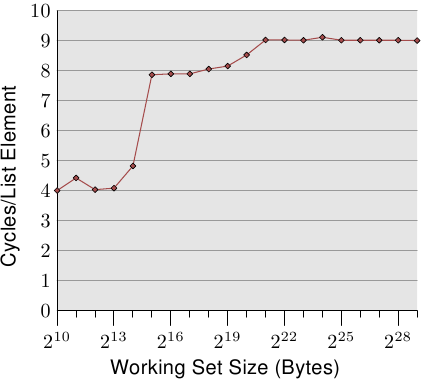
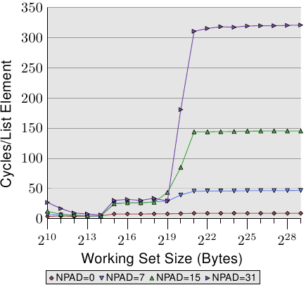
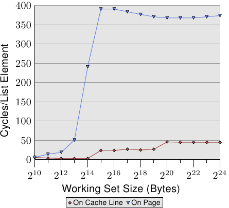
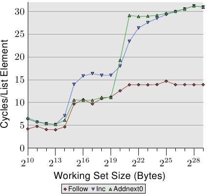
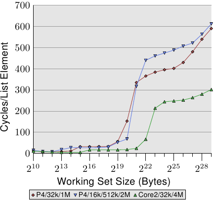
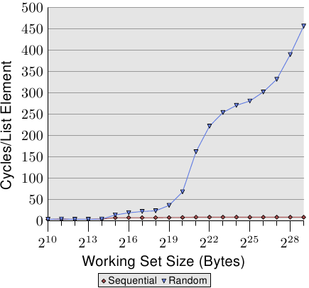
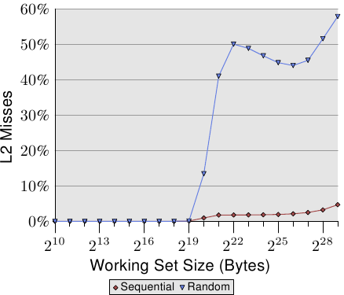
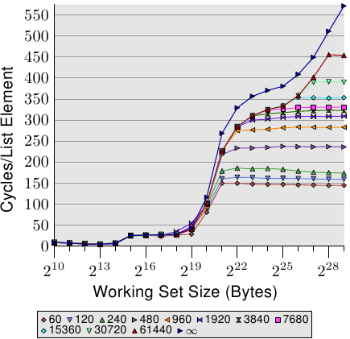

# 3.3.2. cache 影响的测量

所有的图表都是由一支能模拟任意大小的工作集、读取与写入访问、以及顺序或随机访问的程序所产生的。我们已经在图 3.4 中看过一些结果。这支程序会产生与工作集大小相同、这种类型的数组：

```c
struct l {
  struct l *n;
  long int pad[NPAD];
};
```

所有的项目都使用 `n` 元素，以顺序或是随机的顺序，链结在一个循环的链表中。即使元素是顺序排列的，从一个项目前进到下一个项目总是会用到这个指针。`pad` 元素为数据负载（payload），并且能成长为任意大小。在某些测试中，数据会被修改，而在其余的情况中，程序只会执行读取操作。

在性能测量中，我们讨论的是工作集的大小。工作集是由一个 `struct l` 元素的数组所组成的。一个 2<sup>N</sup> byte 的工作集包含 2<sup>N</sup> / `sizeof(struct l)` 个元素。显而易见地，`sizeof(struct l)` 视 `NPAD` 的值而定。以 32 bit 的系统来说，`NPAD`=7 代表每个数组元素的大小为 32 byte，以 64 bit 的系统来说，大小为 64 byte。


## 单线程顺序访问

<figure>
  
  <figcaption>图 3.10：顺序读取访问，NPAD=0</figcaption>
</figure>

最简单的情况就是直接走遍链表中的所有项目。链表元素是顺序排列、紧密地塞在一起的。不管处理的顺序是正向或反向都无所谓，处理器在两个方向上都能处理得一样好。我们这里 –– 以及在接下来的所有测试中 –– 所要测量的是，处理一个单向链表元素要花多久。时间单位为处理器周期。图 3.10 显示了这个结果。除非有另外说明，否则所有的测量都是在一台 Pentium 4 以 64 bit 模式获得的，这表示 `NPAD`=0 的结构 `l` 大小为八 byte。

前两个测量结果受到了杂讯的污染。测量的工作量太小了，因而无法过滤掉其余系统的影响。我们可以放心地假设这些值都在 4 个周期左右。考虑到这点，我们可以看到三个不同的水平（level）：

* 工作集大小至多到 2<sup>14</sup> byte。
* 从 2<sup>15</sup> byte 到 2<sup>20</sup> byte。
* 2<sup>21</sup> byte 以上。

这些阶段可以轻易地解读：处理器拥有一个 16kB L1d 与 1MB L2。我们没有在从一个水平到另一个水平的转变之处看到尖锐的边缘，因为 cache 也会被系统的其他部分用到，因此 cache 并不是专门给这支程序的数据所使用的。特别是 L2 cache，它是一个统一式 cache（unified cache），也会被用来存放指令（注：Intel 使用包含式 cache）。

或许完全没有预期到的是，对于不同工作集大小的实际时间。L1d 命中的时间是预期中的：在 P4 上，L1d 命中之后的加载时间大约是 4 个周期。但 L2 访问怎么样呢？一旦 L1d 不足以保存数据，可以预期这会让每个元素花上 14 个周期以上，因为这是 L2 的访问时间。但结果显示只需要大约 9 个周期。这个差异可以用处理器中的先进逻辑来解释。预期使用连续的 memory 区域时，处理器会*预取*下一个 cache 行。这表示，当真的用到下个 cache 行时，它已经加载一半了。等待下一个 cache 行加载所需的延迟因而比 L2 访问时间要少得多。

一旦工作集大小成长到超过 L2 的大小，预取的效果甚至更明显。先前我们说过，一次主 memory 访问要花费 200+ 个周期。只有利用有效的预取，处理器才可能让访问时间维持在低至 9 个周期。如同我们能从 200 与 9 之间的差异所看到的，它的效果很好。

<figure>
  
  <figcaption>图 3.11：顺序读取多种大小</figcaption>
</figure>

我们可以在预取的时候 –– 至少间接地 –– 观察处理器。在图 3.11 中，我们看到的是相同工作集大小的时间，但这次我们看到的是不同 `l` 结构大小的曲线。这表示在链表中有比较少、但比较大的元素。不同大小有着令（仍然连续的）链表中的 `n` 元素之间的距离成长的影响。在图中的四种情况，距离分别为 0、56、120、248 byte。

在底部我们可以看到图 3.10 的线，但这时它看起来差不多像是条平坦的线。其他情况的时间要糟得多了。我们也能在这张图中看到三个不同的水平，我们也看到在工作集大小很小的情况下有着很大的误差（再次忽略它们）。只要仅有 L1d 牵涉其中，这些线差不多都相互重合。
这里不需要要预取，因此所有元素大小下，每次访问都会命中 L1d。

在 L2 cache 命中的情况下，我们看到三条新的线相互重合得很好，但它们位在比较高的水平上（大约 28）。这是 L2 访问时间的水平。这表示从 L2 到 L1d 的预取基本上失效了。即使是 `NPAD`=7，我们在循环的每一次迭代都需要一个新的 cache 行；以 `NPAD`=0 而言，在需要下一个 cache 行之前，循环得迭代八次。预取逻辑无法每个周期都加载一个新的 cache 行。因此，我们看到的便是在每次迭代时，从 L2 加载的延误。

一旦工作集大小超过 L2 的容量，甚至变得更有趣了。现在四条线全都离得很远。不同的元素大小显然在性能差异上扮演着一个重大的角色。处理器应该要识别出步伐（stride）的大小，不为 `NPAD`=15 与 31 获取不必要的 cache 行，因为元素的大小是比预取窗（prefetch window）还小的（见 6.3.1 节）。元素大小妨碍预取效果之处，是一个硬件预取限制的结果：它无法横跨页（page）边界。我们在每次增加大小时，都减少了 50% 硬件调度器（scheduler）的效率。假如硬件预取器（prefetcher）被允许横跨页边界，并且下一个页不存在或者无效时，操作系统就得被卷入页的定位中。这表示程序要经历并非由它自己产生的页错误（page fault）。这是完全无法接受的，因为处理器并不知道一个页是不在 memory 内还是不存在。在后者的情况下，操作系统必须要中断进程。在任何情况下，假定 –– 以 `NPAD`=7 或以上而言 –– 每个链表元素都需要一个 cache 行，硬件预取器便爱莫能助了。由于处理器一直忙着读取一个 word、然后加载下一个元素，根本没有时间去从 memory 加载数据。

变慢的另一个主要原因是 TLB cache 的错失。这是一个存储了从虚拟地址到物理地址的转换结果的 cache，如同在第四节所详细解释的那样。由于 TLB cache 必须非常地快，所以它非常地小。假如重复访问的页数比 TLB cache 拥有的还多，就必须不断地重算代表着虚拟到物理地址的转换结果的项目。这是一个非常昂贵的操作。对比较大的元素大小而言，一次 TLB 查询的成本是分摊在较少的元素上的。这表示对于每个链表元素，必须要计算的 TLB 项目总数较多。

为了观察 TLB 的影响，我们可以执行一个不同的测试。对于第一个测量，我们像往常一样顺序地摆放元素。我们使用 `NPAD`=7 作为占据一整个 cache 行的元素。对于第二个测量，我们将每个链表元素放置在个别的页中。每个页的其余部分维持原样，我们不会将它算在工作集大小的总和中。[^20]结果是，对于第一个测量，每次链表迭代都需要一个新的 cache 行，并且每 64 个元素一个新的页。对第二个测量而言，每次迭代都需要加载一个在另一个页上的 cache 行。

<figure>
  
  <figcaption>图 3.12：TLB 对顺序读取的影响</figcaption>
</figure>

结果可以在图 3.12 中看到。测量都是在与图 3.11 相同的机器上执行的。由于可用 RAM 的限制，工作集大小必须限制在 2<sup>24</sup> byte，其需要 1GB 以将对象放置在个别的页上。下方的红色曲线正好对应到图 3.11 中的 `NPAD`=7 曲线。我们看到了显示了 L1d 与 L2 cache 大小的不同阶段。第二条曲线看起来完全不同。重要的特征是，当工作集大小达到 2<sup>13</sup> byte 时开始的大幅飙升。这就是 TLB cache 溢出（overflow）的时候了。由于一个元素大小为 64 byte，我们可以计算出 TLB cache 有 64 个项目。由于程序锁定了 memory 以避免它被移出，所以成本不会受页错误影响。

可以看出，计算物理地址、并将它存储在 TLB 中所花的周期数非常高。图 3.12 中的曲线显示了极端的例子，但现在应该能清楚的一点是，对于较大的 `NPAD` 值而言，一个变慢的重大因素即是 TLB cache 效率的降低。由于物理地址必须要在 cache 行能从 L2 或主 memory 读取前算出来，因此地址转换的损失就被附加到了 memory 访问时间上。这在某种程度上解释了，为何每个链表元素在 `NPAD`=31 的总成本会比 RAM 在理论上的访问时间还高的原因。

<figure>
  
  <figcaption>图 3.13：顺序读取与写入，NPAD=1</figcaption>
</figure>

我们可以通过观察修改链表元素的测试执行的数据，来一瞥预取实现的多一些细节。图 3.13 显示了三条线。在所有情况中的元素宽度都是 16 byte。第一条线是现在已经很熟悉的链表遍历，它会被作为一条基准线。第二条线 –– 标为「Inc」–– 仅会在前往下一个元素前，增加当前元素的 `pad[0]` 成员的值。第三条线 –– 标为「Addnext0」–– 会取下一个元素的 `pad[0]` 的值，并加到当前链表元素的 `pad[0]` 成员中。

天真的假设大概是「Addnext0」测试跑得比较慢，因为它有更多路复用作得做。在前进到下一个链表元素之前，就必须加载这个元素的值。这就是看到这个测试实际上 –– 对于某些工作集大小而言 –– 比「Inc」测试还快这点会令人吃惊的原因了。对此的解释是，加载下个链表元素基本上就是一次强制的预取。无论程序在何时前进到下个链表元素，我们都确切地知道这个元素已经在 L1d cache 中了。因此我们看到，只要工作集大小能塞进 L2 cache，「Addnext0」就执行得跟单纯的「Follow」一样好。

不过「Addnext0」测试比「Inc」测试更快耗尽 L2。因为它需要从主 memory 加载更多的数据。这就是在工作集大小为 2<sup>21</sup> byte 时，「Addnext0」测试达到 28 个循环水平的原因了。28 循环水平是「Follow」测试所达到的 14 循环水平的两倍高。这也很容易解释。由于其他两个测试都修改了 memory，L2 cache 为了腾出空间给新的 cache 行的逐出操作便不能直接把数据丢掉。它必须被写到 memory 中。这表示 FSB 中的可用带宽被砍了一半，因此加倍了数据从主 memory 传输到 L2 所花的时间。

<figure>
  
  <figcaption>图 3.14：较大 L2／L3 cache 的优势</figcaption>
</figure>

顺序、高效的 cache 管理的最后一个面向是 cache 的大小。虽然这应该很明显，但仍需要被提出来。图 3.14 显示了以 128 byte 元素（在 64 bit 机器上，`NPAD`=15）进行 Increment 测试的时间。这次我们看到测量结果来自三台不同的机器。前两台机器为 P4，最后一台为 Core2 处理器。前两台由不同的 cache 大小来区分它们自己。第一个处理器有一个 32k L1d 与一个 1M L2。第二个处理器有 16k L1d、512k L2、与 2M L3。Core2 处理器有 32k L1d 与 4M L2。

这张图有趣的部分不必然是 Core2 处理器相对于其他两个表现得有多好（虽然这令人印象深刻）。这里主要有兴趣的地方是，工作集大小对于各自的最后一阶 cache 来说太大、并使得主 memory 得大大地涉入其中之处。

如同预期，最后一阶的 cache 越大，曲线在相应于 L2 访问成本的低水平停留得越久。要注意的重要部分是它所提供的性能优势。第二个处理器（它稍微旧了一点）在 2<sup>20</sup> byte 的工作集上可以用两倍于第一个处理器的速度执行。这全都归功于最后一阶 cache 大小的提升。有着 4M L2 的 Core2 处理器甚至表现得更好。

对于随机的工作量而言，这可能不代表什么。但若是工作量能被裁剪成最后一阶 cache 的大小，程序性能便可以极为大幅地提升。这也是有时候值得为拥有较大 cache 的处理器花费额外金钱的原因。


## 单线程随机访问

我们已经看过，处理器可以通过预取 cache 行到 L2 与 L1d，来隐藏大部分主 memory、甚至是 L2 的访问等待时间。不过，这只有在可以预测 memory 的访问时才能良好运作。

<figure>
  
  <figcaption>图 3.15：顺序 vs 随机读取，NPAD=0</figcaption>
</figure>

若是访问模式是不可预测、或者随机的，情况便大大地不同。图 3.15 比较了顺序访问每个链表元素的时间（如图 3.10）以及当链表元素是随机分布在工作集时的时间。顺序是由随机化的链结链表所决定的。没有让处理器可以确实地预取数据的方法。只有一个元素偶然在另一个在 memory 中也彼此邻近的元素不久之后用到，这才能起得了作用。

在图 3.15 中，有两个要注意的重点。第一点是，增长工作集大小需要大量的周期数。机器可以在 200-300 个周期内访问主 memory，但这里我们达到了 450 个周期以上。我们先前已经看过这个现象了（对比图 3.11）。自动预取在这里实际上起了反效果。

<figure>
  
  <figcaption>图 3.16：L2d 错失率</figcaption>
</figure>

第二个有趣的地方是，曲线并不像在顺序访问的例子中那样，在多个平缓阶段变得平坦。曲线持续上升。为了解释这点，我们可以针对不同的工作集大小测量程序的 L2 访问次数。结果可以在图 3.16 与表 3.2 看到。

图表显示，当工作集大小大于 L2 的大小时，cache 错失率（L2 访问数 / L2 错失数）就开始成长了。这条曲线与图 3.15 的曲线有着相似的形式：它快速地上升、略微下降、然后再度开始上升。这与每链表元素所需循环数的曲线图有着密切的关联。L2 错失率最终会一直成长到接近 100% 为止。给定一个足够大的工作集（以及 RAM），任何随机选取的 cache 行在 L2 或是加载过程中的机率便可以被随心所欲地降低。

<figure>
  <table>
    <tr>
      <th rowspan="2">集合大小</th>
      <th colspan="5">顺序</th>
      <th colspan="5">随机</th>
    </tr>
    <tr>
      <th>L2 命中数</th>
      <th>L2 错失数</th>
      <th>迭代次数</th>
      <th>错失／命中比率</th>
      <th>每迭代 L2 访问数</th>
      <th>L2 命中数</th>
      <th>L2 错失数</th>
      <th>迭代次数</th>
      <th>错失／命中比率</th>
      <th>每迭代 L2 访问数</th>
    </tr>
    <tr>
      <td>2<sup>20</sup></td>
      <td>88,636</td>
      <td>843</td>
      <td>16,384</td>
      <td>0.94%</td>
      <td>5.5</td>
      <td>30,462</td>
      <td>4721</td>
      <td>1,024</td>
      <td>13.42%</td>
      <td>34.4</td>
    </tr>
    <tr>
      <td>2<sup>21</sup></td>
      <td>88,105</td>
      <td>1,584</td>
      <td>8,192</td>
      <td>1.77%</td>
      <td>10.9</td>
      <td>21,817</td>
      <td>15,151</td>
      <td>512</td>
      <td>40.98%</td>
      <td>72.2</td>
    </tr>
    <tr>
      <td>2<sup>22</sup></td>
      <td>88,106</td>
      <td>1,600</td>
      <td>4,096</td>
      <td>1.78%</td>
      <td>21.9</td>
      <td>22,258</td>
      <td>22,285</td>
      <td>256</td>
      <td>50.03%</td>
      <td>174.0</td>
    </tr>
    <tr>
      <td>2<sup>23</sup></td>
      <td>88,104</td>
      <td>1,614</td>
      <td>2,048</td>
      <td>1.80%</td>
      <td>43.8</td>
      <td>27,521</td>
      <td>26,274</td>
      <td>128</td>
      <td>48.84%</td>
      <td>420.3</td>
    </tr>
    <tr>
      <td>2<sup>24</sup></td>
      <td>88,114</td>
      <td>1,655</td>
      <td>1,024</td>
      <td>1.84%</td>
      <td>87.7</td>
      <td>33,166</td>
      <td>29,115</td>
      <td>64</td>
      <td>46.75%</td>
      <td>973.1</td>
    </tr>
    <tr>
      <td>2<sup>25</sup></td>
      <td>88,112</td>
      <td>1,730</td>
      <td>512</td>
      <td>1.93%</td>
      <td>175.5</td>
      <td>39,858</td>
      <td>32,360</td>
      <td>32</td>
      <td>44.81%</td>
      <td>2,256.8</td>
    </tr>
    <tr>
      <td>2<sup>26</sup></td>
      <td>88,112</td>
      <td>1,906</td>
      <td>256</td>
      <td>2.12%</td>
      <td>351.6</td>
      <td>48,539</td>
      <td>38,151</td>
      <td>16</td>
      <td>44.01%</td>
      <td>5,418.1</td>
    </tr>
    <tr>
      <td>2<sup>27</sup></td>
      <td>88,114</td>
      <td>2,244</td>
      <td>128</td>
      <td>2.48%</td>
      <td>705.9</td>
      <td>62,423</td>
      <td>52,049</td>
      <td>8</td>
      <td>45.47%</td>
      <td>14,309.0</td>
    </tr>
    <tr>
      <td>2<sup>28</sup></td>
      <td>88,120</td>
      <td>2,939</td>
      <td>64</td>
      <td>3.23%</td>
      <td>1,422.8</td>
      <td>81,906</td>
      <td>87,167</td>
      <td>4</td>
      <td>51.56%</td>
      <td>42,268.3</td>
    </tr>
    <tr>
      <td>2<sup>29</sup></td>
      <td>88,137</td>
      <td>4,318</td>
      <td>32</td>
      <td>4.67%</td>
      <td>2,889.2</td>
      <td>119,079</td>
      <td>163,398</td>
      <td>2</td>
      <td>57.84%</td>
      <td>141,238.5</td>
    </tr>
  </table>
  <figcaption>表 3.2：顺序与随机遍历时的 L2 命中与错失，NPAD=0</figcaption>
</figure>

光是 cache 错失率的提高就可以解释一部分成本。但有着另一个因素。看看表 3.2，我们可以看到在 L2 / 迭代数那栏，程序每次迭代所使用的 L2 总数都在成长。每个工作集都是前一个的两倍大。所以，在没有 cache 的情况下，我们预期主 memory 的访问次数会加倍。有了 cache 以及（几乎）完美的可预测性，我们看到显示在顺序访问的数据中，L2 使用次数增长得很保守。其增长除了工作集大小的增加以外，就没有别的原因了。

<figure>
  
  <figcaption>图 3.17：逐页（page-wise）随机化，NPAD=7</figcaption>
</figure>

对于随机访问，每次工作集大小加倍的时候，每个元素的访问时间都超过两倍。这表示每个链表元素的平均访问时间增加了，因为工作集大小只有变成两倍而已。背后的原因是 TLB 错失率提高了。在图 3.17 中，我们看到在 `NPAD`=7 时随机访问的成本。只是这次，随机化的方式被修改了。一般的情况下，是将整个链表作为一个区块（block）随机化（以标签〔label〕 $\infty$ 表示），而其他的 11 条曲线则表示在比较小的区块内进行随机化。标记为「60」的曲线，代表每组由 60 个页（245,760 byte）组成的集合会分别进行随机化。这表示在走到下一个区块的元素之前，会先遍历过所有区块内的链表元素。这使得在任何一个时间点使用的 TLB 项目的数量有所限制。

在 `NPAD`=7 时的元素大小为 64 byte，这与 cache 行大小一致。由于链表元素的顺序被随机化了，因此硬件预取器不大可能有任何效果，尤其在有一堆元素的情况下。这表示 L2 cache 的错失率与在一个区块内的整个链表随机化相比并不会有显着地不同。测试的性能随着区块大小增加而逐渐地逼近单一区块随机化的曲线。这表示后者的测试案例的性能显着地受到了 TLB 错失的影响。假如 TLB 错失次数可以降低，性能便会显着地提升（在我们稍候将会看到的测试中，高达 38%）。


[^20]: 是的，这有点不一致，因为在其他的测试中，我们把结构中没用到的部分也算在元素大小里，而且我们可以定义 `NPAD` 以让每个元素填满一个页。在这种情况中，工作集的大小会差得很多。不过这并不是这个测试的重点，而且无论如何预取都没什么效率，因此没有什么差别。
