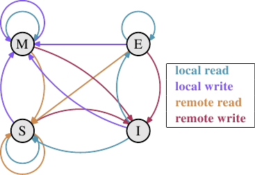
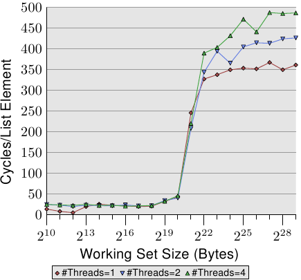
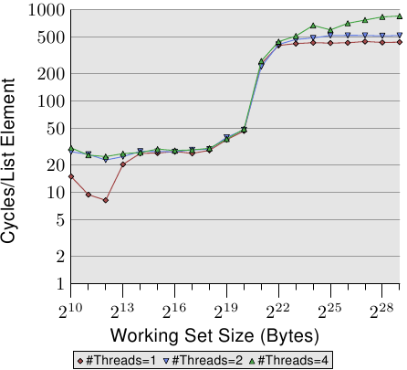
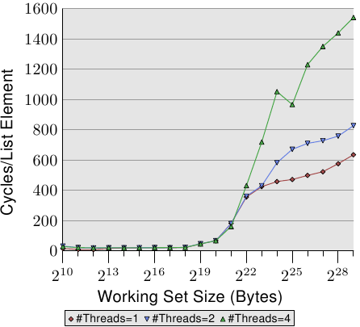
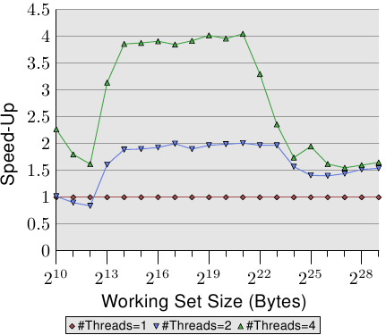
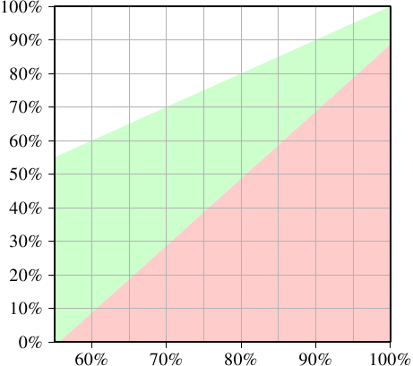

# 3.3.4. 多处理器支持

在上一节，我们已经指出，当多处理器开始起作用时我们会遇到的问题。多核处理器甚至有那些并没有被共享的 cache 层次（至少 L1d）的问题。

提供从一个处理器到另一个处理器的 cache 的直接访问是完全不切实际的。首先，连线根本不够快。实际的替代方案是，将 cache 内容传输给另一个处理器 –– 假如需要的话。注意到这也同样适用于不在相同处理器上共享的 cache。

现在的问题是，什么时候得传输这个 cache 行？这是个相当容易回答的问题：当一个处理器需要读取或写入一个 cache 行，而其在另一个处理器的 cache 上是脏的。但处理器要怎么样才能判断一个 cache 行在另一个处理器的 cache 上是脏的呢？仅因为一个 cache 行被另一个处理器加载就假定如此，（至多）也是次佳的（suboptimal）。通常，大多数的内存访问都是读取操作，产生的 cache 行也不是脏的。处理器对 cache 行的操作是很频繁的（那当然，不然我们怎么会有这篇论文？），这表示在每次写入操作之后，都去广播被改变的 cache 行的信息是不切实际的。

这些年来所发展出来的就是 MESI cache 一致性协议（修改〔Modified〕、独占〔Exclusive〕、共享〔Shared〕、无效〔Invalid〕）。这个协议的名称来自采用 MESI 协议时、一个 cache 行可以变成的四个状态：

**修改：** 本地的处理器已经修改过 cache 行。这也暗指它是在任何 cache 中的唯一副本。

**独占：** cache 行没有被修改过，但已知没有被加载到任何其他处理器的 cache 中。

**共享：** cache 行没有被修改过，并且可能存在于另一个处理器的 cache 中。

**无效：** cache 行是无效的 –– 也就是说，没有被使用。

多年来，这个协议从比较不复杂、但也比较没效率的较简易版本开始发展。有了这四个状态，便可能有效率地实现回写式 cache，而又支持同时在不同的处理器上使用只读的数据。

*图 3.18：MESI 协议的状态转换*

通过处理器监听 –– 或者窥探 –– 其他处理器的运作，不用太多精力便得以完成状态改变。处理器执行的某些操作会被发布在外部针脚上，因而让处理器的 cache 处理能被外界看到。处理中的 cache 行地址能在地址总线上看到。在接下来对状态与其转换（显示在图 3.18）的描述中，我们会指出总线是何时被牵扯进来的。

起初所有 cache 行都是空的，因此也是**无效**的。若是数据是为了写入而加载 cache，则改为**修改**。若是数据是为了读取而加载，新的状态则取决于另一个处理器是否也已加载这个 cache 行。如果是的话，新的状态为**共享**，否则为**独占**。

若是一个**修改**的 cache 行从本地处理器被读取或写入，这个指令可以使用当前的 cache 内容，并且状态不变。若是第二个处理器想要读取这个 cache 行，第一个处理器就必须将它的 cache 内容寄送给第二个处理器，然后它就能将状态改为**共享**。寄送给第二个处理器的数据也会被内存控制器接收并处理，其会将内容存储在内存中。假如没有这么做，cache 行就不能被标为**共享**。若是第二个处理器想要写入 cache 行，第一个处理器便会寄送 cache 行的内容，并将自己的 cache 行标为**无效**。这就是恶名昭彰的「所有权请求（Request For Ownership，RFO）」操作。在最后一个层次的 cache 中执行这个操作，就像是 I→M 的转换一样，相当昂贵。对直写式 cache 而言，我们也得加上它将新的 cache 行内容写入到更高层 cache 或主内存所花费的时间，进而提高了成本。

若是一个 cache 行处于**共享**状态，并且本地处理器要读取它，那么就不必改变状态，读取请求可以由这个 cache 来达成。若是 cache 行要在本地写入，也可以使用这个 cache 行，但状态会被改成**修改**。这也需要令其他处理器的所有可能的 cache 行副本被标为**无效**。因此，写入操作必须要通过一个 RFO 消息发布给其他处理器。若是 cache 行被第二个处理器请求读取，那么什么也不必做。主内存包含了当前的数据，本地的状态也已经是**共享**了。在第二个处理器想要写入到 cache 行的情况下（RFO），就直接将 cache 行标为**无效**。不需要总线操作。

**独占**状态与**共享**状态大致相同，只有一个重大的不同：本地的写入操作不必发布到总线上。因为已经知道本地 cache 是唯一一个持有这个独有的 cache 行的了。这会是一个巨大的优势，所以处理器会试着令尽可能多的 cache 行维持在**独占**状态，而非**共享**。后者是在这种时刻，无法取得这个信息的退而求其次。**独占**状态也可以在完全不引发功能问题的情况下被省去。唯一会变糟的只有性能，因为 E→M 转换比 S→M 转换要快得多了。

从这些状态转换的描述中，应该很清楚多处理器操作特有的成本在哪了。是的，填入 cache 仍旧昂贵，但现在我们也必须留意 RFO 消息。每当必须发送这种消息时，工作就会变慢。

有两种必须要 RFO 消息的情况：

* 一条线程从一个处理器迁移到另一个，并且所有 cache 行都必须一起移动到新的处理器上。
* 一个 cache 行真的被两个不同的处理器所需要。[^21]

在多线程或多进程的程序中，总是有一些同步的需求；这种同步是使用内存实现的。所以有些有根据的 RFO 消息。它们仍旧得尽可能地降低频率。不过，还有其他 RFO 消息的来源。我们将会在第六节解释这些情况。cache 一致性协议的消息必须被分发给系统中的处理器。MESI 转换直到确定系统中的所有处理器都有机会回覆消息之前都不会发生。这表示一个回覆能花上的最长可能时间决定了一致性协议的速度。[^22]可能会有总线上的冲突、NUMA 系统的等待时间会很长、而且突发的流量当然也会让事情变慢。这全都是专注在避免不必要流量的好理由。

还有一个与拥有多于一个处理器有关的问题。这个影响是与机器高度相关的，但原理上这个问题总是存在：FSB 是一个共享的资源。在大多数机器上，所有处理器会通过单一一条总线链接到内存控制器（见图 2.1）。假如单一个处理器可以占满总线（通常是这样），那么共享相同总线的二或四个处理器甚至会更加地限制每个处理器的可用带宽。

即使每个处理器都如图 2.2 一样，有它自己的、链接到内存控制器的总线，但仍旧有链接到内存模块的总线。通常这是唯一一条总线，而 –– 即使在图 2.2 的扩充模型中 –– 同时访问相同的内存模块将会限制带宽。

每个处理器都能拥有本地内存的 AMD 模型亦是如此。所有处理器确实能快速地并行访问它们的本地内存，尤其在使用整合式内存控制器的情况。但多线程与多进程程序 –– 至少偶尔 –– 必须访问相同的内存区域以进行同步。

并行是受可用于必要的同步实现的有限带宽所严重地限制的。程序需要被小心地设计，以将不同处理器核对相同内存位置的访问降到最小。接下来的测量将会显示这点、以及其他与多线程程序有关的 cache 影响。

## 多线程访问

为了确保大家理解在不同处理器上同时使用相同 cache 行所引入的问题的严重性，我们将会在这里多看到一些针对我们先前用过的相同程序的性能图表。不过，这次会同时执行多于一条线程。所要测量的是最快的线程的执行时间。这意味着完成所有线程的完整执行时间还会更长。使用的机器有四个处理器；测试使用至多四条线程。所有处理器共享链接到内存控制器的总线，而且仅有一条链接到内存模块的总线。

*图 3.19：顺序读取，多条线程*

图 3.19 显示了顺序只读访问 128 byte 项目的性能（在 64 bit 机器上，`NPAD`=15）。对于单线程的曲线，我们能预期是条与图 3.11 相似的曲线。测量使用了一台不同的机器，所以实际的数字会有所不同。

这张图中重要的部分当然是执行多条线程时的行为。注意到在走访链结链表时，没有内存会被修改，亦无让线程保持同步的企图。尽管不必有 RFO 消息、而且所有的 cache 行都能被共享，但我们看到当使用两条线程时，性能减低了高达 18%，而使用四条线程时则高达 34%。由于没有必须在处理器之间传输的 cache 行，因此变慢仅仅是由两个瓶颈中的一或二者所引起的：从处理器到内存控制的共享总线、以及从内存控制器到内存模块的总线。一旦工作集大小大于这台机器的 L3 cache，图上三种数量的线程都会预取新的链表元素。即便只有两条线程，可用带宽也不足以线性延展（scale）（即，没有执行多条线程带来的损失）。

*图 3.20：顺序 Increase，多条线程*

当我们修改内存时，情况变得更可怕了。图 3.20 显示了顺序 Increase 测试的结果。这个图表的 Y 轴使用了对数尺度。所以，别被看似很小的差异给骗了。我们在执行两条线程的时候仍有大约 18% 的损失，而执行四条线程则是惊人的 93% 损失。这表示，在使用四条线程时，预取流量加上回写流量就把总线占得非常满了。

我们使用对数尺度来显示 L1d 范围的结果。可以看到的是，一旦执行了多于一条线程，L1d 基本上就没什么效果了。只有在 L1d 不足以容纳工作集的时候，单线程的访问时间才会超过 20 个周期。当执行了多条线程时，访问时间却立即就达到了 –– 即便使用的是最小的工作集大小。

这里没有显示出问题的一个面向。这个特定的测试程序是难以测量的。即使测试修改了内存、而我们因此预期必定会有 RFO 消息，但当使用了多于一条线程时，我们并没有在 L2 范围内看到更高的成本。程序必须要使用大量的内存，并且所有线程必须要并行地访问相同的内存。没有大量的同步 –– 其会占据大多的执行时间 –– 这是很难实现的。

*图 3.21：随机 Addnextlast，多条线程*

最后在图 3.21，我们有 Addnextlast 测试以随机的方式访问内存的数据。提供这张图主要是为了显示出这些高得吓人的数字。现在在极端的状况下，处理一个单一的链表元素要花上大约 1,500 个周期。使用更多线程的情况还要更加严重。我们能使用一张表格来总结多条线程的效率。

| #线程 | 顺序读取 | 顺序递增 | 随机增加 |
| --- | --- | --- | --- |
| 2 | 1.69 | 1.69 | 1.54 |
| 4 | 2.98 | 2.07 | 1.65 |

*表 3.3：多条线程的效率*

表格显示了在图 3.19、3.20、与 3.21 中，多线程以最大工作集大小执行的效率。数据表示在使用二或四条线程处理最大的工作集大小时，测试程序可能达到的最佳加速。以两条线程而言，加速的理论极限为 2，对于四条线程而言为 4。两条线程的数据并没有那么糟。但对于四条线程，最后一个测试的数据显示了，几乎不值得扩展到超过两条线程。额外的获益是非常小的。如果我们以略为不同的方式表示图 3.21 的数据，我们便能更轻易地看出这点。

*图 3.22：经由并行化的加速*

图 3.22 的曲线显示了加速因子 –– 也就是相比于以单一线程执行的程序的相对性能。我们得忽略最小大小的情况，因为测量结果不够精确。以 L2 与 L3 cache 的范围而言，我们可以看到我们确实达到了几乎是线性的加速。我们分别达到了差不多 2 与 4 倍速。但一旦 L3 cache 不足以容纳工作集，数字就往下掉了。两条与四条线程的加速因子都掉到一样的值（见表 3.3 的第四行）。这是难以找到主机板有着超过四个全都使用同个内存控制器的 CPU 插槽的其中一个理由。有着更多处理器的机器必须要以不同的方式来做（见第五节）。

这些数字并不普遍。在某些情况下，甚至连能塞进最后一级 cache 的工作集都无法做到线性加速。事实上，这才是常态，因为线程通常并不像这个测试程序的例子一般解耦（decoupled）。另一方面，是可能运作在大工作集上，而仍旧拥有多于两条线程的优势的。不过，做到这点需要一些思考。我们会在第六节讨论一些方法。

## 特例：Hyper-Threading

Hyper-Threading (简称 HT，有时被称为对称多线程〔Symmetric Multi-Threading，SMT〕）由 CPU 实现，并且是个特例，因为个别线程无法真的同时执行。它们全都共享着寄存器集以外、几乎所有的处理资源。个别的处理器核与 CPU 仍然并行地运作，但实现在每颗处理器核上的线程会受到这个限制。理论上，每颗处理器核可以有许多线程，但是 –– 到目前为止 –– Intel CPU 的每颗处理器核至多仅有两条线程。CPU 有时域多路复用（time-multiplex）线程的职责。不过单是如此并没太大意义。实际的优点是，当同时执行的 HT 被延迟时，CPU 可以调度另一条 HT ，并善用像是算数逻辑一类的可用资源。在大多情况下，这是由内存访问造成的延迟。

假如两条线程执行在一颗 HT 核上，那么只有在两条线程*合并的（combined）*执行时间小于单线程程序的执行时间时，程序才会比单线程程序还有效率。通过重叠经常重复发生的不同内存访问的等待时间，这是可能的。一个简单的计算显示了为了达到某程度的加速，cache 命中率的最小需求。

一支程序的执行时间可以用一个仅有一层 cache 的简易模型来估算，如下（见 [16]）：

$$
T_{\text{exe}} = N [ (1 - F_{\text{mem}}) T_{\text{proc}} + F_{\text{mem}} (G_{\text{hit}} T_{\text{cache}} + (1 - G_{\text{hit}}) T_{\text{miss}}) ]
$$

变量的意义如下：

$$
\begin{aligned}
N &= \text{指令数} \\
F_{\text{mem}} &= N \text{ 次中访问内存的比率} \\
G_{\text{hit}} &= \text{加载次数中的 cache 命中率} \\
T_{\text{proc}} &= \text{每个指令的周期数} \\
T_{\text{cache}} &= \text{cache 命中的周期数} \\
T_{\text{miss}} &= \text{cache 未命中的周期数} \\
T_{\text{exe}} &= \text{程序执行时间}
\end{aligned}
$$

为了要让使用两条线程有任何意义，两条线程任一的执行时间都必须至多为单线程代码的一半。在任一边的唯一变量为 cache 命中的数量。若是我们求解方程序，以得到令线程的执行不减慢超过 50% 以上所需的最小 cache 命中率，我们会得到图 3.23 的结果。

*图 3.23：加速的最小 cache 命中率*

输入 –– 刻在 X 轴上 –– 为单线程代码的 cache 命中率 $G_{\text{hit}}$。Y 轴显示了多线程代码的 cache 命中率。这个值永远不能高于单线程的命中率，不然单线程代码也会使用这个改良的代码。以单线程的命中率 –– 在这个特定的情况下 –– 低于 55% 而言，在所有情况下程序都可以因为使用线程而获益。由于 cache 未命中，CPU 或多或少有足够的空闲来执行第二条 HT。

绿色的区域是目标。假如对线程而言的减慢小于 50%，且每条线程的工作量都减半，那么合并的执行时间就可能会小于单线程的执行时间。以用作模型的处理器（使用一个有着 HT 的 P4 的数据）而言，一支命中率为 60% 的单线程程序，对双线程程序来说需要至少 10% 的命中率。这通常是做得到的。但若是单线程程序的命中率为 95%，那么多线程程序就需要至少 80% 的命中率。这更难了。尤其 –– 这是使用 HT 的问题 –– 因为现在每条 HT 可用的有效 cache 大小（这里是 L1d，在实际上 L2 也是如此）被砍半了。 HT 都使用相同的 cache 来加载它们的数据。若是两条线程的工作集没有重叠，那么原始的 95% 命中率也会打对折，因而远低于所需要的 80%。

HT 因而只有在有限范围的情境中有用。单线程程序的 cache 命中率必须足够低，以在给定上面的等式、以及减小的 cache 大小时，新的命中率仍然满足要求。这时，也只有这时，才有任何使用 HT 的意义。实际上结果是否比较快，取决于处理器是否足以能将一条线程的等待时间重叠在另一条线程的执行时间上。并行化代码的间接成本必须被加到新的总执行时间上，这个额外成本经常无法忽视。

在 6.3.4 节，我们将会看到一种线程紧密合作、而通过共有 cache 的紧密耦合竟然是个优点的技术。这个技术可以用于多种情境，只要程序开发者乐于将时间与精力投入到扩展他们的代码的话。

应该清楚的是，假如两条 HT 执行完全不同的代码（也就是说，两条硬件线程被操作系统如同单独的处理器一般对待，以执行个别的进程），cache 大小固然会减半，这表示 cache 未命中的显着增加。除非 cache 足够大，不然这种操作系统调度的实行是有问题的。除非机器由进程组成的负载确实 –– 经由它们的设计 –– 可以获益于 HT ，否则最好在计算机的 BIOS 把 HT 关掉。[^23]

[^21]: 以相同处理器上的两颗处理器核而言，在较小的层次也是如此。成本只小了一点点。RFO 消息可能会被多次送出。

[^22]: 这就是为何我们如今会看到 –– 举例来说 –– 有三个插槽的 AMD Opteron 系统的原因。假定处理器只拥有三条超链接（hyperlink），而且一条是北桥连接所需，每个处理器都正好相隔一跳（hop）。

[^23]: 另一个令 HT 维持开启的理由是除错。SMT 令人惊讶地善于在平进程序中找出好几组问题。
