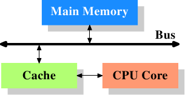
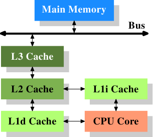
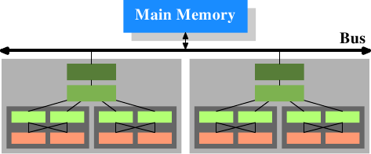

# 3.1. CPU cache 全貌

在深入 CPU cache 的技术细节之前，某些读者或许会发现，先理解 cache 是如何融入现代计算机系统的「大局（big picture）」是有所帮助的。

*图 3.1：最简易的 cache 配置*

图 3.1 显示了最简易的 cache 配置。其与能在早期找到的、采用 CPU cache 的系统架构是一致的。CPU 核不再直接链接到主内存。[^16]所有的加载与存储都必须经过 cache。CPU 核与 cache 之间的连线是一条特殊的、快速的连线。在这个简化的示意图上，主内存与 cache 都被链接到系统总线，其也会用来跟其他系统组件通讯。我们已经以「FSB」介绍过系统总线，这是它如今使用的名称；见 2.2 节。在这一节中，我们会省略北桥；假定它存在，以方便 CPU 与主内存的沟通。

即便过去数十年来的大多数计算机都采用冯纽曼架构（von Neumann architecture），**但实验证实分离代码与数据的 cache 是比较好的**。Intel 自 1993 年起采用分离代码与数据的 cache，就再也没有回头过。代码与数据所需的内存区域彼此相当独立，这也是独立的 cache 运作得更好的原因。近年来，另一个优点逐渐浮现：对大多数常见的处理器而言，指令解码（decoding）的步骤是很慢的；cache 解码过的指令可以让执行加速，在不正确地预测或者无法预测的分支（branch）使得流水线（pipeline）为空的情况下尤其如此。

在引入 cache 之后不久，系统变得越来越复杂。cache 与主内存之间的速度差异再次增加，直到加入了另一层次的 cache，比起第一层 cache 来得更大也更慢。仅仅提升第一层 cache 的大小，以经济因素来说并非一个可行的办法。今日，甚至有正常使用、具有三层 cache 的机器。具有这种处理器的系统看起来就像图 3.2 那样。随着单一 CPU 中的核数增加，未来 cache 层次也许会变得更多。

*图 3.2：具有三层 cache 的处理器*

图 3.2 显示了三层 cache，并引入了我们将会在本文其余部分使用的术语。L1d 是一级数据 cache、L1i 是一级指令 cache 等等。注意，这只是张示意图；实际上数据流从处理器核到主内存的路上并不需要通过任何较高层次的 cache。CPU 设计者在 cache 接口的设计上具有很大的自由。对程序员来说，是看不到这些设计上的选择的。

此外，我们有多核的处理器，每个处理器核都能拥有多条「线程」(thread)。一个处理器核与一条线程的差别在于，不同的处理器核拥有（几乎[^17]）所有硬件资源各自的副本。除非同时用到相同的资源——像是对外连线，否则处理器核是可以完全独立运作的。另一方面，线程则共享几乎所有处理器的资源。Intel 的线程实现只让其拥有个别的寄存器，甚至还是有限的——某些寄存器是共享的。所以，现代 CPU 的完整架构看起来就像图 3.3。

*图 3.3：多处理器、多核、多线程*

在这张图中，我们有两颗处理器，每颗两个核，各自拥有两个线程。线程共享一级 cache。处理器核（以深灰色为底）拥有独立的一级 cache。所有 CPU 核共享更高层次的 cache。两颗处理器（两个浅灰色为底的大方块）自然不会共享任何 cache。这些全都很重要，在我们讨论 cache 对多进程与多线程应用程序的影响时尤为如此。

[^16]: 在更早期的系统中，cache 是如同 CPU 与主内存一样接到系统总线上的。这比起实际的解法，更像是一种临时解（hack）。

[^17]: 早期的多核处理器甚至有分离的第 2 阶 cache (L2)，且无第 3 阶 cache。

