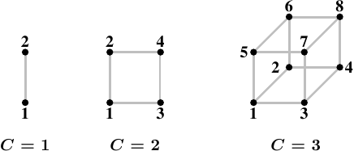

# 5.1. NUMA 硬件

非均匀内存架构正变得越来越普遍。在最简单的 NUMA 类型中，一个处理器可以拥有本地内存（见图 2.3），访问它比访问其他处理器的本地内存还便宜。对这种类型的 NUMA 系统而言，成本差异并不大 –– 即，NUMA 因子很小。

NUMA 也会 –– 而且尤其会 –– 用在大机器中。我们已经描述过拥有多个访问相同内存的处理器的问题。对商用硬件而言，所有处理器都会共享相同的北桥（此刻忽略 AMD Opteron NUMA 节点，它们有它们自己的问题）。这使得北桥成为一个严重的瓶颈，因为*所有*内存流量都会经过它。当然，大机器可以使用定制的硬件来代替北桥，但除非使用的内存芯片拥有多个端口 –– 即，它们可以从多条总线使用 –– 不然依旧有个瓶颈在。多端口 RAM 很复杂、而且建立与支持起来很昂贵，因此几乎不会被使用。

下一个复杂度上的改进为 AMD 使用的模型，其中的互连机制（在 AMD 情况下为超传输〔Hyper Transport〕，是它们由 Digital 授权而来的技术）为没有直接连接到 RAM 的处理器提供了访问。可以用这种方式组成的结构大小是有限的，除非你想要任意地增加直径（diameter）（即，任意两节点之间的最大距离）。

*图 5.1：超立方体*

一种连接节点的高效拓扑（topology）为超立方体（hypercube），其将节点的数量限制在 $2^{C}$，其中 $C$ 为每个节点拥有的交互连接接口的数量。以所有有着 $2^{n}$ 个 CPU 与 $n$ 条交互连接的系统而言，超立方体拥有最小的直径。图 5.1 显示了前三种超立方体。每个超立方体拥有绝对最小（the absolute minimum）的直径 $C$。AMD 第一世代的 Opteron 处理器，每个处理器拥有三条超传输链接。至少有一个处理器必须有个连接在一条链接上的南桥，代表 –– 目前而言 –– 一个 $C = 2$ 的超立方体可以直接且有效率地实现。下个世代将在某个时间点拥有四条链接，届时将可能有 $C = 3$ 的超立方体。

不过，这不代表无法支持更大的处理器集合体（accumulation）。有些公司已经开发出可以使用更大的处理器集合的 crossbar（例如，Newisys 的 Horus）。但这些 crossbar 提高了 NUMA 因子，而且在一定数量的处理器上便不再有效。

下一个改进为连接 CPU 的群组，并为它们全体实现一个共享的内存。所有这类系统都需要定制化的硬件，绝不是商用系统。这样的设计存在多方面的复杂度。一个仍然十分接近于商用机器的系统为 IBM x445 以及类似的机器。它们可以作为有着 x86 与 x86-64 的普通 4U、8 路机器购买。两台（某些时候高达四台）这种机器就可以被连接起来运作，如同一台有着共享内存的机器。使用的交互连接引入了一个操作系统 –– 以及应用程序 –– 必须纳入考量的重要的 NUMA 因子。

在光谱的另一端，像 SGI 的 Altix 这样的机器是专门被设计来互连的。SGI 的 NUMAlink 互连结构非常地快，同时拥有很短的等待时间；两个特性对于高性能计算（high-performance computing，HPC）都是必要条件，尤其是在使用消息传递接口（Message Passing Interface，MPI）的时候。当然，缺点是，这种精密与定制化是非常昂贵的。它们令合理地低的 NUMA 因子成为可能，但以这些机器能拥有的 CPU 数量（几千个）以及有限的互连能力，NUMA 因子实际上是动态的，而且可能因工作负载而达到不可接受的程度。

更常使用的解决方法是，使用高速网络将许多商用机器连接起来，组成一个集群（cluster）。不过，这些并非 NUMA 机器；它们没有实现共享的地址空间，因此不会归于这里讨论的任何一个范畴中。

