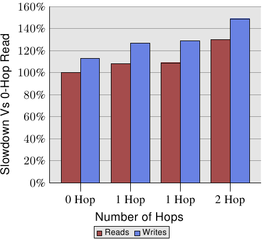
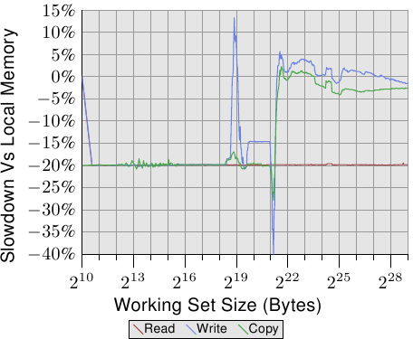

# 5.4. 远程访问成本



*图 5.2：多节点的读／写性能*

不过，距离是有关系的。AMD 在 [1] 提供了一台四槽机器的 NUMA 成本的文件。写入操作的数据显示在图 5.2。写入比读取还慢，这并不让人意外。有趣的部分在于 1 与 2 跳（1- and 2-hop）情况下的成本。两个 1 跳的成本实际上有略微不同。细节见 [1]。2 跳读取与写入（分别）比 0 跳读取慢了 30% 与 49%。2 跳写入比 0 跳写入慢了 32%、比 1 跳写入慢了 17%。处理器与内存节点的相对位置可以造成很大的差距。来自 AMD 下个世代的处理器将会以每个处理器四条连贯的超传输链接为特色。在这个例子中，一台四槽机器的直径会是一。但有八个插槽的话，同样的问题又——来势汹汹地——回来了，因为一个具有八个节点的超立方体的直径为三。

所有这些信息都可以获取，但用起来很麻烦。在 6.5 节，我们会看到较容易访问与使用这个信息的接口。

```text
00400000 default file=/bin/cat mapped=3 N3=3
00504000 default file=/bin/cat anon=1 dirty=1 mapped=2 N3=2
00506000 default heap anon=3 dirty=3 active=0 N3=3
38a9000000 default file=/lib64/ld-2.4.so mapped=22 mapmax=47 N1=22
38a9119000 default file=/lib64/ld-2.4.so anon=1 dirty=1 N3=1
38a911a000 default file=/lib64/ld-2.4.so anon=1 dirty=1 N3=1
38a9200000 default file=/lib64/libc-2.4.so mapped=53 mapmax=52 N1=51 N2=2
38a933f000 default file=/lib64/libc-2.4.so
38a943f000 default file=/lib64/libc-2.4.so anon=1 dirty=1 mapped=3 mapmax=32 N1=2 N3=1
38a9443000 default file=/lib64/libc-2.4.so anon=1 dirty=1 N3=1
38a9444000 default anon=4 dirty=4 active=0 N3=4
2b2bbcdce000 default anon=1 dirty=1 N3=1
2b2bbcde4000 default anon=2 dirty=2 N3=2
2b2bbcde6000 default file=/usr/lib/locale/locale-archive mapped=11 mapmax=8 N0=11
7fffedcc7000 default stack anon=2 dirty=2 N3=2
```

*图 5.3：`/proc/**PID**/numa_maps` 的内容*

系统提供的最后一类信息来自进程自身的状态。通过 <code>/proc/<strong>PID</strong>/numa_maps</code>，可以查看文件映射、写时复制（Copy-On-Write，COW）[^27]页和匿名内存（anonymous memory）分布在哪些 NUMA 节点上，其中 **PID** 是进程 ID。图 5.3 中，`N0` 到 `N3` 的值分别表示节点 0 到 3 上分配的页数。程序代码和脏页主要位于节点 3，因此可以推测该程序运行在节点 3 的处理器核上；`ld-2.4.so`、`libc-2.4.so` 的只读映射及共享文件 `locale-archive` 则分布在其他节点。

如同我们已经在图 5.2 看到的，当横跨节点操作时，1 与 2 跳读取的性能分别掉了 9% 与 30%。对执行来说，这种读取是必须的，而且如果 L2 cache 未命中，每个 cache 行都会招致这些额外成本。如果内存离处理器很远，对超过 cache 大小的大工作负载而言，所有测量的成本都必须提高 9%／30%。



*图 5.4：在远程内存操作*

为了看到在现实世界的影响，我们可以像 3.5.1 节一样测量带宽，但这次使用的是在远程、相距一跳的节点上的内存。这个测试相比于使用本地内存的数据的结果能在图 5.4 中看到。数字在两个方向都有一些大起伏，这是一个测量多线程程序的问题所致，可以忽略。在这张图上的重要信息是，读取操作总是慢了 20%。这明显慢于图 5.2 中的 9%，这极有可能不是连续读／写操作的数字，而且可能与较旧的处理器修订版本有关。只有 AMD 知道了。

以塞得进 cache 的工作集大小而言，写入与复制操作的性能也慢了 20%。当工作集大小超过 cache 大小时，写入性能不再显著慢于本地节点上的操作。互连的速度足以跟上内存的速度。主要因素是花费在等待主内存的时间。


[^27]: 当一个内存页起初有个用户，然后必须被复制以允许独立的用户时，写时复制是一种经常在操作系统实现用到的方法。在许多场景中，复制——起初或完全——是不必要的。在这种情况下，只在任何一个用户修改内存的时候复制是合理的。操作系统拦截写入操作、复制内存页、然后允许写入指令继续执行。
