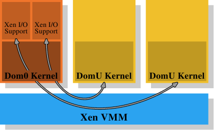
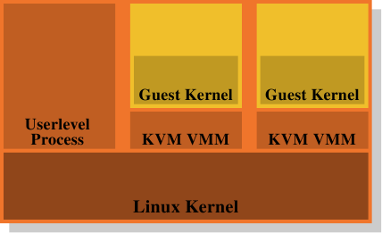

# 4.4. 虚拟化的影响

操作系统映像（image）的虚拟化会变得越来越流行；这表示内存管理的另一层会被加到整体中。进程（基本上为监狱〔jail〕）或操作系统容器（container）的虚拟化并不属于这个范畴，因为只有一个操作系统会牵涉其中。像 Xen 或 KVM 这类技术可以——无论有没有来自处理器的协助——执行独立操作系统映像。在这些情况下，只有一个直接控制物理内存访问的软件。

*图 4.4：Xen 虚拟化模型*

在 Xen 的情况下（见图 4.4），Xen VMM 即是这个软件。不过 VMM 本身并不实现太多其他的硬件控制。不像在其他较早期的系统（以及首次释出的 Xen VMM）上的 VMM，除了内存与处理器之外的硬件是由具有特权的 Dom0 域所控制的。目前，这基本上是与没有特权的 DomU 内核相同的内核，而且——就所关心的内存管理而言——它们没什么区别。重要的是，VMM 将物理内存分发给了 Dom0 与 DomU 内核，其因而实现了普通的内存管理，就好像它们是直接执行在一个处理器上一样。

为了实现完成虚拟化所需的域的分离，Dom0 与 DomU 内核中的内存处理并不具有无限制的物理内存访问。VMM 不是通过分发独立的物理页、并让客户端操作系统处理寻址的方式来分发内存；这不会提供任何针对有缺陷或者流氓客户域的防范。取而代之地，VMM 会为每个客户域建立它自己拥有的页表树，并使用这些数据结构来分发内存。好处是可以控制对页表树的管理信息的访问。如果程序没有合适的权限，它就什么也无法做。

这种访问控制被利用在 Xen 提供的虚拟化之中，无论使用的是半虚拟化（paravirtualization）或是硬件虚拟化（亦称全虚拟化）。客户域采用了有意与半虚拟化以及硬件虚拟化十分相似的方式，为每个进程建立了它们的页表树。无论客户端操作系统在何时修改了它的页表，都会调用 VMM。VMM 于是使用在客户域中更新的信息来更新它自己拥有的影子页表。这些是实际被硬件用到的页表。显然地，这个过程相当昂贵：页表树每次修改都需要一次 VMM 的调用。在没有虚拟化的情况下对内存映射的更动并不便宜，而它们现在甚至变得更昂贵了。

考虑到从客户端操作系统到 VMM 的更改并返回，它们本身已经非常昂贵，额外的成本可能非常大。这就是为何处理器开始拥有额外的功能，以避免影子页表的建立。这很好，不仅因为速度的关系，它也减少了 VMM 的内存消耗。Intel 有扩展页表（Extended Page Table，EPT），而 AMD 称它为嵌套页表（Nested Page Table，NPT）。基本上这两个技术都拥有客户端操作系统从「客户虚拟地址（guest virtual address）」产生「宿主虚拟地址（host virtual address）」的页表。宿主虚拟地址接着必须被进一步——使用每个域的 EPT／NPT 树——转换成真正的物理地址。这会令内存处理以几乎是非虚拟化情况的速度来进行，因为大多数内存管理的 VMM 项目都被移除了。它也减少了 VMM 的内存使用，因为现在每个域（对比于进程）都仅有一个必须要维护的页。

这个额外的地址转换步骤的结果也会存储在 TLB 中。这表示 TLB 不会存储虚拟的物理地址，而是查询的完整结果。已经解释过 AMD 的 Pacifica 扩展引入了 ASID 以避免在每个项目上的 TLB 刷新。ASID 的 bit 数量在最初释出的处理器扩展中只有一位；这足以区隔 VMM 与客户端操作系统了。Intel 拥有用于相同目的的虚拟处理器 ID（virtual processor ID，VPID），只不过有更多的 bit 数。但是对于每个客户域而言，VPID 都是固定的，因此它无法被用来标记个别的进程，也不能在这个层次避免 TLB 刷新。

每次地址空间修改所需的工作量是具有虚拟化操作系统的一个问题。不过，基于 VMM 的虚拟化还有另一个固有的问题：没有办法拥有两层内存处理。但是内存处理很难（尤其在将像 NUMA 这类难题纳入考虑的时候，见第五节）。Xen 使用一个分离 VMM 的方式使得优化的（甚至是好的）处理变得困难，因为所有的内存管理实现的难题——包含像内存区域的探寻这类「琐碎」事——都必须在 VMM 中重复。操作系统拥有成熟且优化的实现；真的应该避免重复这些事。

*图 4.5：KVM 虚拟化模型*

这就是为何废除 VMM／Dom0 模型是个如此有吸引力的替代方案。图 4.5 显示了 KVM Linux 内核扩展是如何试着解决这个问题的。没有直接执行在硬件上、并控制所有客户的分离 VMM；而是一个普通的 Linux 内核接管了这个功能。这表示在 Linux 内核上完整且精密的内存处理功能被用来管理系统中的内存。客户域与被创造者称为「客户模式（guest mode）」的普通的用户层次进程一同执行。虚拟化功能——半虚拟化或全虚拟化——是由 KVM VMM 所控制。这只不过是另一个用户层次的进程，使用内核实现的特殊 KVM 设备来控制一个客户域。

这个模型相较于 Xen 模型的分离 VMM 的优点是，即使在使用客户端操作系统时仍然有两个运作的内存处理者，但只需要唯一一种在 Linux 内核中的实现。没有必要像 Xen VMM 一样在另一段代码中重复相同的功能。这导致更少的工作、更少的缺陷、以及——也许——更少两个内存管理者接触的摩擦，因为在一个 Linux 客户端中的内存管理者会与外部在裸机上执行的 Linux 内核的内存管理者做出相同的假设。

总而言之，程序员必须意识到，采用虚拟化的时候，cache 未命中（指令、数据、或 TLB）的成本甚至比起没有虚拟化还要高。任何减少这些工作的优化，在虚拟化的环境中甚至会获得更多的回报。处理器设计者将会——随着时间的推移——通过像是 EPT 与 NPT 这类技术来逐渐减少这个差距，但它永远也不会完全消失。

