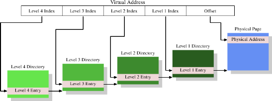

# 4.2. 多层次页表

4MB 的页并非常态，它们会浪费很多的 memory，因为操作系统必须执行的许多操作都需要与 memory 页对齐（align）。以 4kB 页而言（32 bit 机器、甚至经常是 64 bit 机器上的常态），虚拟地址的偏移量部分的大小仅有 12 bit。这留了 20 bit 作为页目录的选择器。一个有着 220 个项目的表格是不切实际的。即使每个项目只会有 4 byte，表格大小也会有 4MB。由于每个进程都可能拥有它自己独有的页目录，这些页目录会占据系统中大量的物理 memory。

解决方法是使用多个层次的页表。阶层于是形成一个巨大、稀疏的页目录；没有真的用到的地址空间范围不需要要被分配的 memory。这种表示法因而紧密得多了，使得 memory 中可以拥有许多进程的页表，而不会太过于影响性能。

<figure>
  
  <figcaption>图 4.2：四层地址转换</figcaption>
</figure>

如今最复杂的页表结构由四个层次所构成。图 4.2 显示了这种实现的示意图。虚拟 memory –– 在这个例子中 –– 被切成至少五个部分。其中四个部分为不同目录的索引。第四层目录被 CPU 中一种特殊用途的寄存器所指涉。第二层到第四层目录的内容为指向更低层次目录的参考。若是一个目录项目被标记为空，它显然不需要要指到任何更低层的目录。如此一来，页表树便可以稀疏且紧密。第一层目录的项目为 –– 就像在图 4.1 一样 –– 部分的物理地址，加上像访问权限这类辅助数据。

要确定对应到一个虚拟地址的物理地址，处理器首先会确定最高层目录的地址。这个地址通常存储在一个寄存器中。CPU 接着取出对应到这个目录的虚拟 memory 的索引部分，并使用这个索引来挑选合适的项目。这个项目是下一个目录的地址，使用虚拟地址的下一个部分来索引。这个过程持续到抵达第一层目录，这时目录项目的值为物理地址的高位部分。加上来自虚拟 memory 的页偏移 bit 便组成了完整的物理地址。这个过程被称为页树走访（page tree walking）。有些处理器（像是 x86 与 x86-64）会在硬件中执行这个操作，其他的则需要来自操作系统的协助。

每个在系统中执行的进程会需要它自己的页表树。部分地共享树是可能的，但不如说这是个例外状况。因此，如果页表树所需的 memory 尽可能地小的话，对性能与延展性而言都是有益的。理想的情况是将用到的 memory 彼此靠近地摆在虚拟地址空间中；实际用到的物理地址则无关紧要。对一支小程序而言，仅仅使用在第二、三、四层各自的一个目录、以及少许第一层目录，可能还过得去。在有着 4kB 页以及每目录 512 个项目的 x86-64 上，这可以用总计 4 个目录（每层一个）来寻址 2MB。1GB 的连续 memory 可以用一个第二到第四层目录、以及 512 个第一层目录来寻址。

不过，假设可以连续地分配所有 memory 也太过于简化了。为了弹性起见，一个进程的栈（stack）与堆（heap）区域 –– 在大多情况下 –– 会被分配在地址空间中极为相对的两端。这令两个区域在需要时都能尽可能地增长。这表示，最有可能是两个需要的第二层目录，以及与此相应的、更多低层次的目录。

但即使如此也不总是符合当前的实际状况。为了安全考量，一个可执行程序的多个部分（代码、数据、堆、栈、动态共享对象〔Dynamic Shared Object，DSO〕，又称共享函数库〔shared library〕）会被映射在随机化的地址上 [9]。随机化扩大了不同部分的相对位置；这暗示着，在一个进程里使用中的不同 memory 区域会广泛地散布在虚拟地址空间中。通过在随机化的地址的 bit 数上施加一些限制也可以限制范围，但这无疑 –– 在大多情况下 –– 会让一个进程无法以仅仅一或两个第二与第三层目录来执行。

若是性能比起安全性真的重要太多了，也可以把随机化关闭。于是操作系统通常至少会在虚拟 memory 中连续地加载所有的 DSO。

