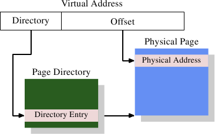

# 4.1. 最简单的地址转换

有趣的部分是虚拟地址到物理地址的转换。MMU 可以逐个页重新映射地址。就如同寻址 cache 行的时候一样，虚拟地址会被切成多个部分。这些部分用来索引多个用于构建最终物理地址的表格。以最简单的模型而言，我们仅有一个层次的表格。

*图 4.1：一层地址转换*

图 4.1 显示了到底是怎么使用虚拟地址的不同部分的。开头的部分用于选择一个页目录（Page Directory）中的一个项目；在这个目录中的每个项目都能由操作系统个别设置。页目录项目决定了一个物理内存页的地址；在页目录中，可以有多于一个指到相同物理地址的项目。记忆单元的完整物理地址是由页目录的页地址、结合虚拟地址的低 bit 所决定的。页目录项目也包含一些像是访问权限这类关于页的额外信息。

页目录的数据结构存储于主内存中。操作系统必须分配连续的物理内存、并将这个内存区域的基底地址（base address）存储在一个特殊的寄存器中。虚拟内存中适当的 bit 量接着会被用作一个页目录的索引——它实际上是一个目录项目的数组。

作为一个实际的例子，以下是在 x86 机器上的 4MB 页所使用的布局。虚拟内存的偏移量部分的大小为 22 bit，足以寻址一个 4MB 页中的每个 byte。虚拟内存剩余的 10 bit 选择了页目录里 1024 个项目中的其中一个。每个项目包含一个 4MB 页的一个 10 bit 的基底地址，其会与偏移量结合以构成完整的 32 bit 地址。

