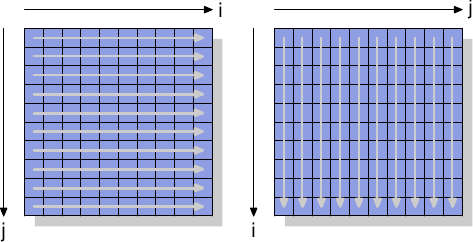

# 6.1. 绕过 cache

当数据被产生、并且没有（立即）被再次使用时，memory 存储操作会先读取完整的 cache 行然后修改 cache 数据，这点对性能是有害的。这个操作会将可能再次用到的数据踢出 cache，以让给那些短期内不会再次被用到的数据。尤其是像矩阵 –– 它会先被填值、接着才被使用 –– 这类大数据结构。在填入矩阵的最后一个元素前，第一个元素就会因为矩阵太大被踢出 cache，导致写入 cache 丧失效率。

对于这类情况，处理器提供对*非暂存（non-temporal）*写入操作的支持。这个情境下的非暂存指的是数据在短期内不会被使用，所以没有任何 cache 它的理由。这些非暂存的写入操作不会先读取 cache 行然后才修改它；反之，新的内容会被直接写进 memory。

这听来代价高昂，但并不是非得如此。处理器会试着使用合并写入（见 3.3.3 节）来填入整个 cache 行。若是成功，那么 memory 读取操作是完全不必要的。如 x86 以及 x86-64 架构，gcc 提供若干 intrinsic 函数 [^译注]：

```c
#include <emmintrin.h>
void _mm_stream_si32(int *p, int a);
void _mm_stream_si128(int *p, __m128i a);
void _mm_stream_pd(double *p, __m128d a);
#include <xmmintrin.h>
void _mm_stream_pi(__m64 *p, __m64 a);
void _mm_stream_ps(float *p, __m128 a);
#include <ammintrin.h>
void _mm_stream_sd(double *p, __m128d a);
void _mm_stream_ss(float *p, __m128 a);
```

最有效率地使用这些指令的情况是一次处理大量数据。数据从 memory 加载、经过一或多步处理、而后写回 memory。数据「流（stream）」经处理器，这些指令便得名于此。

memory 位置必须各自对齐至 8 或 16 byte。在使用多媒体扩充（multimedia extension）的代码中，也可以用这些非暂存的版本替换一般的 `_mm_store_*` 指令。我们并没有在 A.1 节的矩阵相乘程序中这么做，因为写入的值会在短时间内被再次使用。这是串流指令无所助益的一个例子。6.2.1 节会更加深入这段代码。

处理器的合并写入缓冲区可以将部分写入 cache 行的请求延迟一小段时间。一个接着一个执行所有修改单一 cache 行的指令，以令合并写入能真的发挥功用通常是必要的。以下是一个如何实践的例子：

```c
#include <emmintrin.h>
void setbytes(char *p, int c)
{
  __m128i i = _mm_set_epi8(c, c, c, c,
                           c, c, c, c,
                           c, c, c, c,
                           c, c, c, c);
  _mm_stream_si128((__m128i *)&p[0], i);
  _mm_stream_si128((__m128i *)&p[16], i);
  _mm_stream_si128((__m128i *)&p[32], i);
  _mm_stream_si128((__m128i *)&p[48], i);
}
```

假设指针 `p` 被适当地对齐，呼叫这个函数会将指向的 cache 行中的所有 byte 设为 `c`。合并写入逻辑会看到四个生成的 `movntdq` 指令，并仅在最后一个指令被执行之后，才对 memory 发出写入命令。总而言之，这段程序不仅避免在写入前读取 cache 行，也避免 cache 被并非立即需要的数据污染。这在某些情况下有着巨大的好处。一个经常使用这项技术的例子即是 C 函数库中的 `memset` 函数，它在处理大块 memory 时应该要使用类似于上述程序的作法。

某些架构提供专门的解法。PowerPC 架构定义 `dcbz` 指令，它能用以清除整个 cache 行。这个指令不会真的绕过 cache，因为 cache 行仍会被分配来存放结果，但没有任何数据会从 memory 被读出来。这相比于非暂存存储指令更加受限，因为 cache 行只能全部被清空而污染 cache（在数据为非暂存的情况），但其不需要合并写入逻辑来达到这个结果。

为了一探非暂存指令的运作，我们将观察一个用以测量矩阵 –– 由一个二维数组所组成 –– 写入性能的新测试。编译器将矩阵置放于 memory 中，以令最左边的（第一个）索引指向一列在 memory 中连续置放的所有元素。右边的（第二个）索引指向一列中的元素。测试程序以两种方式迭代矩阵：第一种是在内部循环增加行号，第二种是在内部循环增加列号。这代表其行为如图 6.1 所示。

<figure>
  
  <figcaption>图 6.1：矩阵访问模式</figcaption>
</figure>

我们测量初始化一个 3000 × 3000 矩阵所花的时间。为了观察 memory 的表现，我们采用不会使用 cache 的存储指令。在 IA-32 处理器上，「非暂存提示（non-temporal hint）」即被用在于此。作为比较，我们也测量一般的存储操作。结果见于表 6.1。

<figure>
  <table>
    <tr>
      <th rowspan="2"></th>
      <th colspan="2">内部循环增加</th>
    </tr>
    <tr>
      <th>列</th>
      <th>行</th>
    </tr>
    <tr>
      <td>一般</td>
      <td>0.048s</td>
      <td>0.127s</td>
    </tr>
    <tr>
      <td>非暂存</td>
      <td>0.048s</td>
      <td>0.160s</td>
    </tr>
  </table>
  <figcaption>表 6.1：矩阵初始化计时</figcaption>
</figure>

对于使用 cache 的一般写入操作，我们观察到预期中的结果：若是 memory 被顺序地使用，我们会得到比较好的结果，整个操作费 0.048s，相当于 750MB/s，几近于随机访问的情况却花 0.127s（大约 280MB/s）。这个矩阵已经大到令 cache 没那么有效。

我们感兴趣的部分主要是绕过 cache 的写入操作。可能令人吃惊的是，在这里顺序访问跟使用 cache 的情况一样快。这个结果的原因是处理器执行上述的合并写入操作。此外，对于非暂存写入的*memory 排序（memory ordering）*规则亦被放宽：程序需要明确地插入 memory 屏障（memory barriers）（如 x86 与 x86-64 处理器的 `sfence` 指令）。意味着处理器在写回数据时有着更多的自由，因此能尽可能地善用可用的带宽。

内部循环以行向（column-wise）访问的情况就不同。无 cache 访问的结果明显地慢于 cache 访问（0.16s，约 225MB/s）。这里我们可以理解到，合并写入是不可能的，每个记忆单元都必须被独立处理。这需要不断地从 RAM 芯片上选取新的几列，附带着与此相应的延迟。结果是比有 cache 的情况还慢 25%。

在读取操作上，处理器 –– 直到最近 –– 除了非暂存访问（Non-Temporal Access，NTA）预取指令的弱提示之外，仍欠缺相应的支持。没有与合并写入对等的读取操作，这对诸如 memory 映射 I/O（memory-mapped I/O）这类无法被 cache 的 memory 尤其糟糕。Intel 附带 SSE4.1 扩充引入 NTA 加载。它们以一些串流加载缓冲区（streaming load buffer）实现；每个缓冲区包含一个 cache 行。针对一个 cache 行的第一个 `movntdqa` 指令会将 cache 行加载一个缓冲区 –– 可能会替换掉另一个 cache 行。随后，对同一个 cache 行、以 16 byte 对齐的访问操作将会由加载缓冲区以少量的成本来提供服务。除非有其他理由，cache 行将不会被加载到 cache 中，于是便可以在不污染 cache 的情况下加载大量的 memory。编译器为这个指令提供一个 intrinsic 函数：

```c
#include <smmintrin.h>
__m128i _mm_stream_load_si128 (__m128i *p);
```

这个 intrinsic 函数应该要以 16 byte 区块的地址做为参数执行多次，直到每个 cache 行都被读取为止。在这时才应该开始处理下一个 cache 行。由于只有少数几个串流读取缓冲区，可能要一次从两个 memory 位置进行读取。

我们应该从这个实验得到的是，现代的 CPU 非常巧妙地优化无 cache 写入 –– 近来甚至包括读取操作，只要它们是顺序操作的。在处理只会被用到一次的大数据结构时，这个知识是非常有用的。再者，cache 可以降低一些 –– 但不是全部 –– 随机 memory 访问的成本。在这个例子中，由于 RAM 访问的实现，导致随机访问慢 70%。在实现改变以前，无论何时都应该避免随机访问。

我们将会在谈论预取的章节再次一探非暂存标志。

[^译注]: intrinsic 函数可简称 intrinsics，由编译器提供，类似 inline 函数，但跟微处理器架构紧密相关，因为编译器知道如何运用最佳的方式来输出对应的微处理器指令。有些状况下，intrinsics 可能会呼叫标准函数库或执行环境的函数，甚至可能会有跨越处理器之间 intrinsics 的转换，例如译者维护的 [SSE2NEON](https://github.com/DLTcollab/sse2neon) 项目。
