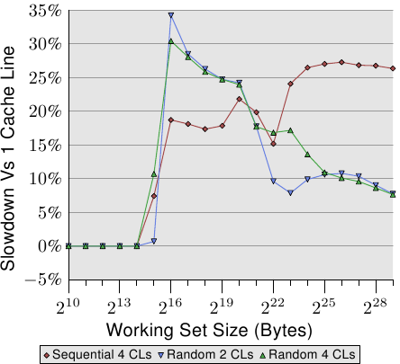
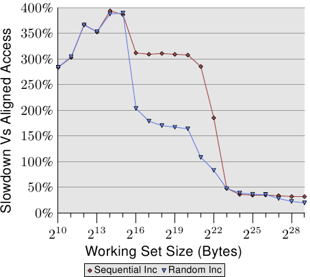
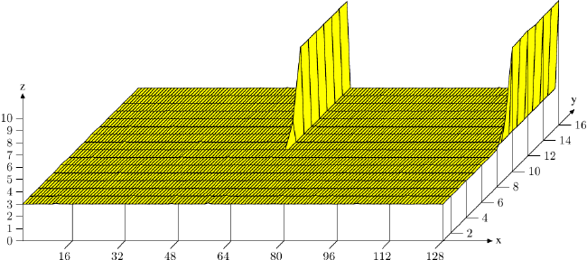
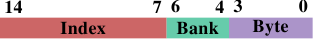

# 6.2.1. 优化一阶数据 cache 访问

在 3.3 节，我们已经看过 L1d cache 的有效使用可以提升性能。在这一节，我们会展示什么样的代码改变可以协助改进这个性能。延续前一节，我们首先聚焦在顺序访问 memory 的优化。如同在 3.3 节中看到的数字，处理器在 memory 被顺序访问的时候会自动预取数据。

使用的范例代码为矩阵乘法。我们使用两个 $1000 \times 1000$ `double` 元素的方阵（square matrices）。对于那些忘记数学的人，给定元素为 $a_{ij}$ 与 $b_{ij}$ 的矩阵 $A$ 与 $B$，$0 \leq i,j < N$，乘积为

$$
(AB)_{ij} = \sum^{N - 1}_{k = 0} a_{ik} b_{kj} = a_{i1} b_{1j} + a_{i2} b_{2j} + \cdots + a_{i(N - 1)} b_{(N - 1)j}
$$

一个直观的 C 实现看起来可能像这样

```c
for (i = 0; i < N; ++i)
  for (j = 0; j < N; ++j)
    for (k = 0; k < N; ++k)
      res[i][j] += mul1[i][k] * mul2[k][j];
```

两个输入矩阵为 `mul1` 与 `mul2`。假定结果矩阵 `res` 全被初始化为零。这是个既好又简单的实现。但应该很明显的是，我们有个正好是在图 6.1 解释过的问题。在 `mul1` 被顺序访问的时候，内部的循环增加 `mul2` 的列号。这表示 `mul1` 是像图 6.1 中左边的矩阵那样处理，而 `mul2` 是像右边的矩阵那样处理。这可能不太好。

有一个可以轻易尝试的可能补救方法。由于矩阵中的每个元素会被多次访问，是值得在使用第二个矩阵 `mul2` 之前将它重新排列（数学术语的话，「转置〔transpose〕」）的。

$$
(AB)_{ij} = \sum^{N - 1}_{k = 0} a_{ik} b^{\text{T}}_{jk} = a_{i1} b^{\text{T}}_{j1} + a_{i2} b^{\text{T}}_{j2} + \cdots + a_{i(N - 1)} b^{\text{T}}_{j(N - 1)}
$$

在转置之后（通常以上标「T」表示），我们现在顺序地迭代两个矩阵。就 C 程序而言，现在看起来像这样：

```c
double tmp[N][N];
for (i = 0; i < N; ++i)
  for (j = 0; j < N; ++j)
    tmp[i][j] = mul2[j][i];
for (i = 0; i < N; ++i)
  for (j = 0; j < N; ++j)
    for (k = 0; k < N; ++k)
      res[i][j] += mul1[i][k] * tmp[j][k];
```

我们建立一个容纳被转置的矩阵的暂时变量（temporary variable）。这需要动到额外的 memory，但这个成本会被 –– 希望如此 –– 弥补回来，因为每行 1000 次非顺序访问是更为昂贵的（至少在现代的硬件上）。是进行一些性能测试的时候。在有着 2666MHz 时钟的 Intel Core 2 上的结果为（以时钟周期为单位）：

<table>
  <tr>
    <th></th>
    <th>原始</th>
    <th>转置</th>
  </tr>
  <tr>
    <th>周期数</th>
    <td>16,765,297,870</td>
    <td>3,922,373,010</td>
  </tr>
  <tr>
    <th>相对值</th>
    <td>100%</td>
    <td>23.4%</td>
  </tr>
</table>

虽然只是个简单的矩阵转置，但我们能达到 76.6% 的加速！复制操作的损失完全被弥补。1000 次非顺序访问真的很伤。

下个问题是，我们是否能做得更好。无论如何，我们确实需要一个不需要额外复制的替代方法。我们并不是总有馀裕能进行复制：矩阵可能太大、或者可用的 memory 太小。

替代实现的探寻应该从彻底地检验涉及到的数学与原始实现所执行的操作开始。简单的数学知识让我们可以发现，只要每个加数（addend）正好出现一次，对结果矩阵的每个元素执行的加法顺序是无关紧要的。[^28]这个理解让我们可以寻找将执行在原始代码内部循环的加法重新排列的解法。

现在，让我们来检验在原始代码执行中的实际问题。被访问的 `mul2` 元素的顺序为：$(0, 0)$、$(1, 0)$、 ... 、$(N - 1, 0)$、$(0,1)$、$(1, 1)$、 ...。元素 $(0, 0)$ 与 $(0, 1)$ 位于同一个 cache 行中，但在内部循环完成一轮的时候，这个 cache 行早已被逐出。以这个例子而言，每一轮内部循环都需要 –– 对三个矩阵的每一个而言 –– 1000 个 cache 行（Core 2 处理器为 64 byte）。这加起来远比 L1d 可用的 32k 还多。

但若是我们在执行内部循环的期间，一起处理中间循环的两次迭代呢？在这个情况下，我们使用两个来自必定在 L1d 中的 cache 行的 `double` 值。我们将 L1d 错失率减半。[^译注]这当然是个改进，但 –– 视 cache 行的大小而定 –– 也许仍不是我们可以得到的最好结果。Core 2 处理器有个 cache 行大小为 64 byte 的 L1d。实际的大小可以使用

`sysconf (_SC_LEVEL1_DCACHE_LINESIZE)`

在运行期查询、或是使用命令行（command line）的 `getconf` 工具程序（utility），以让程序可以针对特定的 cache 行大小编译。以 `sizeof(double)` 为 8 来说，这表示 –– 为了完全利用 cache 行 –– 我们应该展开内部循环 8 次。继续这个想法，为了有效地使用 `res` 矩阵 –– 即，为了同时写入 8 个结果 –– 我们也该展开外部循环 8 次。我们假设这里的 cache 行大小为 64，但这个代码也能在 32 bytecache 行的系统上运作，因为 cache 行也会被 100% 利用。一般来说，最好在编译期像这样使用 `getconf` 工具程序来写死（hardcode）cache 行大小：

`gcc -DCLS=$(getconf LEVEL1_DCACHE_LINESIZE) ...`

若是二进制文件是假定为一般化（generic）的话，应该使用最大的 cache 行大小。使用非常小的 L1d 表示并非所有数据都能塞进 cache，但这种处理器无论如何都不适合高性能程序。我们写出的代码看起来像这样：

```c
#define SM (CLS / sizeof (double))
for (i = 0; i < N; i += SM)
  for (j = 0; j < N; j += SM)
    for (k = 0; k < N; k += SM)
      for (i2 = 0, rres = &res[i][j],
           rmul1 = &mul1[i][k]; i2 < SM;
           ++i2, rres += N, rmul1 += N)
        for (k2 = 0, rmul2 = &mul2[k][j];
             k2 < SM; ++k2, rmul2 += N)
          for (j2 = 0; j2 < SM; ++j2)
            rres[j2] += rmul1[k2] * rmul2[j2];
```

这看起来超可怕的。在某种程度上它是如此，但只是因为它包含一些技巧。最显而易见的改变是，我们现在有六层巢状循环。外部循环以 `SM`（cache 行大小除掉 `sizeof(double)`）为间隔迭代。这将乘法切成多个可以用更多 cache 局部性处理的较小的问题。内部循环迭代外部循环漏掉的索引。再一次，这里有三层循环。这里唯一巧妙的部分是 `k2` 与 `j2` 循环的顺序不同。这是因为在实际运算中，仅有一个表示式取决于 `k2`、但有两个取决于 `j2`。

这里其余的复杂之处来自 gcc 在优化数组索引的时候并不是非常聪明的结果。额外变量 `rres`、`rmul1`、与 `rmul2` 的引入，通过将内部循环的常用表示式（expression）尽可能地拉出来，以优化代码。C 与 C++ 语言默认的别名规则（aliasing rule）并不能帮助编译器做出这些决定（除非使用 `restrict`，所有指针访问都是别名的潜在来源）。这就是为何对于数值程序设计而言，Fortran 仍是一个偏好语言的原因：它令快速程序的撰写更简单。[^29]

|  | 原始 | 转置 | 子矩阵 | 向量化 |
| --- | --- | --- | --- | --- |
| 周期数 | 16,765,297,870 | 3,922,373,010 | 2,895,041,480 | 1,588,711,750 |
| 相对值 | 100% | 23.4% | 17.3% | 9.47% |

表 6.2：矩阵乘法计时

所有努力所带来的成果可以在表 6.2 看到。通过避免复制，我们增加额外的 6.1% 性能。此外，我们不需要要任何额外的 memory。只要结果矩阵也能塞进 memory，输入矩阵可以是任意大小的。这是我们现在已经达成的一个通用解法的一个必要条件。

在表 6.2 中还有一栏没有被解释过。大多现代处理器如今包含针对向量化（vectorization）的特殊支持。经常被标为多媒体扩充，这些特殊指令可以同时处理 2、4、8、或者更多值。这些经常是 SIMD（单指令多数据，Single Instruction, Multiple Data）操作，通过其他操作的协助，以便以正确的形式获取数据。由 Intel 处理器提供的 SSE2 指令可以在一个操作中处理两个 `double` 值。指令参考手册列出提供对这些 SSE2 指令访问的 intrinsic 函数。若是使用这些 intrinsic 函数，程序执行会变快 7.3%（相对于原始实现）。结果是，一支以原始代码 10% 的时间执行的程序。翻译成人们认识的数字，我们从 318 MFLOPS 变为 3.35 GFLOPS。由于我们在这里仅对 memory 的影响有兴趣，程序的源代码被摆到 A.1 节。

应该注意的是，在最后一版的代码中，我们仍然有一些 `mul2` 的 cache 问题；预取仍然无法运作。但这无法在不转置矩阵的情况下解决。或许 cache 预取单元将会变得聪明地足以识别这些模式，那时就不需要要额外的更动。不过，以一个 2.66 GHz 处理器上的单线程程序而言，3.19 GFLOPS 并不差。

我们在矩阵乘法的例子中优化的是被加载的 cache 行的使用。一个 cache 行的所有 byte 总是会被用到。我们只是确保在 cache 行被逐出前会用到它们。这当然是个特例。

更常见的是，拥有塞满一或多个 cache 行的数据结构，而程序在任何时间点都只会使用几个成员。我们已经在图 3.11 看过，大结构尺寸在只有一些成员被用到时的影响。

<figure>
  
  <figcaption>图 6.2：散布在多个 cache 行中</figcaption>
</figure>

图 6.2 显示使用现在已熟知的程序执行另一组基准测试的结果。这次会加上同个链表元素的两个值。在一个案例中，两个元素都在同一个 cache 行内；在另一个案例中，一个元素位在链表元素的第一个 cache 行，而第二个位在最后一个 cache 行。这张图显示我们正遭受的性能衰减。

不出所料，在所有情况下，若是工作集塞得进 L1d 就不会有任何负面影响。一旦 L1d 不再充足，则是使用一个进程的两个 cache 行来偿付损失，而非一个。红线显示链表被顺序地排列时的数据。我们看到寻常的两步模式：当 L2 cache 充足时的大约 17% 的损失、以及当必须用到主 memory 时的大约 27% 的损失。

在随机 memory 访问的情况下，相对的数据看起来有点不同。对于塞得进 L2 的工作集而言的性能衰减介于 25% 到 35% 之间。再往后它下降到大约 10%。这不是因为损失变小，而是因为实际的 memory 访问不成比例地变得更昂贵。这份数据也显示，在某些情况下，元素之间的距离是很重要的。Random 4 CLs 的曲线显示较高的损失，因为用到第一个与第四个 cache 行。

要查看一个数据结构对比于 cache 行的布局，一个简单的方法是使用 pahole 程序（见 [4]）。这个程序检验定义在二进制文件中的数据结构。取一个包含这个定义的程序：

```c
struct foo {
  int a;
  long fill[7];
  int b;
};
```

当在一台 64 bit 机器上编译时，pahole 程序的输出（在其他东西之中）包含显示于图 6.3 的输出。这个输出结果告知我们很多东西。首先，它显示这个数据结构使用超过一个 cache 行。这个工具假设目前使用的处理器的 cache 行大小，但这个值可以使用一个命令行参数来覆盖。尤其在结构大小几乎没有超过一个 cache 行、以及许多这种类型的对象会被分配的情况下，寻求一个压缩这种结构的方式是合理的。或许几个元素能有比较小的类型、又或者某些字段实际上是能使用独立 bit 来表示的标志。

```text
struct foo {
      int                        a;                    /*     0     4 */

      /* XXX 4 bytes hole, try to pack */

      long int                   fill[7];              /*     8    56 */
      /* --- cacheline 1 boundary (64 bytes) --- */
      int                        b;                    /*    64     4 */
}; /* size: 72, cachelines: 2 */
   /* sum members: 64, holes: 1, sum holes: 4 */
   /* padding: 4 */
   /* last cacheline: 8 bytes */
```

图 6.3：pahole 执行的输出

在这个范例的情况中，压缩是很容易的，而且它也被这支程序所暗示。输出显示在第一个元素后面有个四 bit 的洞（hole）。这个洞是由结构的对齐需求以及 `fill` 元素所造成的。很容易发现元素 `b` –– 其大小为四 byte（由那行结尾的 4 所指出的）–– 完美地与这个间隔（gap）相符。在这个情况下的结果是，间隔不再存在，而这个数据结构塞得进一个 cache 行中。pahole 工具能自己完成这个优化。若是使用 `--reorganize` 参数，并将结构的名称加到命令行的结尾，这个工具的输出即是优化的结构、以及使用的 cache 行。除了移动字段以填补间隔之外，这个工具也可以优化 bit 字段以及合并填充（padding）与洞。更多细节见 [4]。

有个正好大得足以容纳尾端元素的洞当然是个理想的情况。为了让这个优化有用，对象本身也必须对齐 cache 行。我们马上就会开始处理这点。

pahole 输出也可以轻易看出元素是否必须被重新排列，以令那些一起用到的元素也会被存储在一起。使用 pahole 工具，很容易就可以确定哪些元素要在同个 cache 行，而不是必须在重新排列元素时才能达成。这并不是一个自动的过程，但这个工具能帮助很多。

各个结构元素的位置、以及它们被使用的方式也很重要。如同我们已经在 3.5.2 节看到的，晚到 cache 行的关键 word 的程序性能是很糟的。这表示一位程序开发者应该总是遵循下列两条原则：

1. 总是将最可能为关键 word 的结构元素移到结构的开头。
2. 访问数据结构、以及访问顺序不受情况所约束时，以它们定义在结构中的顺序来访问。

以小结构而言，这表示元素应该以它们可能被访问的顺序排列。这必须以灵活的方式处理，以允许其他像是补洞之类的优化也能被使用。对于较大的数据结构，每个 cache 行大小的区块应该遵循这些原则来排列。

不过，若是对象自身不像预期地对齐，就不值得花时间来重新排列它。一个对象的对齐，是由数据类型的对齐需求所决定的。每个基础类型有它自己的对齐需求。对于结构类型，它的任意元素中最大的对齐需求决定这个结构的对齐。这几乎总是小于 cache 行大小。这表示即使一个结构的成员被排列成塞得进同一个 cache 行，一个被分配的对象也可能不具有相符于 cache 行大小的对齐。有两种方法能确保对象拥有在设计结构布局时使用的对齐：

* 对象可以用明确的对齐需求分配。对于动态分配（dynamic allocation），呼叫 `malloc` 仅会以相符于最严格的标准类型（通常是 `long double`）的对齐来分配对象。不过，使用 `posix_memalign` 请求较高的对齐也是可能的。

    ```c
    #include <stdlib.h>
    int posix_memalign(void **memptr,
                       size_t align,
                       size_t size);
    ```

    这个函数将一个指到新分配的 memory 的指针存储到由 `memptr` 指到的指针变量中。memory 区块大小为 `size` byte，并在 `align` byte 边界上对齐。

    对于由编译器分配的对象（在 `.data`、`.bss` 等，以及在栈中），可以使用一个变量属性（attribute）：

    ```c
    struct strtype variable
       __attribute((aligned(64)));
    ```

    在这个情况下，不管 `strtype` 结构的对齐需求为何，`variable` 都会在 64 byte 边界上对齐。这对全局变量与自动变量也行得通。

    对于数组，这个方法并不如你可能预期的那般运作。只有数组的第一个元素会被对齐，除非每个元素的大小是对齐值的倍数。这也代表每个单一变量都必须被适当地标注。`posix_memalign` 的使用也不是完全不受控制的，因为对齐需求通常会导致碎片与／或更高的 memory 消耗。

* 一个用户定义类型的对齐需求可以使用一个类型属性来改变：

    ```c
    struct strtype {
        ...members...
    } __attribute((aligned(64)));
    ```

    这会使编译器以合适的对齐来分配所有的对象，包含数组。不过，程序开发者必须留意针对动态分配对象的合适对齐的请求。这里必须再一次使用 `posix_memalign`。使用 gcc 提供的 `alignof` 运算子（operator）、并将这个值作为第二个参数传递给 `posix_memalign` 是很简单的。

之前在这一节提及的多媒体扩充几乎总是需要对齐 memory 访问。即，对于 16 byte 的 memory 访问而言，地址是被假定以 16 byte 对齐的。x86 与 x86-64 处理器拥有可以处理非对齐访问的 memory 操作的特殊变体，但这些操作比较慢。对于所有 memory 访问都需要完全对齐的大多 RISC 架构而言，这种严格的对齐需求并不新奇。即使一个架构支持非对齐的访问，这有时也比使用合适的对齐还慢，尤其是在不对齐导致一次加载或存储使用两个 cache 行、而非一个的情况下。

<figure>
  
  <figcaption>图 6.4：非对齐访问的间接成本</figcaption>
</figure>

图 6.4 显示非对齐 memory 访问的影响。现已熟悉的测试会在（顺序或随机）走访 memory 被测量的期间递增一个数据元素，一次使用对齐的链表元素、一次使用刻意不对齐的元素。图表显示程序因非对齐访问而招致的性能衰减。顺序访问情况下的影响比起随机的情况更为显着，因为在后者的情况下，非对齐访问会部分地被一般来说较高的 memory 访问成本所隐藏。在顺序的情况下，对于塞得进 L2 cache 的工作集大小来说，性能衰减大约是 300%。这可以由 L1 cache 的有效性降低来解释。某些递增操作现在会碰到两个 cache 行，而且现在在一个链表元素上操作经常需要两次 cache 行的读取。L1 与 L2 之间的连接简直太壅塞。

对于非常大的工作集大小，非对齐访问的影响仍然是 20% 至 30% –– 考虑到对于这种大小的对齐访问时间很长，这是非常多的。这张图表应该显示对齐是必须被严加对待的。即使架构支持非对齐访问，也绝对不要认为「它们跟对齐访问一样好」。

不过，有一些来自这些对齐需求的附带结果。若是一个自动变量拥有一个对齐需求，编译器必须确保它在所有情况下都可以被满足。这并不容易，因为编译器无法控制呼叫点（call site）与它们处理栈的方式。这个问题可以用两种方式处理：

1. 产生的程序主动地对齐栈，必要时插入间隔。这需要程序检查对齐、建立对齐、并在之后还原对齐。
2. 要求所有的呼叫端都将栈对齐。

所有常用的应用程序二进制接口（application binary interface，ABI）都遵循第二条路。如果一个呼叫端违反规则、并且对齐为被呼叫端所需，程序很可能会失去作用。不过，对齐的完美保持并不会平白得来。

在一个函数中使用的一个栈框（frame）的大小不必是对齐的倍数。这表示，若是从这个栈框呼叫其他函数，填充就是必要的。很大的不同是，在大部分情况下，栈框的大小对编译器而言是已知的，因此它知道如何调整栈指针，以确保任何从这个栈框呼叫的函数的对齐。事实上，大多编译器会直接将栈框的大小调高，并以它来完成操作。

如果使用可变长度数组（variable length array，VLA）或 `alloca`，这种简单的对齐处理方式就不合适。在这种情况下，栈框的总大小只会在运行期得知。在这种情况下可能会需要主动的对齐控制，使得产生的代码（略微地）变慢。

在某些架构上，只有多媒体扩充需要严格的对齐；在那些架构上的栈总是作为普通的数据类型进行最低限度的对齐，对于 32 与 64 bit 架构通常分别是 4 或 8 byte。在这些系统上，强制对齐会招致不必要的成本。这表示，在这种情况下，我们可能会想要摆脱严格的对齐需求，如果我们知道不会依赖它的话。不进行多媒体操作的尾端函数（tail function）（那些不呼叫其他函数的函数）不必对齐。只呼叫不需要对齐的函数的函数也不用。若是可以识别出够大一组函数，一支程序可能会想要放宽对齐需求。对于 x86 的二进制文件，gcc 拥有宽松栈对齐需求的支持：

`-mpreferred-stack-boundary=2`

若是这个选项（option）的值为 $N$，栈对齐需求将会被设为 $2^{N}$ byte。所以，若是使用 2 为值，栈对齐需求就被从默认值（为 16 byte）降低成只有 4 byte。在大多情况下，这表示不需要额外的对齐操作，因为普通的栈推入（push）与弹出（pop）操作无论如何都是在四 byte 边界上操作的。这个机器特定的选项可以帮忙减少程序大小，也可以提升执行速度。但它无法被套用到许多其他的架构上。即使对于 x86-64，一般来说也不适用，因为 x86-64 ABI 要求在 SSE 寄存器中传递浮点数参数，而 SSE 指令需要完整的 16 byte 对齐。然而，只要可以使用这个选项，就能造成明显的差别。

结构元素的高效摆放与对齐并非数据结构影响 cache 效率的唯一面向。若是使用一个结构的数组，整个结构的定义都会影响性能。回想一下图 3.11 的结果：在这个情况中，我们增加数组元素中未使用的数据总量。结果是预取越来越没效果，而程序 –– 对于大数据集 –– 变得越来越没效率。

对于大工作集，尽可能地使用可用的 cache 是很重要的。为了达到如此，可能有必要重新排列数据结构。虽然对程序开发者而言，将所有概念上属于一块儿的数据摆在同个数据结构是比较简单的，但这可能不是最大化性能的最好方法。假设我们有个如下的数据结构：

```c
struct order {
  double price;
  bool paid;
  const char *buyer[5];
  long buyer_id;
};
```

进一步假设这些记录会被存在一个大数组中，并且有个经常执行的工作（job）会加总所有账单的预期付款。在这种情境中，`buyer` 与 `buyer_id` 使用的 memory 是不必被加载到 cache 中的。根据图 3.11 的数据来判断，程序将会表现得比它能达到的还糟了高达五倍。

将 `order` 切成两块，前两个字段存储在一个结构中，而另一个字段存储在别处要好得多。这个改变无疑提高程序的复杂度，但性能提升证明这个成本的正当性。

最后，让我们考虑一下另一个 –– 虽然也会被应用在其他 cache 上 –– 主要是影响 L1d 访问的 cache 使用的优化。如同在图 3.8 看到的，增加的 cache 关联度有利于一般的操作。cache 越大，关联度通常也越高。L1d cache 太大，以致于无法为全关联式，但又没有足够大到要拥有跟 L2 cache 一样的关联度。若是工作集中的许多对象属于相同的 cache 集，这可能会是个问题。如果这导致由于过于使用一组集合而造成逐出，即使大多 cache 都没被用到，程序还是可能会受到延迟。这些 cache 错失有时被称为*冲突性错失（conflict miss）*。由于 L1d 寻址使用虚拟地址，这实际上是可以受程序开发者控制的。如果一起被用到的变量也存储在一块儿，它们属于相同集合的可能性是被最小化的。图 6.5 显示多快就会碰上这个问题。

<figure>
  
  <figcaption>图 6.5：cache 关联度影响</figcaption>
</figure>

在这张图中，现在熟悉的、使用 `NPAD`=15 的 Follow[^30] 测试是以特殊的配置来测量的。X 轴是两个链表元素之间的距离，以空链表元素为单位测量。换句话说，距离为 2 代表下一个元素的地址是在前一个元素的 128 byte 之后。所有元素都以相同的距离在虚拟 memory 空间中摆放。Y 轴显示链表的总长度。仅会使用 1 至 16 个元素，代表工作集总大小为 64 至 1024 byte。Z 轴显示遍历每个链表元素所需的平均周期数。

图中显示的结果应该不让人吃惊。若是被用到的元素很少，所有的数据都塞得进 L1d，而每个链表元素的访问时间仅有 3 个周期。对于几乎所有链表元素的安排都是如此：虚拟地址以几乎没有冲突的方式，被良好地映射到 L1d 的槽（slot）中。（在这张图中）有两个情况不同的特殊距离值。若是距离为 4096 byte（即，64 个元素的距离）的倍数、并且链表的长度大于八，每个链表元素的平均周期数便大幅地增加。在这些情况下，所有项目都在相同的集合中，并且 –– 一旦链表长度大于关联度 –– 项目会从 L1d 被刷新，而下一轮必须从 L2 重新读取。这造成每个链表元素大约 10 个周期的成本。

使用这张图，我们可以确定使用的处理器拥有一个关联度 8、且总大小为 32kB 的 L1d cache。这表示，这个测试可以 –– 必要的话 –– 用以确定这些值。可以为 L2 cache 测量相同的影响，但在这里更为复杂，因为 L2 cache 是使用物理地址来索引的，而且它要大得多。

但愿程序开发者将这个数据视为值得关注集合关联度的一种暗示。将数据摆放在二的幂次的边界上足够常见于现实世界中，但这正好是容易导致上述影响与性能下降的情况。非对齐访问可能会提高冲突性错失的可能性，因为每次访问都可能需要额外的 cache 行。

<figure>
  
  <figcaption>图 6.6：AMD 上 L1d 的 Bank 地址</figcaption>
</figure>

如果执行这种优化，另一个相关的优化也是可能的。AMD 的处理器 –– 至少 –– 将 L1d 实现为多个独立的 bank。只有当两个数据 word 存储在不同的 bank 中或存储在同一索引（index）下相同的 bank 中，L1d cache 才能在每一个周期里拿到两个 word。bank 地址是以虚拟地址的低 bit 编码的，如图 6.6 所示。假若会共同使用的变量也存储在一起，则它们也会有高可能性在不同的 bank 中或在同一索引下相同的 bank 中。


[^28]: 我们这里忽略可能会改变上溢位（overflow）、下溢位（underflow）、或是四舍五入（rounding）的发生的算术影响。

[^译注]: 原文说法较简略，作者的意思是：在一开始三层循环的实现中，最内部的每一次 `k` 循环迭代同时处理 `res[i][j] += mul1[i][k] * mul2[k][j]` 与 `res[i][j + 1] += mul1[i][k] * mul2[k][j + 1]`。由于才刚访问过 `mul2[k][j]` 与 `res[i][j]`，所以 `mul2[k][j + 1]` 与 `res[i][j + 1]` 还在 L1d cache 中，因而降低错失率。后述的方法是这个方法的一般化（generalization）。

[^29]: 理论上在 1999 年修订版引入 C 语言的 `restrict` 关键字应该解决这个问题。不过编译器还是不理解。原因主要是存在着太多不正确的代码，其会误导编译器、并导致它产生不正确的目的码（object code）。

[^30]: 测试是在一台 32 bit 机器上执行的，因此 `NPAD`=15 代表每个链表元素一个 64 bytecache 行。
