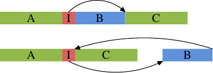

# 6.2.2. 优化一阶指令 cache 访问

准备有效使用 L1i 的代码需要与有效使用 L1d 类似的技术。不过，问题是，程序开发者通常不会直接影响 L1i 的使用方式，除非他以组合语言来撰写程序。若是使用编译器，程序开发者可以通过引导编译器建立更好的程序布局，来间接地决定 L1i 的使用。

程序有跳跃（jump）之间为线性的优点。在这些期间，处理器可以有效地预取 memory。跳跃打破这个美好的想象，因为

* 跳跃目标（target）可能不是静态决定的；
* 而且即使它是静态的，若是它错失所有 cache，memory 获取可能会花上很长一段时间。

这些问题造成执行中的停顿，可能严重地影响性能。这就是为何如今的处理器在分支预测（branch prediction，BP）上费尽心思的原因。高度定制化的 BP 单元试着尽可能远在跳跃之前确定跳跃的目标，使得处理器可以开始将新的位置的指令加载到 cache 中。它们使用静态与动态规则、而且越来越擅于判定执行中的模式。

对指令 cache 而言，尽早将数据拿到 cache 甚至是更为重要的。如同在 3.1 节提过的，指令必须在它们被执行之前解码，而且 –– 为了加速（在 x86 与 x86-64 上很重要）–– 指令实际上是以被解码的形式、而非从 memory 读取的 byte ／word 的形式被 cache 的。

为了达到最好的 L1i 使用，程序开发者至少应该留意下述的代码产生的面向：

1. 尽可能地减少代码量（code footprint）。这必须与像是循环展开（loop unrolling）与行内展开（inlining）等优化取得平衡。
2. 程序执行应该是没有气泡（bubble）的线性的。[^31]
3. 合理的情况下，对齐代码。

我们现在要看一些根据这些面向、可用于协助优化程序的编译器技术。

编译器有启动不同优化层次的选项，特定的优化也可以个别地启用。在高优化层次（gcc 的 -O2 与 -O3）启用的许多优化处理循环优化与函数行内展开。一般来说，这些是不错的优化。如果以这些方式优化的代码占了程序总执行时间的很重要的一部分，便可以提升整体的性能。尤其是，函数的行内展开允许编译器一次优化更大的代码块（chunk），从而可以产生更好地利用处理器的管线架构的机器代码。当程序较大的一部分能被视为一个单一单元时，代码与数据的处理（通过死码消除〔dead code elimination〕或值域传播〔value range propagation〕、等等）的效果更好。

较大的程序大小意味着 L1i（以及 L2 与更高层）cache 上的压力更大。这*可能*导致较差的性能。较小的程序可能比较快。幸运的是，gcc 有一个针对于此的优化选项。如果使用 -Os，编译器将会为程序大小优化。已知会增加程序大小的优化会被关掉。使用这个选项经常产生惊人的结果。尤其在编译器无法真的获益于循环展开与行内展开的情况下，这个选项就是首选。

行内展开也能被个别处理。编译器拥有引导行内展开的启发法（heuristic）与限制；这些限制可以由程序开发者控制。`-finlinelimit` 选项指定对行内展开而言，必须被视为过大的函数有多大。若是一个函数在多处被呼叫，在所有函数中行内展开它便会导致程序大小的剧增。但还有更多细节。假设一个函数 `inlcand` 在两个函数 `f1` 与 `f2` 中被呼叫。函数 `f1` 与 `f2` 本身是先后被呼叫的。

行内展开：

```text
start f1
  code f1
  inlined inlcand
  more code f1
end f1

start f2
  code f2
  inlined inlcand
  more code f2
end f2
```

没有行内展开：

```text
start inlcand
  code inlcand
end inlcand

start f1
  code f1
end f1

start f2
  code f2
end f2
```

表 6.3：行内展开 Vs 没有行内展开

表 6.3 显示在两个函数中没有行内展开与行内展开的情况下，产生的代码看起来会怎么样。若是函数 `inlcand` 在 `f1` 与 `f2` 中被行内展开，产生的代码的大小为 size `f1` + size `f2` + $2 \times$ size `inlcand`。如果没有进行行内展开的话，总大小减少 size `inlcand`。这就是在 `f1` 与 `f2` 相互在不久后呼叫的话，L1i 与 L2 cache 额外所需的量。再加上：若是 `inlcand` 没被行内展开，代码可能仍在 L1i 中，而它就不必被再次解码。再加上：分支预测单元或许能更好地预测跳跃，因为它已经看过这段程序。如果对程序而言，被行内展开的函数大小上限的编译器默认值并不是最好的，它应该要被降低。

不过，有些行内展开总是合理的情况。假如一个函数只会被呼叫一次，它也应该被行内展开。这给编译器执行更多优化的机会（像是值域传播，其会显着地改进代码）。行内展开也许会受选择限制所阻碍。对于像这样的情况，gcc 有个选项来明确指定一个函数总是要被行内展开。加上 `always_inline` 函数属性会命令编译器执行恰如这个名称所指示的操作。

在相同的情境下，若是即便一个函数足够小也不该被行内展开，可以使用 `noinline` 函数属性。假如它们经常从多处被呼叫，即使对于小函数，使用这个属性也是合理的。若是 L1i 内容能被重复使用、并且整体的代码量减少，这往往弥补额外函数呼叫的附加成本。如今分支预测单元是非常可靠的。若是行内展开可以促成更进一步的优化，情况就不同。这是必须视情况来决定的。

如果行内展开的代码总是会被用到的话，`always_inline` 属性表现得很好。但假如不是这样呢？如果偶尔才会呼叫被行内展开的函数会怎么样：

```c
void fct(void) {
  ... code block A ...
  if (condition)
    inlfct()
  ... code block C ...
```

为这种程序序列产生的代码一般来说与源代码的结构相符。这表示首先会是程序区块 A、接着是一个条件式跳跃 –– 假如条件式被求值为否（false），就往前跳跃。接下来是为行内展开的 `inlfct` 产生的代码，最后是程序区块 C。这看起来全都很合理，但它有个问题。

若是 `condition` 经常为否，执行就不是线性的。中间有一大块没用到的代码，不仅因为预取污染 L1i，它也会造成分支预测的问题。若是分支预测错，条件表示式可能非常没有效率。

这是个普遍的问题，而且并不专属于函数的行内展开。无论在何时用到条件执行、而且它是不对称的（即，表示式比起某一种结果还要更常产生另一种结果），就有不正确的静态分支预测、从而有管线中的气泡的可能性。这可以通过告知编译器，以将较不常执行的代码移出主要的程序路径来避免。在这种情况下，为一个 `if` 叙述产生的条件分支将会跳跃到一个跳脱顺序的地方，如下图所示。



上半部表示单纯的程序布局。假如区域 B –– 即，由上面被行内展开的函数 `inlfct` 所产生的 –– 因为条件 I 跳过它而经常不被执行，处理器的预取会拉进包含鲜少用到的区块 B 的 cache 行。这可以通过区块的重新排列来改变，其结果可以在图的下半部看到。经常执行的代码在 memory 中是线性的，而鲜少执行的代码被移到不伤及预取与 L1i 效率的某处。

gcc 提供两个实现这点的方法。首先，编译器可以在重新编译代码的期间将性能分析（profiling）的输出纳入考量，并根据性能分析摆放程序区块。我们将会在第七节看到这是如何运作的。第二个方法则是通过明确的分支预测。gcc 认得 `__builtin_expect`：

```c
long __builtin_expect(long EXP, long C);
```

这个结构告诉编译器，表示式 `EXP` 的值非常有可能会是 `C`。返回值为 `EXP`。`__builtin_expect` 必须被用在条件表示式中。在几乎所有的情况中，它会被用在布尔表示式的情境中，在这种情况下定义两个辅助宏（macro）要更方便一些：

```c
#define unlikely(expr) __builtin_expect(!!(expr), 0)
#define likely(expr) __builtin_expect(!!(expr), 1)
```

然后可以像这样用这些宏

```c
if (likely(a > 1))
```

若是程序开发者使用这些宏、然后使用 `-freorder-blocks` 优化选项，gcc 会如上图那样重新排列区块。这个选项会随着 `-O2` 启用，但对于 `-Os` 会被停用。有另一个重新排列区块的 gcc 选项（`-freorder-blocks-and-partition`），但它的用途有限，因为它不适用于异常处理。

还有另一个小循环的大优点，至少在某些处理器上。Intel Core 2 前端有一个特殊的功能，称作循环指令流检测器（Loop Stream Detector，LSD）。若是一个循环拥有不多于 18 条指令（没有一个是对子程序〔routine〕的呼叫）、仅要求至多 4 次 16 byte 的解码器获取、拥有至多 4 条分支指令、并且被执行超过 64 次，那么这个循环有时会被锁在指令队列中，因而在循环被再次用到的时候可以更为快速地使用。举例来说，这适用于会通过一个外部循环进入很多次的很小的内部循环。即使没有这种特化的硬件，小巧的循环也有优点。

就 L1i 而言，行内展开并非优化的唯一面向。另一个面向是对齐，就如数据一般。但有些明显的差异：程序大部分是线性的一团，其无法任意地摆在地址空间中，而且它无法直接受程序开发者影响，因为是编译器产生这些程序的。不过，有些程序开发者可以控制的面向。

对齐每条单一指令没有任何意义。目标是令指令流为连续的。所以对齐仅在战略要地上才有意义。为了决定要在何处加上对齐，理解能有什么好处是必要的。有条在一个 cache 行开头的指令[^32]代表 cache 行的预取是最大化的。对指令而言，这也代表着解码器是更有效的。很容易看出，若是执行一条在 cache 行结尾的指令，处理器就必须准备读取一个新的 cache 行、并对指令解码。有些事情可能会出错（像是 cache 行错失），代表平均而言，一条在 cache 行结尾的指令执行起来并不跟在开头的指令一样有效。

如果控制权刚转移到在 cache 行结尾的指令（因此预取无效），则情况最为严重。将以上推论结合后，我们得出对齐代码最有用的地方：

* 在函数的开头；
* 在仅会通过跳跃到达的基础区块的开头；
* 对某些扩充而言，在循环的开头。

在前两种情况下，对齐的成本很小。在一个新的位置继续执行，假如决定让它在 cache 行的开头，我们便优化预取与解码。[^33]编译器通过无操作（no-op）指令的插入，填满因对齐程序产生的间隔，而实现这种对齐。这种「死码（dead code）」占用一些空间，但通常不伤及性能。

第三种情况略有不同：对齐每个循环的开头可能会造成性能问题。问题在于，一个循环的开头往往是连续地接在其他的代码之后。若是情况不是非常凑巧，便会有个在前一条指令与被对齐的循环开头之间的间隔。不像前两种情况，这个间隔无法完全不造成影响。在前一条指令执行之后，必须执行循环中的第一条指令。这表示，在前一条指令之后，要不是非得有若干条无操作指令以填补间隔、要不就是非得有个到循环开头的无条件跳跃。两种可能性都不是免费的。特别是循环本身并不常被执行的话，无操作指令或是跳跃的开销可能会比对齐循环所省下的还多。

有三种程序开发者可以影响程序对齐的方法。显然地，若是程序是以组合语言撰写，其中的函数与所有的指令都可以被明确地对齐。组合语言为所有架构提供 `.align` 假指令（pseudo-op）以做到这点。对高层语言而言，必须将对齐需求告知编译器。不像数据类型与变量那样，这在源代码中是不可能的。而是要使用一个编译器选项：

`-falign-functions=N`

这个选项命令编译器将所有函数对齐到下一个大于 `N` 的二的幂次的边界。这表示会产生一个至多 `N` byte 的间隔。对小函数而言，使用一个很大的 `N` 值是个浪费。对只有难得才会执行的程序也相同。在可能同时包含常用与没那么常用的接口的函数库中，后者可能经常发生。选项值的明智选择可以通过避免对齐来让工作加速或是节省 memory。可以通过使用 1 作为 `N` 的值、或是使用 `-fno-align-functions` 选项来关掉所有的对齐。

有关前述的第二种情况的对齐 –– 无法顺序达到的基础区块的开头 –– 可以使用一个不同的选项来控制：

`-falign-jumps=N`

所有其他的细节都相同，关于浪费 memory 的警告也同样适用。

第三种情况也有它自己的选项：

`-falign-loops=N`

再一次，同样的细节与警告都适用。除了在这里，如同先前解释过的，对齐会造成运行期的成本，因为在对齐的地址会被顺序地抵达的情况下，要不是必须执行无操作指令就是必须执行跳跃指令。

gcc 还知道一个用来控制对齐的选项，在这里提起它仅是为了完整起见。`-falign-labels` 对齐了程序中的每个单一标签（label）（基本上是每个基础区块的开头）。除了一些例外状况之外，这都会让程序变慢，因而不该被使用。


[^31]: 气泡生动地描述在一个处理器的管线中执行的空洞，其会在执行必须等待资源的时候发生。关于更多细节，请读者参阅处理器设计的文献。

[^32]: 对某些处理器而言，cache 行并非指令的最小区块（atomic block）。Intel Core 2 前端会将 16 byte 区块发给解码器。它们会被适当的对齐，因此没有任何被发出的区块能横跨 cache 行边界。对齐到 cache 行的开头仍有优点，因为它优化预取的正面影响。

[^33]: 对于指令解码，处理器往往会使用比 cache 行还小的单元，在 x86 与 x86-64 的情况中为 16 byte。
