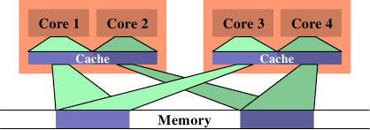
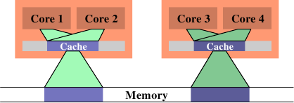

# 6.4.3. 带宽考量

当使用多条线程、并且它们不会因为在不同的处理器核上使用相同的 cache 行而造成 cache 争夺时，仍然会有潜在的问题。每个处理器拥有连接到与这个处理器上所有处理器核与 HT 共享的内存的最大带宽。取决于机器架构（如，图 2.1 中的那个），多核可能会共享链接到内存或北桥的相同的总线。

处理器核本身即便在完美的情况下全速运转，到内存的连线也无法在不等待的前提下满足所有加载与存储的请求。现在，将可用的带宽进一步以处理器核、HT、以及共享一条到北桥的连线的处理器的数量划分，并行突然变成一个大问题。有效率程序的性能可能会受限于可用的内存带宽。

图 3.32 显示增加处理器的 FSB 速度能帮上大忙。这就是为什么随着处理器核数量的成长，我们也会看到 FSB 速度上的提升。尽管如此，若是程序使用很大的工作集，并且被充分优化过，这也永远不会足够。程序开发者必须准备好识别由有限带宽所致的问题。

现代处理器的性能测量计数器可以观察到 FSB 的争夺。在 Core 2 处理器上，`NUS_BNR_DRV` 事件计算一颗处理器核因为总线尚未准备就绪而必须等待的周期数。这指出总线被重度使用，而且加载或存储至主内存要花费比平常还要更长的时间。Core 2 处理器支持更多事件，可以计算像 RFO 或一般的 FSB 使用率等特定的总线行为。在开发期间研究一个应用程序的可延展性的可能性的时候，后者可能会派上用场。若是总线使用率已接近 1.0，可延展性的机会是最小的。

若是识别出一个带宽问题，有几件可以做到的事情。它们有时候是矛盾的，所以某些实验可能是必要的。一个解法是去买更快的计算机，假如有什么可买的话。取得更多的 FSB 速度、更快的 RAM 模块、或许还有处理器本地的内存，大概 –– 而且很可能会 –– 有帮助。不过，这可能成本高昂。若是程序仅在一台机器（或少数几台机器）上需要，硬件的一次性开销可能会比重写程序的成本还低。不过一般来说，最好是对程序下手。

在优化代码本身以避免 cache 未命中之后，达到更好带宽使用率的唯一剩余选项是将线程更妥善地放在可用的处理器核上。默认情况下，系统核心中的调度器会根据它自己的策略，将一条线程指派给一个处理器。将一条线程从一颗处理器核移到另一颗是被尽可能避免的。不过，调度器并不真的知道关于工作负载的任何事情。它可以从 cache 未命中等收集信息，但这在许多情况下并不是非常有帮助。



*图 6.13：没效率的调度*

一个可能导致很大的内存总线使用率的情况，是在两条线程被调度在不同的处理器（或是在不同 cache 区域的核）上、而且它们使用相同的数据集的时候。图 6.13 显示这种状况。处理器核 1 与 3 访问相同的数据（以相同颜色的访问指示与内存区域表示）。同样地，处理器核 2 与 4 访问相同的数据。但线程被调度在不同的处理器上。这表示每次数据集都必须要从内存读取两次。这种状况可以被更好地处理。



*图 6.14：有效率的调度*

在图 6.14 中，我们看到理想上来看应该要是怎么样。现在被使用的总 cache 大小减少，因为现在处理器核 1 与 2 以及 3 与 4 都在相同的数据上运作。数据集只需从内存读取一次。

这是个简单的例子，但通过扩充，它适用于许多情况。如同先前提过的，操作系统核心中的调度器对数据的使用并没有深刻的理解，所以程序开发者必须确保调度是被有效率地完成的。没有很多操作系统核心的接口可用于传达这个需求。事实上，只有一个：定义线程亲和性。

线程亲和性表示，将一条线程指派给一颗或多颗处理器核。调度器接着将会在决定在哪执行这条线程的时候，（只）在那些处理器核中选择。即使有其他闲置的处理器核，它们也不会被考虑。这听来可能像是个缺陷，但这是必须偿付的代价。假如太多线程排外地执行在一组处理器核上，剩余的处理器核可能大多数都是闲置的，而除了改变亲和性之外就没什么能做的。默认情况下，线程可以执行在任一处理器核上。

有一些查询与改变一条线程的亲和性的接口：

```c
#define _GNU_SOURCE
#include <sched.h>
int sched_setaffinity(pid_t pid, size_t size,
                      const cpu_set_t *cpuset);
int sched_getaffinity(pid_t pid, size_t size,
                      cpu_set_t *cpuset);
```

这两个接口必须要被用在单线程的程序上。`pid` 引数指定哪个进程的亲和性应该要被改变或测定。调用者显然需要适当的权限来做这件事。第二与第三个参数指定处理器核的 bit 掩码。第一个函数需要填入 bit 掩码，使得它可以设置亲和性。第二个函数以选择的线程的调度信息来填充 bit 掩码。这些接口都被宣告在 `<sched.h>` 中。

`cpu_set_t` 类型也和一些操作与使用这个类型对象的宏一同被定义在这个头档中。

```c
#define _GNU_SOURCE
#include <sched.h>
#define CPU_SETSIZE
#define CPU_SET(cpu, cpusetp)
#define CPU_CLR(cpu, cpusetp)
#define CPU_ZERO(cpusetp)
#define CPU_ISSET(cpu, cpusetp)
#define CPU_COUNT(cpusetp)
```

`CPU_SETSIZE` 指定有多少 CPU 可以用这个数据结构表示。其他三个宏运用 `cpu_set_t` 对象。要初始化一个对象，应该使用 `CPU_ZERO`；其他两个宏应该用以选择或取消选择个别的处理器核。`CPU_ISSET` 测试一个指定的处理器是否为集合的一部分。`CPU_COUNT` 返回集合中被选择的处理器核数量。`cpu_set_t` 类型为 CPU 数量的上限提供一个合理的默认值。随着时间推移，肯定会证实它太小；在这个时间点，这个类型将会被调整。这表示程序必须一直将这个大小放在心上。上述的便利宏根据 `cpu_set_t` 的定义，隐式地处理这个大小。若是需要更动态的大小管理，应该使用一组扩充的宏：

```c
#define _GNU_SOURCE
#include <sched.h>
#define CPU_SET_S(cpu, setsize, cpusetp)
#define CPU_CLR_S(cpu, setsize, cpusetp)
#define CPU_ZERO_S(setsize, cpusetp)
#define CPU_ISSET_S(cpu, setsize, cpusetp)
#define CPU_COUNT_S(setsize, cpusetp)
```

这些接口接收一个对应于这个大小的额外参数。为了可以分配动态大小的 CPU 集，提供三个宏：

```c
#define _GNU_SOURCE
#include <sched.h>
#define CPU_ALLOC_SIZE(count)
#define CPU_ALLOC(count)
#define CPU_FREE(cpuset)
```

`CPU_ALLOC_SIZE` 宏的返回值为，必须为一个可以处理 CPU 计数的 `cpu_set_t` 结构而分配的 byte 数量。为了分配这种区块，可以使用 `CPU_ALLOC` 宏。以这种方式分配的内存必须使用一次 `CPU_FREE` 的调用来释放。这些宏可能会在背后使用 `malloc` 与 `free`，但并不是非得要维持这种方式。

最后，定义了一些对 CPU 集对象的操作：

```c
#define _GNU_SOURCE
#include <sched.h>
#define CPU_EQUAL(cpuset1, cpuset2)
#define CPU_AND(destset, cpuset1, cpuset2)
#define CPU_OR(destset, cpuset1, cpuset2)
#define CPU_XOR(destset, cpuset1, cpuset2)
#define CPU_EQUAL_S(setsize, cpuset1, cpuset2)
#define CPU_AND_S(setsize, destset, cpuset1,
                  cpuset2)
#define CPU_OR_S(setsize, destset, cpuset1,
                 cpuset2)
#define CPU_XOR_S(setsize, destset, cpuset1,
                  cpuset2)
```

这两组四个宏的集合可以检查两个集合的相等性，以及对集合执行逻辑 AND、OR、与 XOR 操作。这些操作在使用一些 libNUMA 函数（见附录 D）的时候会派上用场。

一个进程可以使用 `sched_getcpu` 接口来确定它目前跑在哪个处理器上：

```c
#define _GNU_SOURCE
#include <sched.h>
int sched_getcpu(void);
```

结果为 CPU 在 CPU 集中的索引。由于调度的本质，这个数字并不总是 100% 正确。在返回结果的时间、与线程回到用户层次的时间之间，线程可能已经被移到一个不同的 CPU 上。程序必须总是将这种不正确的可能性纳入考量。在任何情况下，更为重要的是被允许执行线程的那组 CPU。这个集合可以使用 `sched_getaffinity` 来查询。集合会被子线程与进程继承。线程不能指望集合在生命周期中是稳定的。亲和性掩码可以从外界设置（见上面原型中的 `pid` 参数）；Linux 也支持 CPU 热插拔（hot-plugging），这意味着 CPU 可以从系统中消失 –– 因此，也能从亲和 CPU 集消失。

在多线程程序中，个别的线程并没有如 POSIX 定义的正式进程 ID，因此无法使用上面两个函数。作为替代，`<pthread.h>` 宣告四个不同的接口：

```c
#define _GNU_SOURCE
#include <pthread.h>
int pthread_setaffinity_np(pthread_t th,
                           size_t size,
                           const cpu_set_t *cpuset);
int pthread_getaffinity_np(pthread_t th,
                           size_t size,
                           cpu_set_t *cpuset);
int pthread_attr_setaffinity_np(
                           pthread_attr_t *at,
                           size_t size,
                           const cpu_set_t *cpuset);
int pthread_attr_getaffinity_np(
                           pthread_attr_t *at,
                           size_t size,
                           cpu_set_t *cpuset);
```

前两个接口基本上与我们已经看过的那两个相同，除了它们在第一个参数拿的是一个线程的控制柄（handle），而非一个进程 ID。这可以寻址在一个进程中的个别线程。这也代表这些接口无法在另一个进程使用，它们完全是为了进程内部使用的。第三与第四个接口使用一个线程属性。这些属性是在建立一条新的线程的时候使用的。通过设置属性，一条线程可以在开始时就被调度在一个特定的 CPU 集合上。这么早选择目标处理器 –– 而非在线程已经启动之后 –– 可以在许多不同层面上受益，包含（而且尤其是）内存分配（见 6.5 节的 NUMA）。

说到 NUMA，亲和性接口在 NUMA 程序设计中也扮演着一个重要的角色。我们不久后就会回到这个案例。

目前为止，我们已经谈过两条线程的工作集重叠、使得在相同处理器核上拥有两条线程是合理的情况。反之亦然。假如两条线程在个别的数据集上运作，将它们调度在相同的处理器核上可能是个问题。两条线程为相同的 cache 斗争，因而相互减少 cache 的有效使用。其次，两个数据集都得被加载到相同的 cache 中；实际上，这增加必须加载的数据总量，因此可用的带宽被砍半。

在这种情况中的解法是，设置线程的亲和性，使得它们无法被调度在相同的处理器核上。这与先前的情况相反，所以在做出任何改变之前，理解试着要优化的情况是很重要的。

针对 cache 共享优化以优化带宽，实际上是将会在下一节涵盖的 NUMA 程序设计的一个面相。只要将「内存」的概念扩充至 cache。一旦 cache 的层次数增加，这会变得越来越重要。基于这个理由，NUMA 支持函数库中提供一个多核调度的解决方法。在不写死系统细节、或是钻入 `/sys` 文件系统的深度的前提下，决定亲和性掩码的方法请参阅附录 D 中的程序例子。

