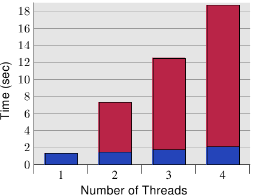
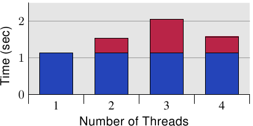

# 6.4.1. 并行优化

一开始，我们将会在本节讨论两个个别的议题，其实际上需要对立的优化。一个多线程应用程序在一些它的线程中使用共有的数据。一般的 cache 优化要求将数据保存在一起，使得应用程序的内存使用量很小，从而最大化在任意时间塞得进 cache 的内存总量。[^译注1]

不过，使用这个方法有个问题：如果多条线程写入到一个内存位置，每个相对应处理器核的 L1d 中的 cache 行必须处于「E」（独占）状态。这表示会送出许多的 RFO 消息。在最糟的情况下，每次写入访问都会送出一个消息。所以一个普通的写入将会突然变得非常昂贵。如果使用相同的内存位置，同步就是必须的（可能通过 atomic 操作[^译注3]的使用，其会在下个章节讨论到）。不过，当所有线程都使用不同的内存位置、并且可能是独立的时候，问题也显而易见。



*图 6.10：并行 cache 行访问的间接成本*

图 6.10 显示这种「假共享（false sharing）」的结果。测试程序（显示于 A.3 节）建立若干线程，其除递增一个内存位置（5 亿次）外什么也不做。测量的时间是从程序启动、直到程序等待最后一条线程结束之后。线程被钉在独立的处理器上。机器拥有四个 P4 处理器。蓝色值表示被指派到每条线程的内存分配位于个别 cache 行上的执行时间。红色部分为线程的位置被移到仅一个 cache 行时出现的损失。

蓝色的测量（使用独立的 cache 行时所需的时间）与预期的相符。程序在无损失的情况下延展至多条线程。每个处理器都将它的 cache 行保存在它拥有的 L1d 中，而且没有带宽问题，因为不必读取太多代码或数据（事实上，它们全都被 cache）。测量的些微提升其实是系统的杂讯、和可能的一些预取影响（线程使用连续的 cache 行）。

使用唯一一个 cache 行所需的时间、以及每条线程一个个别的 cache 行所需的时间相除所计算出的测量的间接成本分别是 390%、734%、以及 1,147%。乍看之下，这些很大的数字可能很令人吃惊，但考虑到需要的 cache 交互影响，这应该很显而易见。已经完成写入到 cache 行之后，就从一个处理器的 cache 拉出 cache 行。[^译注2]在任何给定的时刻，除了拥有 cache 行的处理器以外，所有处理器都会被延迟，无法做任何事。每个额外的处理器都会导致更多的延迟。



*图 6.11：四个处理器核的间接成本*

由于这些测量，清楚的是这种情况必须在程序中避免。考虑到巨大的损失，在许多情况下，这个问题是很显而易见的（至少，性能分析会显示程序位置），但有个使用现代硬件的陷阱。图 6.11 显示当程序执行在一台单一处理器节点具备四核的机器上（Intel Core 2 QX 6700）的等价测量。即使使用这个处理器的两个个别的 L2，测试案例也没有显示出任何可扩展性的问题。当相同的 cache 行被使用超过一次时有些许的间接成本，但它并没有随着处理器核的数量增加。[^36]如果用多于一个这种处理器，我们自然会看到类似于那些在图 6.10 中的结果。尽管越来越多多核处理器的使用，许多机器还是会继续使用多处理器。因此，正确的处理这种状况是很重要的，这可能意味着要在真实的 SMP 机器上测试程序。

有个针对这个问题的非常简单的「修正」：将每个变量放在它们自己的 cache 行。这是与先前提到的发挥作用的优化的冲突之处，具体来说就是应用程序的内存使用量会增加许多。这是不能忍受的；因此有必要想出一个更聪明的解法。

需要确定哪些变量一次只会被唯一一条线程使用到，始终只有一条线程使用的那些变量、也可能是那些不时会被争夺的变量。针对这些情况的每一个的不同解法是可能而且有用的。以变量的区分来说，最基本的标准是：它们是否曾被写入过、以及这有多常发生。

不曾被写入、以及那些仅会被初始化一次的变量基本上是常数（constant）。由于仅有写入操作需要 RFO 消息，因此可以被在 cache 中共享常数（「S」状态）。所以，不必特别处理这些变量；将它们归在一起很好。如果程序员正确地以 `const` 标记这些变量，工具链将会把这些变量从普通的变量移出到 `.rodata`（只读数据）或 `.data.rel.ro`（重定位〔relocation〕后只读） 数据段（section）。[^37]不需要其他特别的行为。如果出于某些理由，变量无法正确地以 `const` 标记，程序员可以通过将它们指派到一个特殊的数据段来影响它们的放置。

当链接器构造出最后的二进制文件时，它首先会附加来自所有输入文件、具有相同名称的数据段；那些数据段接着会以链接器脚本所决定的顺序排列。这表示，通过将所有基本上为常数、但没被这样标记的变量移到一个特殊的数据段，程序员便可以将那些变量全部群组在一起。它们之中不会有个经常被写入的变量。通过适当地对齐在这个数据段中的第一个变量，就可能保证不会发生假共享。假定这个小例子：

```c
int foo = 1;
int bar __attribute__((section(".data.ro"))) = 2;
int baz = 3;
int xyzzy __attribute__((section(".data.ro"))) = 4;
```

如果被编译的话，这个输入文件定义四个变量。有趣的部分是，变量 `foo` 与 `baz`、以及 `bar` 与 `xyzzy` 被各自群组在一起。少了那个属性定义，编译器就会以源代码中定义的顺序将四个变量全都分配在一个叫做 `.data` 的数据段中。[^38]使用现有这段程序，变量 `bar` 与 `xyzzy` 会被放置在一个叫做 `.data.ro` 的数据段中。将这个数据段叫做 `.data.ro` 或多或少有些随意。一个 `.data.` 的前缀保证 GNU 链接器会将这个数据段与其他数据段放在一起。

相同的技术能被用于分离出主要是读取、但偶尔也会被写入的变量。只要选择一个不同的数据段名称就可以。在某些像是 Linux 内核的情况中，这种分离看起来很合理。

如果一个变量永远仅会被一条线程用到的话，有另一个指定变量的方式。在这种情况下，使用线程区域变量（thread-local variable）是可能而且有用的（见 [8]）。gcc 中的 C 与 C++ 语言允许使用 `__thread` 关键字将变量定义为各条线程的。

```c
int foo = 1;
__thread int bar = 2;
int baz = 3;
__thread int xyzzy = 4;
```

变量 `bar` 与 `xyzzy` 并非被分配在普通的数据段中；而是每条线程拥有它自己的、存储这种变量的分离区域。这些变量可以拥有静态初始子（static initializer）。所有线程区域变量都可以被所有其他的线程寻址，但除非一条线程将线程区域变量的指针传递给那些其他的线程，其他线程也没法找到这个变量。由于变量为线程区域的，假共享就不是个问题——除非程序人为地造成问题。这个解法很容易设置（编译器与链接器做了所有的事），但它有它的成本。当建立线程时，它必须花上一些时间来设置线程区域变量，这需要时间与内存。此外，寻址线程区域变量通常比使用全局或自动变量更昂贵（如何自动地将成本最小化——如果可能的话——的解释见 [8]）。

另一个使用线程区域存储区（thread-local storage，TLS）的缺点是，如果变量的使用转移给另一条线程，在旧线程的目前值是无法被新线程获取的。每条线程的变量副本都是不同的。通常这根本不是问题，但如果是的话，转移到新的线程就需要协调，可以在这个时刻复制目前值。

一个更大的问题是可能浪费资源。如果在任何时候都仅有一条线程会使用这个变量，所有线程都必须付出内存的代价。如果一条线程不使用任何 TLS 变量的话，TLS 内存区域的惰性分配（lazy allocation）会防止它成为问题（除了在应用程序本身的 TLS）。如果一条线程仅在 DSO 中使用一个 TLS 变量，所有在这个对象中的其他 TLS 变量也都会被分配内存。如果大规模地使用 TLS，这可能会潜在地累加。

一般来说，可以给出的最好的建议是

1. 至少分离只读（初始化之后）与读写变量。可能将这种分离扩展到，以主要是读取的变量作为第三种类别。
2. 将一起用到的读写变量一起群组在一个结构中。使用结构，是确保在某种程度上，被所有 gcc 版本一致翻译成，所有那些变量的内存区域都紧靠在一起的唯一方法。
3. 将经常被不同线程写入的读写变量移到它们自己的 cache 行。这可能代表要在末端加上填充，以填满 cache 行的剩余部分。如果结合步骤 2，这经常不是真的浪费。扩展上面的例子，我们可能会产生下列程序（假定 `bar` 与 `xyzzy` 要一起使用）：

    ```c
    int foo = 1;
    int baz = 3;
    struct {
      struct al1 {
        int bar;
        int xyzzy;
      };
      char pad[CLSIZE sizeof(struct al1)];
    } rwstruct __attribute__((aligned(CLSIZE))) =
      { { .bar = 2, .xyzzy = 4 } };
    ```

    某些程序的改变是必要的（`bar` 的参考必须被取代为 `rwstruct.bar`，`xyzzy` 亦同），但就这样。编译器与链接器会做完剩下的事情。[^39]
4. 如果一个变量被多条线程用到，但每次使用都是独立的，则将变量移入 TLS。


[^译注1]: 因为 cache 的最小单位为 cache 行。因此如果数据放在一起，代表它们所占用的 cache 行数量较少，因此一次能 cache 的数据量就变多。

[^译注2]: 因为所有线程写入的数据都在同个 cache 行内。因此刚写入的 cache 行立刻就会因为其他线程也要对相同的 cache 行进行写入，而变为「I（无效）」状态。

[^译注3]: 原子的英文 "atom" 源于希腊文 ἄτομος (拉丁转写为 atomos)，意思是「不可分割的单位」，十五世纪晚期 atomos 这词去除后缀转写为现代英语，成为 atom。计算机科学进一步借用 atomic 一词来表示「不可再拆分的」，于是 "atomic operation" 寓意为「不可再拆分的执行步骤」，也就是「原子操作」，即某个动作执行时，中间没有办法分割。倘若我们将 atomic operation 翻译为「原子操作」，可能会让人联想到高科技或者核能 (nuclear)，但事实根本不是这个意思，于是这里保留原文。

[^36]: 我无法解释在四颗处理器核全都用上时的较低的数字，但它是可以重现的。

[^37]: 数据段，由它们的名字所识别，为一个 ELF 文件中包含程序与数据的 atomic 单元。

[^38]: 这并不受 ISO C 标准保证，但 gcc 是这么做的。

[^39]: 到目前为止，这段程序都必须在命令行以 `-fms-extensions` 编译。
