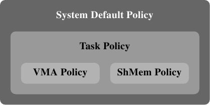

# 6.5.1. 内存策略

定义一个内存策略背后的构想是，令现有的程序在不大幅度修改的情况下，可以在一个 NUMA 环境中适度良好地运作。策略由子进程继承，这使得我们可以使用 numactl 工具。这个工具的用途之一是可以用来以给定的策略来启动一个程序。

Linux 内核支持下列策略：

**`MPOL_BIND`：** 内存只会从一组给定的节点分配。如果不能做到，则分配失败。

**`MPOL_PREFERRED`：** 内存最好是从一组给定的节点分配。如果这失败，才考虑来自其他节点的内存。

**`MPOL_INTERLEAVE`：** 内存是平等地从指定的节点分配。节点要不是针对基于 VMA 的策略，以虚拟内存区域中的偏移量来选择、就是针对基于任务（task）的策略，通过自由执行的计数器来选择。

**`MPOL_DEFAULT`：** 根据内存区域的默认值来选择分配方式。

*图 6.15：内存策略层级结构*

这份清单似乎递回地定义策略。这对了一半。事实上，内存策略形成一个层级结构（见图 6.15）。如果一个地址被一个 VMA 策略所涵盖，就会使用这个策略。一种特殊的策略被用在共享的内存区段上。如果没有针对特定地址的策略，就会使用任务的策略。如果连这也没有，便使用系统的默认策略。

系统默认是分配请求内存的那条线程本地的内存。默认不会提供任务与 VMA 策略。对于一个具有多条线程的进程，本地节点为首先执行进程的「家」节点。上面提到的系统调用可以用来选择不同的策略。
