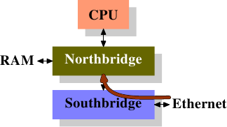
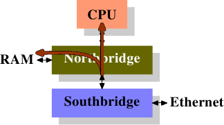

# 6.3.5. 直接 cache 访问

在现代操作系统中，cache 未命中的一个来源是到来的数据流量的处理。像网卡（Network Interface Card，NIC）与硬盘控制器等现代硬件，可以在不涉及 CPU 的情况下，直接将接收或读取的数据写入到内存中。这对于我们如今拥有的装置的性能而言至关重要，但它也造成问题。假使有个从网络传入的封包：操作系统必须检查封包的头（header）以决定要如何处理它。NIC 将封包摆进内存，然后通知处理器它的到来。处理器没有机会去预取数据，因为它并不知道数据将何时抵达，甚至可能不会确切知道它将会被存在哪。结果是在读取头时的一次 cache 未命中。

Intel 已经在它们的芯片组与 CPU 中加上技术以缓解这个问题 [14]。构想是将封包的数据填入将会被通知到来的封包的 CPU 的 cache。封包的承载内容在这里并不重要，这个数据一般将会由更高层的函数 –– 要不是在系统核心中、就是在用户层次 –– 处理。封包头被用来决定封包必须以什么方式处理，因此这个数据是立即所需的。

网络 I/O 硬件已有 DMA 以写入封包。这表示它直接地与潜在整合在北桥中的内存控制器进行沟通。内存控制器的另一边是通过 FSB 到处理器的接口（假设内存控制器没有被整合到 CPU 自身）。

*(a) 启动 DMA*

*(b) 执行 DMA 与 DCA*

*图 6.9：直接 cache 访问*

直接 cache 访问（Direct Cache Access，DCA）背后的想法是，扩充 NIC 与内存控制器之间的通讯协议。在图 6.9 中，第一张图显示在一台有着南北桥的正规机器上的 DMA 传输的起始。NIC 被连接到南桥上（或作为其一部分）。它启动 DMA 访问，但提供关于封包头的新信息，其应该被推进处理器的 cache 中。

在第二步中，传统的行为仅会是以链接到内存的连线完成 DMA 传输。对于被设置 DCA 标志的 DMA 传输，北桥会以特殊的、新的 DCA 标志在 FSB 上同时送出数据。处理器一直窥探着 FSB，并且若是它认出 DCA 标志，它会试着将寄给处理器的数据加载到最低阶 cache 中。事实上，DCA 标志是个提示；处理器可以自由地忽略它。在 DMA 传输完成之后，会以信号通知处理器。

在处理封包时，操作系统必须先确定是哪种封包。若是 DCA 提示没有被忽略的话，操作系统必须执行、以识别封包的加载操作很有可能发生 cache 命中。将每个封包数以百计个循环的节约，乘上每秒能处理的成千上万个封包，节省的加总量是个非常可观的数字，尤其在谈到等待时间的时候。

少了 I/O 硬件（在这个例子中为 NIC）、芯片组与 CPU 的整合，这种优化是不可能的。因此，假如需要这个技术的话，确保明智地挑选平台是必要的。
