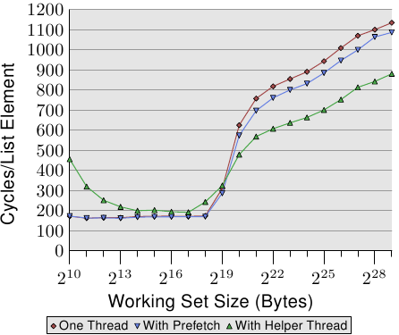

# 6.3.4. 辅助线程

在尝试使用软件预取时，往往会碰到程序复杂度的问题。如果程序必须迭代于一个数据结构上（在我们的情况中是个链表），必须在同个循环中实现两个独立的迭代：执行作业的普通迭代、与往前看以使用预取的第二个迭代。这轻易地变得足够复杂到容易产生失误。

此外，决定要往前看多远是必要的。太短的话，内存将无法及时被加载。太远的话，刚加载的数据可能会被再一次逐出。另一个问题是，虽然它不会阻挡或等待内存加载，但预取指令很花时间。指令必须被解码，如果解码器太忙碌的话——举例来说，由于良好撰写／产生的代码——这可能很明显。最后，循环的程序大小会增加。这降低 L1i 的效率。若通过一次发出多个预取指令来试着避免部分成本，则会碰到显著的预取请求数的问题。

一个替代方法是完全独立地执行一般的操作与预取。这能使用两条普通的线程来进行。线程显然必须被调度，以令预取线程填充一个被两条线程访问的 cache。有两个值得一提的特殊解法：

* 在相同的处理器核上使用 HT（见 3.3.4 节，Hyper-Threading）。在这种情况下，预取可以进入 L2（或者甚至是 L1d）。
* 使用比 SMT 线程「更愚笨的（dumber）」线程，其除预取与其他简单的操作之外什么也不做。这是个处理器厂商可能会探究的选项。

HT 的使用是尤其令人感兴趣的。如同我们已经在 3.3.4 节看到的，如果 HT 执行独立的代码的话，cache 的共享是个问题。反而，在一条线程被用作一条预取辅助线程（helper thread）时，这并不是个问题。与此相反，这是个令人渴望的结果，因为最低层次的 cache 被预载。此外，由于预取线程大多处于空闲状态或等待内存，所以如果不必自己访问主内存的话，其余 HT 的一般操作并不会太受干扰。后者正好是预取辅助线程所预防的。

唯一棘手的部分是确保辅助线程不会往前跑得太远。它不能完全污染 cache，以致最早被预取的值被再次逐出。在 Linux 上，使用 `futex` 系统调用 [7] 或是——以稍微高一些的成本——使用 POSIX 线程同步基本指令（primitive），是很容易做到同步的。



*图 6.8：使用辅助线程的平均，NPAD=31*

这个方法的好处可以在图 6.8 中看到。这是与图 6.7 中相同的测试，只不过加上额外的结果。新的测试建立一条额外的辅助线程，往前执行大约 100 个链表项目，并读取（不只预取）每个链表元素的所有 cache 行。在这种情况下，我们每个链表元素有两个 cache 行（在一台具有 64 byte cache 行大小的 32 bit 机器上，`NPAD`=31）。

两条线程被调度在相同处理器核的两条 HT 上。测试机仅有一颗处理器核，但结果应该与多于一颗处理器核的结果大致相同。亲和性函数——我们将会在 6.4.3 节介绍——被用来将线程绑到合适的 HT 上。

要确定操作系统知道哪两个 (或更多) 处理器为 HT，可以使用来自 libNUMA 的 `NUMA_cpu_level_mask` 接口（见附录 D）。

```c
#include <libNUMA.h>
ssize_t NUMA_cpu_level_mask(size_t destsize,
                            cpu_set_t *dest,
                            size_t srcsize,
                            const cpu_set_t*src,
                            unsigned int level);
```

这个接口能用来决定通过 cache 与内存关联的 CPU 层次结构。这里感兴趣的是对应于 HT 的一级 cache。为在两条 HT 上调度两条线程，可以使用 libNUMA 函数（为简洁起见，省略错误处理）：

```c
cpu_set_t self;
NUMA_cpu_self_current_mask(sizeof(self),
                           &self);
cpu_set_t hts;
NUMA_cpu_level_mask(sizeof(hts), &hts,
                    sizeof(self), &self, 1);
CPU_XOR(&hts, &hts, &self);
```

在执行这段程序之后，我们有两个 CPU bit 集。`self` 能用来设置目前线程的亲和性，而 `hts` 中的掩码能被用来设置辅助线程的亲和性。这在理想上应该在线程被建立前发生。在 6.4.3 节，我们会介绍设置亲和性的接口。如果没有可用的 HT，`NUMA_cpu_level_mask` 函数会返回 1。这可以作为避免这个优化的信号。

这个基准测试的结果可能出乎意料（也可能不会）。如果工作集塞得进 L2，辅助线程的间接成本将性能降低 10% 到 60% 之间（主要在比较低的那端，再次忽略最小的工作集大小，杂讯太多）。这应该在预料之中，因为如果所有数据都已经在 L2 cache 中，预取辅助线程仅仅使用系统资源，却没有对执行有所贡献。

不过，一旦不再足够的 L2 大小耗尽，情况就改变。预取辅助线程协助将执行时间降低大约 25%。我们仍旧看到一条上升的曲线，只不过是因为无法足够快速地处理预取。不过，主线程执行的算术操作与辅助线程的内存加载操作彼此互补。资源冲突是最小的，其导致这种相辅相成的结果。

这个测试的结果应该可以被转移到更多其他的场景。由于 cache 污染而经常无用的 HT，在这些场景中表现出众，并且应该被善用。附录 D 介绍的 NUMA 函数库令线程兄弟的找寻非常容易（见这个附录中的示例）。如果函数库不可用，`sys` 文件系统令一个程序可以找出线程的兄弟（见表 5.3 的 `thread_siblings` 字段）。一旦可以获取这个信息，程序就必须定义线程的亲和性，然后以两种模式执行循环：普通的操作与预取。被预取的内存总量应该视共享的 cache 大小而定。在这个例子中，L2 大小是有关的，程序可以使用

`sysconf(_SC_LEVEL2_CACHE_SIZE)`

来查询大小。辅助线程的进度是否必须被限制取决于程序。一般来说，最好确定有一些同步，因为调度细节可能会导致显著的性能降低。
