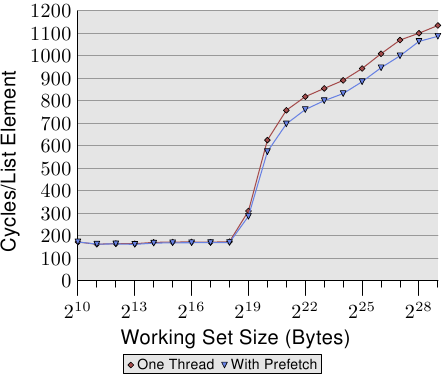

# 6.3.2. 软件预取

硬件预取的优势在于不必调整程序。缺点如同方才描述的，访问模式必须很直观，而且预取无法横跨页边界进行。因为这些原因，我们现在有更多可能性，软件预取它们之中最重要的。软件预取不需要通过插入特殊的指令来修改源代码。某些编译器支持编译指示（pragma）以或多或少地自动插入预取指令。
在 x86 和 x86-64，intrinsic 函数会由编译器产生特殊的指令:

```c
#include <xmmintrin.h>
enum _mm_hint
{
  _MM_HINT_T0 = 3,
  _MM_HINT_T1 = 2,
  _MM_HINT_T2 = 1,
  _MM_HINT_NTA = 0
};
void _mm_prefetch(void *p,
                  enum _mm_hint h);
```

程序可以在程序中的任何指针上使用 `_mm_prefetch` intrinsic 函数。许多处理器（当然包含所有 x86 与 x86-64 处理器）都会忽略无效指针产生的错误，这令程序员的生活好过非常多。如果被传递的指针指向合法的内存，会命令预取单元将数据加载到 cache 中，并且——必要的话——逐出其他数据。不必要的预取应该被确实地避免，因为这会降低 cache 的有效性，而且它会耗费内存带宽（在被逐出的 cache 行是脏的情况下，可能需要两个 cache 行的带宽）。

要与 `_mm_prefetch` 一起使用的不同提示（hint）是由实现定义的。这表示每个处理器版本可以（稍微）不同地实现它们。一般能说的是，`_MM_HINT_T0` 会为包含式 cache 将数据获取到所有 cache 层次，并为独占式 cache 获取到最低层次的 cache。如果数据项目在较高层次的 cache 中，它会被加载到 L1d 中。`_MM_HINT_T1` 提示将数据拉进 L2 而非 L1d。如果有个 L3 cache，`_MM_HINT_T2` 能做到类似于此的事情。不过，这些是没怎么被明确指定的细节，需要对所使用的实际处理器进行验证。一般来说，如果数据在使用 `_MM_HINT_T0` 之后立刻被用到就没错。当然这要求 L1d cache 大小要大得足以容纳所有被预取的数据。如果立即被使用的工作集大小太大，将所有东西预取到 L1d 就是个坏点子，而应该使用其他两种提示。

第四种提示，`_MM_HINT_NTA` 可以吩咐处理器特殊地对待预取的 cache 行。NTA 代表非暂存对齐（non-temporal aligned），我们已经在 6.1 节解释过。程序告诉处理器应该尽可能地避免以这个数据污染 cache，因为数据只在一段很短的期间内会被使用。对于包含式 cache 实现，处理器因而可以在加载时避免将数据读取进较低层次的 cache。当数据从 L1d 逐出时，数据不必被推进 L2 或更高层次的 cache 中，但可以直接写到内存中。可能有其他处理器设计师在给定这个提示时可以部署的其他手法。程序员必须谨慎地使用这个提示：如果目前的工作集大小太大，并强制逐出以 NTA 提示加载的 cache 行，就要重新从内存加载。



*图 6.7：使用预取的平均，NPAD=31*

图 6.7 显示使用现已熟悉的指针追逐框架（pointer chasing framework）的测试结果。链表是随机地被放置在内存中的。与先前测试的不同之处在于，程序真的会在每个链表节点上花一些时间（大约 160 周期）。如同我们从图 3.15 的数据中学到的，一旦工作集大小大于最后一级 cache，程序的性能就会受到严重的影响。

我们现在可以试着在计算之前发出预取请求来改善这种状况。即，我们在循环的每一轮预取一个新元素。链表中被预取的节点与正在处理的节点之间的距离必须被谨慎地选择。假定每个节点在 160 周期内被处理、并且我们必须预取两个 cache 行（`NPAD`=31），五个链表元素的距离便足够。

图 6.7 的结果显示预取确实有帮助。只要工作集大小不超过最后一级 cache 的大小（这台机器拥有 512kB = 2<sup>19</sup>B 的 L2），数字就是相同的。预取指令并不会增加能测量出来的额外负担。一旦超过 L2 大小，预取省下 50 到 60 周期之间，高达 8%。预取的使用无法隐藏任何损失，但它稍微有点帮助。

AMD 在它们 Opteron 产品线的 [10h 家族](https://en.wikipedia.org/wiki/AMD_10h)实现另一个指令：`prefetchw`。在 Intel 这边迄今仍没有这个指令的等价物，也不能通过 intrinsic 使用。`prefetchw` 指令要求 CPU 将 cache 行预取到 L1 中，就如同其他预取指令一样。差异在于 cache 行会立即变成「M」状态。如果之后没有接着对 cache 行的写入，这将会是个不利之处。但如果有一或多次写入，它们将会被加速，因为写入操作不必改变 cache 状态——其在 cache 行被预取时就被设好。这对于竞争的 cache 行尤为重要，其中在另一个处理器的 cache 中的 cache 行的一次普通的读取操作会先在两个 cache 中将状态改成「S」。

预取可能有比我们这里达到的微薄的 8% 还要更大的优势。但它是众所皆知地难以做得正确，尤其是在预期相同的二进制文件在各种各样的机器上都表现良好的情况。由 CPU 提供的性能计数器可以帮助程序员分析预取。可以被计数并取样的事件包含硬件预取、软件预取、有用的／使用的软件预取、在不同层次的 cache 未命中、等等。在 7.1 节，我们将会介绍这些事件。这所有的计数器都是机器特有的。

在分析程序时，应该要先看看 cache 未命中。找出大量 cache 未命中来源的所在时，应该试着针对碰上问题的内存访问加上预取指令。这应该一次处理一个地方。每次修改的结果应该通过观察测量有用预取指令的性能计数器来检验。如果那些计数器没有提升，那么预取可能是错的，它并没有给予足够的时间来从内存加载，或者预取从 cache 逐出仍然需要的内存。

gcc 如今可以在唯一一种情况下自动发出预取指令。如果一个循环迭代在一个数组上，可以使用下面的选项：

`-fprefetch-loop-arrays`

编译器会计算出预取是否合理，以及——如果是的话——它应该往前看多远。对小数组而言，这可能是个不利之处，而且如果在编译时不知道数组的大小的话，结果可能更糟。gcc 手册提醒道，这个好处极为依赖于代码的形式，而在某些情况下，程序可能真的会跑得比较慢。程序员必须谨慎地使用这个选项。

